English | [简体中文](README.zh-CN.md)

# A Multilayer Perceptron (MLP) from Scratch with NumPy (NumPy-Keras)
<p align="center">
  
  <br>
  <b>NumPy-Keras</b>
  <br>
  <a href="https://github.com/XavierSpycy/NumPy-Keras/actions/workflows/ci.yml"></a>
  <a href="https://codecov.io/gh/XavierSpycy/NumPy-Keras"></a>
</p>

**NumPy-Keras**, originally named **NumPyMultilayerPerceptron**, is a deep learning library implemented purely with `numpy`, covering the classic architecture trilogy — multilayer perceptrons, convolutional networks and recurrent networks (SimpleRNN/LSTM/GRU). Its purpose is to provide a simple and easy-to-understand implementation, aimed at facilitating learning and teaching.

<p align="center">
  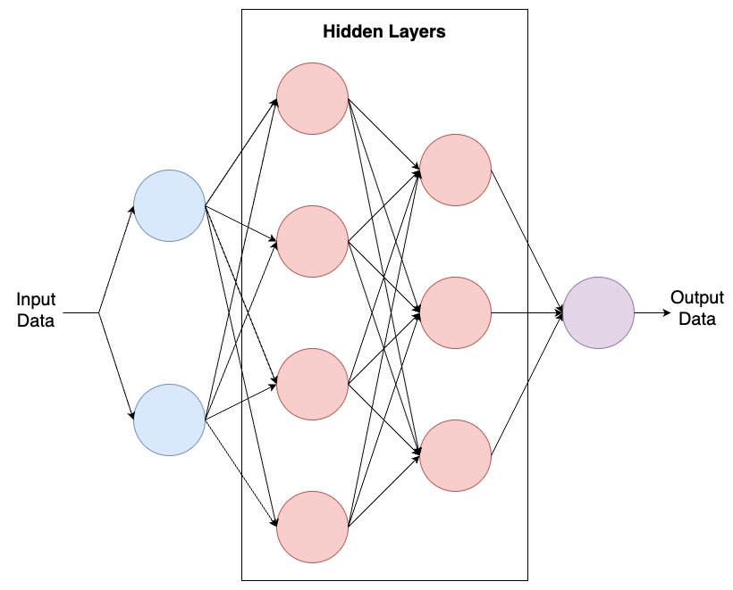
  <br>
  <b>Figure 1.</b> Multilayer Perceptron
</p>

> [!IMPORTANT]
> Major Update: A Completely New Implementation
- We have refactored the entire library to make it easier to understand and use.
    - The latest release offers an implementation that only requires the `Python` standard library and depends on `numpy`.
    - No other libraries need to be installed, even common ones like `scipy` or `scikit-learn`.
- We provide an interface that is closer to `Keras` for better usability.
- We have optimized the code for better performance, including improvements in numerical stability, coding style, and security.
- To enhance the learning experience, we have added extra features, including:
  - A progress bar (requires the `tqdm` library)
  - A training history plot (requires the `matplotlib` library)
  - Automatic differentiation (requires the `autograd` library)
  - If you are only interested in the specifics of the implementations themselves, you can use just the `numpy` library, with lazy imports and exception handling to avoid errors if the necessary libraries are missing. <u> **Again, emphasize**: You only need the `numpy` library to run this framework.</u>

## Table of Contents
- [0. Quick Start](#sparkles-0-quick-start)
- [1. Introduction](#sparkles-1-introduction)
- [2. Dependencies](#sparkles-2-dependencies)
- [3. Testing on Other Datasets](#sparkles-3-testing-on-other-datasets)
  - [3.1 Toy Example: Random Dataset](#31-toy-example-random-dataset)
    - [3.1.1 Basic Model](#311-basic-model)
    - [3.1.2 SGD Optimizer](#312-sgd-optimizer)
    - [3.1.3 Adam Optimizer](#313-adam-optimizer)
    - [3.1.4 The Effect of Dropout](#314-the-effect-of-dropout)
    - [3.1.5 The Effect of BatchNormalization](#315-the-effect-of-batchnormalization)
    - [3.1.5 The Effect of Batch Size on BatchNormalization](#315-the-effect-of-batch-size-on-batchnormalization)
    - [3.1.6 Classification Problem](#316-classification-problem)
  - [3.2 Multi-Class Classification Problem](#32-multi-class-classification-problem)
    - [3.2.1 Load the Dataset](#321-load-the-dataset)
    - [3.2.2 Build the Model](#322-build-the-model)
    - [3.2.3 Compile the Model](#323-compile-the-model)
    - [3.2.4 Train the Model](#324-train-the-model)
    - [3.2.5 Visualize the Training History](#325-visualize-the-training-history)
- [4. Key Modules](#sparkles-4-key-modules)
    - [4.1 Activations](#41-activations)
    - [4.2 Layers](#42-layers)
    - [4.3 Optimizers](#43-optimizers)
    - [4.4 Callbacks](#44-callbacks)
- [5. Conclusion](#sparkles-5-conclusion)
- [6. Version Log](#sparkles-6-version-Log)

## :sparkles: 0. Quick Start
- Clone the repository.

```bash
git clone https://github.com/XavierSpycy/NumPy-Keras.git
cd NumPy-Keras
```

- Create a virtual environment.

```bash
conda create -n numpy_keras python=3.12 -y
```

- Activate the virtual environment.

```bash
conda activate numpy_keras
```

- Install the library itself (editable, so changes to the source take effect immediately):

```bash
pip install -e .
```

- Install any extra dependencies you need.

To avoid installing extra dependencies for additional features, we have commented out the non-`numpy` dependencies in `requirements.txt`. If you need these features, you can uncomment the lines and rerun `pip install -r requirements.txt`.

If you are using miniconda, you may also need to install dependencies for `Jupyter Notebook`.

```bash
pip3 install jupyter ipywidgets
```

- Finally, you can learn how to use the library through the [tutorial series](tutorials/00_quickstart.md) or the Jupyter Notebooks in the [notebooks](notebooks) folder.

### 0.1 Tutorial Series
A Chinese tutorial series in `tutorials/` builds the whole trilogy from scratch, one concept per article, each with complete runnable code and measured numbers:

| # | 文章 | 主题 |
|---|---|---|
| 00 | 五分钟上手 | honest train/test split, first MNIST model |
| 01 | 激活函数全解 | 17 activations, derivatives on post-activation values, vanishing gradients |
| 02 | 损失函数 | MSE vs cross-entropy, the softmax+CE combined gradient |
| 03 | 反向传播逐行拆解 | chain rule through `Sequential`, finite-difference gradient checking, autograd comparison |
| 04 | 优化器进化史 | SGD → Momentum → NAG → Adagrad → Adadelta → Adam |
| 05 | 学习率与九大调度器 | lr sweep, nine schedulers, ReduceLROnPlateau + EarlyStopping |
| 06 | MLP 深入 | initializer scales and the 12-layer deep network |
| 07 | Dropout | inverted dropout and the overfitting comparison |
| 08 | BatchNormalization | train/inference modes and running statistics |
| 09 | CNN 解剖 | im2col, LeNet and feature maps |
| 10 | RNN 三部曲 | SimpleRNN/LSTM/GRU and BPTT |
| 11 | 引擎室 (可选) | the duck-typed layer contract, adding a layer |
| 12 | Cython 加速 (可选) | compiled kernels and benchmark methodology |
| 13 | CuPy GPU 加速 (可选) | backend switch, host/device boundary, where the bottleneck moves |

Each article stands alone, and its code is byte-identical to `tutorials/code/*.py`; see [tutorials/README.md](tutorials/README.md) for the full index and the Zhihu/CSDN publishing checklist.

## :sparkles: 1. Introduction
Multi-layer Perceptron (MLP) is one of the most basic neural network models. It consists of an input layer, one or more hidden layers, and an output layer. Each layer consists of multiple neurons, each with an activation function. An MLP is a feedforward neural network, and its output is calculated by forward propagation from the input layer to the output layer.

The current mainstream deep learning frameworks, such as `TensorFlow`, `PyTorch`, etc., provide efficient implementations, but the underlying implementations are complex and difficult to understand. Therefore, to better understand the principles of deep learning, we provide from-scratch `NumPy` implementations of the classic architectures — MLP, CNN and RNN (SimpleRNN/LSTM/GRU) — whose internals are written to read like a textbook.

We mentioned `Keras` because our implementation was inspired by the `Keras` interface. From the interface perspective, `Keras` provides a high-level interface that allows users to easily build neural network models, making it very suitable for beginners because it is simple and easy to understand. For this reason, `TensorFlow` 2.0 and later versions also use `Keras` as their high-level interface.

When we open the [official website](https://www.tensorflow.org/) of `TensorFlow`, we can see the following code example:

```python
import tensorflow as tf
mnist = tf.keras.datasets.mnist

(x_train, y_train),(x_test, y_test) = mnist.load_data()
x_train, x_test = x_train / 255.0, x_test / 255.0

model = tf.keras.models.Sequential([
  tf.keras.layers.Flatten(input_shape=(28, 28)),
  tf.keras.layers.Dense(128, activation='relu'),
  tf.keras.layers.Dropout(0.2),
  tf.keras.layers.Dense(10, activation='softmax')
])

model.compile(optimizer='adam',
  loss='sparse_categorical_crossentropy',
  metrics=['accuracy'])

model.fit(x_train, y_train, epochs=5)
model.evaluate(x_test, y_test)
```

Meanwhile, we can see the following code example in our framework:

```python
import csv
import itertools

import numpy as np
import numpy_keras as keras


def load_mnist(path, n_rows=None):
    """Load a label-first MNIST CSV: the first column is the label and the
    remaining 784 columns are pixels (0-255)."""
    with open(path) as f:
        rows = list(itertools.islice(csv.reader(f), n_rows))
    y = np.array([int(r[0]) for r in rows])
    X = np.array([[float(v) for v in r[1:]] for r in rows]) / 255.0
    return X, y


# The training and test sets come from two different files.
np.random.seed(0)
X_train, y_train = load_mnist("data/mnist_train_small.csv", n_rows=5000)
X_test, y_test = load_mnist("data/mnist_test.csv", n_rows=1000)
X_train = X_train.reshape(-1, 28, 28)
X_test = X_test.reshape(-1, 28, 28)

model = keras.models.Sequential([
    keras.layers.Flatten(input_shape=(28, 28)),
    keras.layers.Dense(128, activation='relu', kernel_initializer='he_normal'),
    keras.layers.Dropout(0.2),
    keras.layers.Dense(10, activation='softmax')
])

model.compile(optimizer='adam',
  loss='sparse_categorical_crossentropy',
  metrics=['accuracy'])

history = model.fit(X_train, y_train, epochs=5, verbose=1)
print(f"Accuracy on the training set: {model.evaluate(X_train, y_train):.2%}")
print(f"Accuracy on the test set: {model.evaluate(X_test, y_test):.2%}")
# Outputs (np.random.seed(0), pure NumPy mode, Apple M2 Pro):
# Accuracy on the training set: 96.72%
# Accuracy on the test set: 93.30%
```

We can notice that our framework is very similar to the `Keras` interface, which allows beginners to refer to a more mature framework and build and train neural network models by themselves.

Detailed usage can be found in our [Jupyter Notebook](notebooks/beginner.ipynb).

In addition to the basic implementation, we also provide some additional features, such as:
- A progress bar during training to better monitor the training process (requires the `tqdm` library).
- A function to plot the training history when we train the model to better visualize the training process (requires the `matplotlib` library).
  - Use `keras.plot_history(history)` to plot the training history.

<p align="center">
  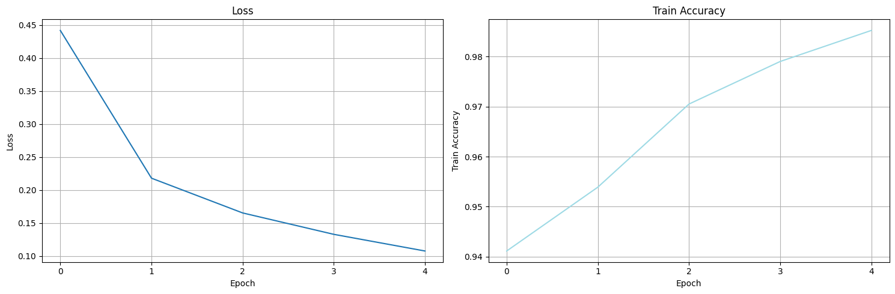
  <br>
  <b>Figure 2.</b> Training History
</p>

To conclude, our framework is a lightweight framework that only depends on the `numpy` library and provides a simple and easy-to-understand implementation. We hope that this framework can help users better understand the principles of deep learning and better use deep learning frameworks.

## :sparkles: 2. Dependencies
A `pytest` suite in [tests](tests) covers the layers, losses, optimizers, callbacks and the CNN/RNN paths, plus the Cython parity, GPU (CuPy) parity, float32 and autograd-subpackage tests (`python -m pytest tests/ -q`, currently 315 tests; the GPU/optional-dependency parts skip automatically when unavailable). The library is developed and tested in the following environment:
- Python 3.12.1
- numpy 1.26.4

Although we expect to achieve the most lightweight implementation, we still provide some additional features for better usability. For example, we provide a progress bar during training to better monitor the training process (requires the `tqdm` library); we also provide a function to plot the training history to better visualize the training process (requires the `matplotlib` library).

We have implemented these features using lazy loading, so you only need `numpy` to run this library when you don't need these features.

To avoid errors, we recommend using our environment or an environment similar to ours. 

Here are the versions of `tqdm`, `matplotlib`, and `autograd`:
- tqdm 4.66.1
- matplotlib 3.8.2
- autograd 1.7.0

If there are no major differences in the versions, we believe that this library should work on other versions as well.

The `autograd/` subpackage (an automatic-differentiation mirror of the API: forward-only layers plus gradients via `autograd.grad`) is covered by `tests/test_autograd.py`, which is skipped automatically when `autograd` is not installed.

### 2.1 Optional Cython Acceleration
By default, everything runs on pure NumPy. If you would like to speed up training and inference, you can compile the optional Cython kernels (one fused pass per parameter array for the optimizer updates, fused bias/activation passes for `Dense`, compiled elementwise activations, and compiled `col2im` / max-pooling kernels for the convolutional layers):

```
pip install cython>=3.0.10
python build_cython.py build_ext --inplace
```

The library detects the compiled module at import time and uses it automatically; when it is not built (or when the `NUMPY_KERAS_DISABLE_CYTHON` environment variable is set), it falls back to the pure NumPy implementations with identical behavior. The pure and compiled paths are pinned against each other by parity tests (`tests/test_cython_kernels.py`), and `benchmarks/bench_cython.py` measures the speedup. For the CNN, `im2col` itself is deliberately *not* compiled — building the column matrix is a strided copy that NumPy already performs at memcpy speed — but the scatter-add back (`col2im`, ~16x on one batch) and the max-pooling window scan (~2.7x) are, and the convolution's matmul + activation reuse the fused `Dense` kernels. The RNN layers have no kernels: each timestep is already a BLAS matrix product, so whether the Python loop over timesteps is worth compiling remains to be measured.

The table below was produced with `python benchmarks/bench_cython.py` (MLP rows: 5 repetitions; CNN row: 3 repetitions; mean ± standard deviation; the two modes were measured in the same session). Both modes include the pure-Python hot-path fixes (metrics-skip, cached activation lookups), so the speedup shown comes from the Cython layer alone.

| Configuration | Pure NumPy | Cython | Speedup |
|---|---|---|---|
| teaching-scale 3000x64, hidden [128, 64, 1], 5 epochs, batch 32 | 0.195s ± 0.021 | 0.136s ± 0.001 | ~1.4x |
| MNIST-like 10000x784, hidden [256, 256, 10], 3 epochs, batch 64 | 25.16s ± 2.24 | 19.15s ± 1.32 | ~1.3x |
| LeNet-style CNN (6@5x5 / pool / 16@5x5 / pool / 120 / 10) on 2000x28x28 MNIST, 2 epochs, batch 32 | 14.47s ± 0.66 | 8.69s ± 0.30 | ~1.7x |

Measured on an Apple M2 Pro (Mac14,9, 16 GB RAM, macOS arm64) with Python 3.12.8 and NumPy 1.26.4. The speedup depends on the CPU, the BLAS implementation, and the matrix sizes, so do not expect identical numbers on other machines. Absolute times in particular are sensitive to concurrent load — BLAS-heavy workloads are affected the most (in an idle window on the same machine the script measured ~2.5s vs ~4.1s for the MNIST-like configuration), while the speedup ratio stayed in the ~1.3-1.6x band across conditions. Re-run the benchmark on your own machine before drawing conclusions. Training trajectories are essentially identical in both modes: on the CNN configuration above, two epochs of the two modes reached the same loss and accuracy to four decimal places.

### 2.2 Optional GPU Acceleration (CuPy)
The library also ships an optional CuPy GPU backend that follows the same philosophy as the Cython layer: the default behavior (pure NumPy) is **unchanged**, the GPU path is opt-in, and it degrades gracefully (a warning plus fallback to NumPy when CuPy is not installed).

**Installation** (pick the wheel matching your CUDA version; `cupy-cuda12x` works on any driver >= 12.x, e.g. a CUDA 13.0 driver with a 12.1 toolkit):

```
pip install numpy-keras[cupy]        # or: pip install cupy-cuda12x>=13.6.0
```

**Enabling the GPU backend** (both ways are equivalent; the environment variable is read at import time, while `set_backend` can be called at any time, e.g. from a notebook after the package is already imported):

```
export NUMPY_KERAS_BACKEND=cupy      # option 1: environment variable
```

```python
import numpy_keras
numpy_keras.set_backend("cupy")      # option 2: runtime switch
```

`numpy_keras.get_backend()` reports the active backend (`"numpy"` / `"cupy"`). No manual data movement is needed: at the entry of `fit` / `predict` / `evaluate` the model automatically syncs its parameters, gradients, BatchNorm statistics and optimizer state to the active device (in both directions). Random number generation, data preparation (shuffling, one-hot encoding) and label/metric math always stay on the host — so **with the same seed, CPU and GPU runs get bit-identical initial weights and Dropout masks**. The two paths are pinned against each other by `tests/test_cupy.py` (44 tests covering activations, dense/conv/pooling, the three RNNs, the four optimizers, end-to-end training, a finite-difference gradient check and backend switching). Numerically, GPU reduction orders and libm differ from NumPy at the ~1-ulp level; the library stays float64 throughout, and training trajectories agree to 4-5 decimal places.

**Measured speedups** (2× NVIDIA A800 80GB, Python 3.12.3, cupy-cuda12x 13.6.0, via `benchmarks/bench_cupy.py`, against the pure NumPy path): matrix-bound operators benefit massively — elementwise activations 61-203x, `Dense` forward/backward 45-59x, the fused optimizer kernels ~83x (the device twin of the Cython kernels: one GPU kernel per param array — the pure path's per-op launch overhead was 40% of the model-level time), convolution and pooling 5-13x. Model-level (`fit` timed end to end, including host-side data prep; MLP 10000x784 [256,256,10], 3 epochs, batch 64, warmed-up medians; Cython and CuPy are the library's two optional acceleration layers, and a machine with the Cython kernels compiled gets them on the CPU side automatically):

| Configuration | Pure NumPy | CPU + Cython | CuPy | GPU/Pure NumPy |
|---|---|---|---|---|
| no metrics | 2.47 s | 1.67 s | 0.78 s | ~3.2x |
| + accuracy metric | 2.20 s | 2.13 s | 1.05 s | ~2.1x |
| tutorial script (with metric, `tutorials/code/13_cupy.py`) | — | 2.20 s | 1.20 s | ~1.8x |

**Known exception: RNNs at this teaching scale are *slower* on the GPU** (the per-timestep Python loop is dominated by many small kernel launches; the GPU branch batches the input projection into one 3D matmul, which is not enough to offset the launch overhead — only much larger N/T/U pays off on the device). Re-run the benchmark on your own machine before drawing conclusions.

**Compute dtype**: `Sequential(..., dtype="float32")` runs the model in float32 (float64 is the default). Parameters, gradients and every layer output stay at the chosen precision — cupy's `clip`/`maximum` turn Python scalars into 0-d float64 arrays and silently promote float32, so the library enforces the dtype at the two choke points (activation outputs and the loss gradient; see the 9 tests in `tests/test_float32.py`). float32 halves device memory and pays off hugely on consumer GPUs (an RTX 4090's fp64 throughput is 1/64 of its fp32); on the A800 used here cuBLAS runs float64 on FP64 tensor cores too, so at teaching scale the two dtypes measure about the same (f64 1.10s / f32 1.15s, identical accuracy). The Cython kernels stay float64-only; float32 models automatically take the pure NumPy path or the fused GPU kernels.

## :sparkles: 3. Testing on Other Datasets
Perhaps you have a question: We only tested on the MNIST dataset, and our model performed very well in terms of accuracy. But is it possible that our model overfits on the MNIST dataset? How does it perform on other datasets?

We are going to test our model on a simple random dataset and a slightly more complex ten-classification problem to better understand how our model performs on other datasets.

### 3.1 Toy Example: Random Dataset
When introducing this module, we may involve some core features. If you have any questions about these concepts, we will explain them in detail in the following sections to help you better understand them.

We will test on a simple random dataset. You can view more details by visiting our [Jupyter Notebook](notebooks/toy-example.ipynb).

```python
import numpy as np
import matplotlib.pyplot as plt
```

To ensure the reproducibility of our experiments and the comparability between different models, we set a random seed.

```python
np.random.seed(3407)

y_1 = np.hstack([np.random.normal(1, 1, size=(100, 2)),  np.ones(shape=(100, 1))])
y_2 = np.hstack([np.random.normal(-1, 1, size=(40, 2)), -np.ones(shape=(40, 1))])
dataset = np.vstack([y_1, y_2])

X_train, y_train = dataset[:, 0:2], dataset[:, 2]
```

Following the construction of the dataset, we will visualize the dataset.

<p align="center">
  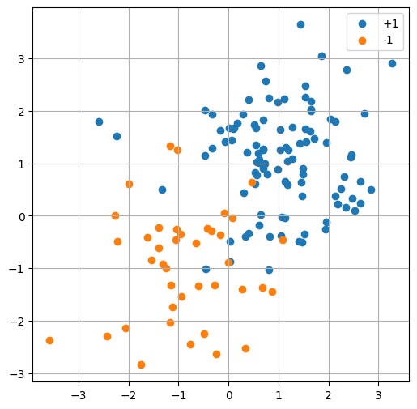
  <br>
  <b>Figure 3.</b> Random Dataset
</p>

Now, we can import our framework to witness the performance of our model on this dataset.

```python
import numpy_keras as keras
```

To better visualize the decision boundary, we provide a function to plot the decision boundary.

```python 
def plot_decision_boundary(model, X_train, y_train):
    xx, yy = np.meshgrid(np.arange(-2, 2, .02), np.arange(-2, 2, .02))
    Z = model.predict(np.c_[xx.ravel(), yy.ravel()])
    Z = Z.reshape(xx.shape)
    
    plt.figure(figsize=(15,7))
    plt.subplot(1, 2, 1)
    plt.pcolormesh(xx, yy, Z>0, cmap='cool')
    plt.scatter(X_train[:, 0], X_train[:, 1], c=[(['b', 'r'])[int(d>0)] for d in y_train], s=100)
    plt.xlim(-2, 2)
    plt.ylim(-2, 2)
    plt.grid()
    plt.title('Labels')
    plt.subplot(1, 2, 2)
    plt.pcolormesh(xx, yy, Z>0, cmap='cool')
    plt.scatter(X_train[:, 0], X_train[:, 1], c=[(['b', 'r'])[int(d>0)] for d in model.predict(X_train)], s=100)
    plt.xlim(-2, 2)
    plt.ylim(-2, 2)
    plt.grid()
    plt.title('Predictions')
```

#### 3.1.1 Basic Model
We will use a simple model to solve this problem.

```python
layers = [
    keras.layers.Input(2),
    keras.layers.Dense(3, activation="relu", kernel_initializer='he_normal'),
    keras.layers.Dense(1, activation='tanh')
]
```

Although we construct a dataset for a classification problem, in fact, any classification problem can be transformed into a regression problem. We will use the Mean Squared Error (MSE) as the loss function and use $R^2$ as the evaluation metric.

#### 3.1.2 SGD Optimizer
To begin with, we will use the Stochastic Gradient Descent (SGD) optimizer, which is the first optimizer that most beginners encounter and is widely used. To compare the performance under the same learning rate, we will not use the string form to pass the optimizer, but pass an instance of the optimizer class and set the learning rate to $1 \times 10^{-3}$ (usually the default value of the Adam optimizer).

```python
model = keras.Sequential(layers)
model.compile(loss='mse', optimizer=keras.optimizers.SGD(1e-3), metrics=['r2_score'])
history = model.fit(X_train, y_train, batch_size=2, epochs=500, verbose=1)
keras.plot_history(history)
```

<p align="center">
  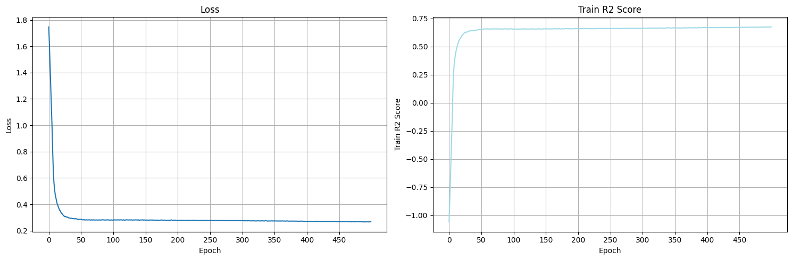
  <br>
  <b>Figure 4.</b> Training History (with SGD Optimizer)
</p>

<p align="center">
  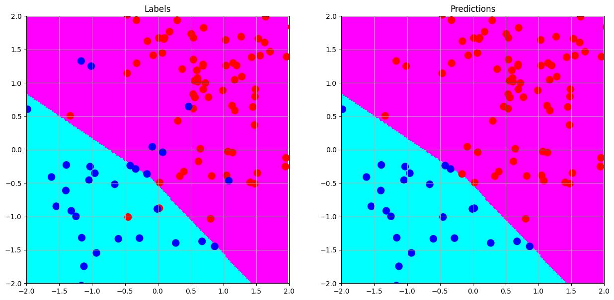
  <br>
  <b>Figure 5.</b> Decision Boundary (with SGD Optimizer)
</p>

#### 3.1.3 Adam Optimizer
Next, we will use a more advanced optimizer, the Adam optimizer, to train our model. The Adam optimizer adjusts the learning rate for each parameter by computing the first and second moments of the gradients. In simpler terms, the Adam optimizer is an adaptive learning rate optimizer. It allows us to converge faster and makes it easier to adjust the learning rate.

```python
model.compile(loss='mse', optimizer='adam', metrics=['r2_score'])
```

<p align="center">
  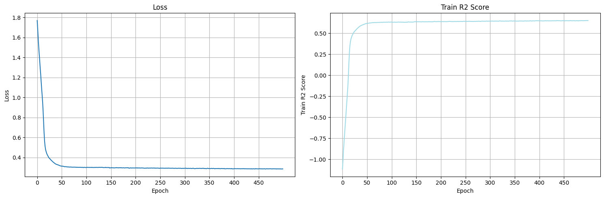
  <br>
  <b>Figure 6.</b> Training History (with Adam Optimizer)
</p>

<p align="center">
  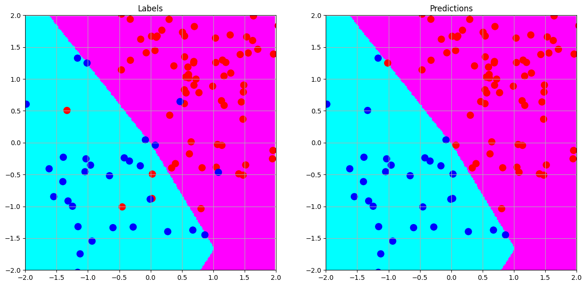
  <br>
  <b>Figure 7.</b> Decision Boundary (with Adam Optimizer)
</p>

It is worth noting that the decision boundary has an interesting "corner".

#### 3.1.4 The Effect of Dropout
We will use a model containing a Dropout layer to solve this problem. Dropout is a regularization technique that randomly drops a portion of neurons during training to reduce overfitting.

```python
layers = [
    keras.layers.Input(2),
    keras.layers.Dense(3, activation="relu", kernel_initializer='he_normal'),
    keras.layers.Dropout(0.2),
    keras.layers.Dense(1, activation='tanh')
]
```
<p align="center">
  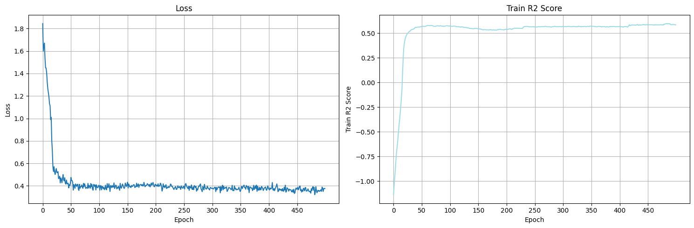
  <br>
  <b>Figure 8.</b> Training History (with Dropout)
</p>

<p align="center">
  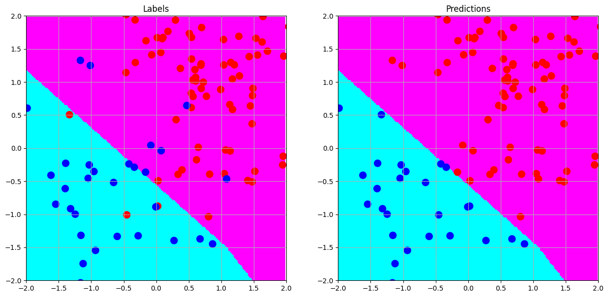
  <br>
  <b>Figure 9.</b> Decision Boundary (with Dropout)
</p>

#### 3.1.5 The Effect of BatchNormalization
We will use a model containing a BatchNormalization layer to solve this problem. BatchNormalization is a technique used in neural networks to standardize the activations of a given input layer in small batches, helping to normalize and accelerate the training process. In common cognition, we usually follow the order of `Linear -> BatchNormalization -> Activation -> Dropout`. Therefore, we will try this order here.

```python
layers = [
    keras.layers.Input(2),
    keras.layers.Dense(3, activation=None),
    keras.layers.BatchNormalization(),
    keras.layers.Activation('relu'),
    keras.layers.Dropout(0.2),
    keras.layers.Dense(1, activation='tanh')
]
```

<p align="center">
  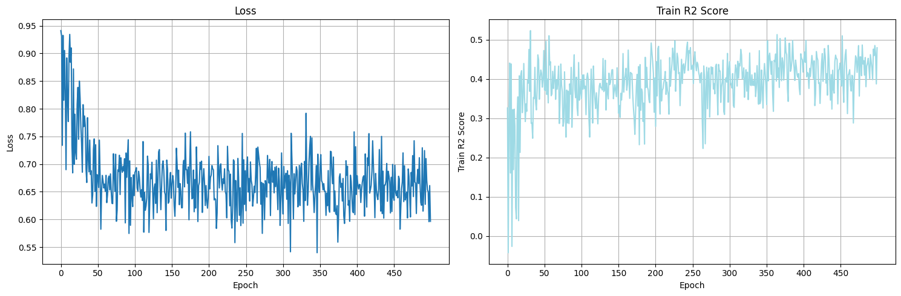
  <br>
  <b>Figure 10.</b> Training History (with BatchNormalization)

<p align="center">
  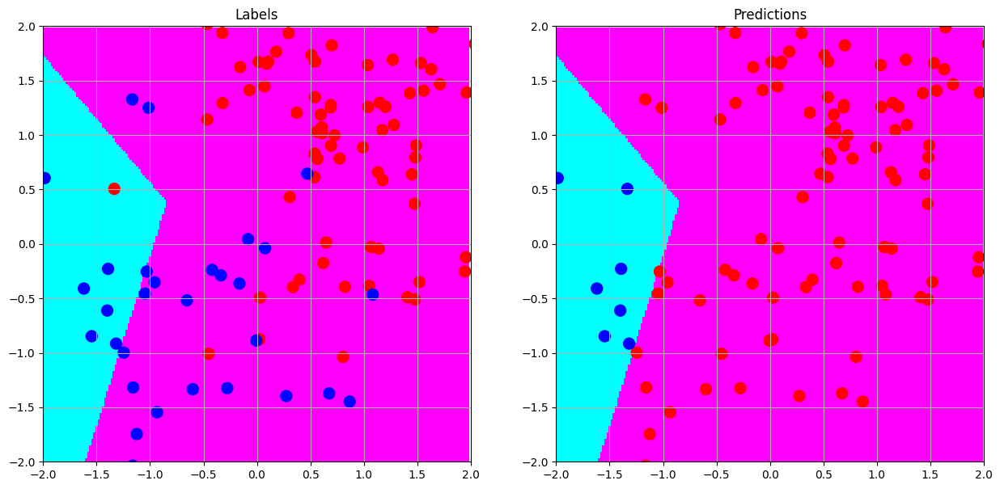
  <br>
  <b>Figure 11.</b> Decision Boundary (with BatchNormalization)
</p>

Unfortunately, the BatchNormalization layer causes the loss function to oscillate sharply, and from the decision boundary, the model's performance is very poor. This is because our batch size is too small for the BatchNormalization layer to work properly. This is also a drawback of the BatchNormalization layer, as it is very sensitive to the batch size.

#### 3.1.5 The Effect of Batch Size on BatchNormalization
In terms of the sensitivity of the BatchNormalization layer to the batch size, we will try different batch sizes to better understand the sensitivity of the BatchNormalization layer to the batch size.

```python
history = model.fit(X_train, y_train, batch_size=16, epochs=500, verbose=1)
```

<p align="center">
  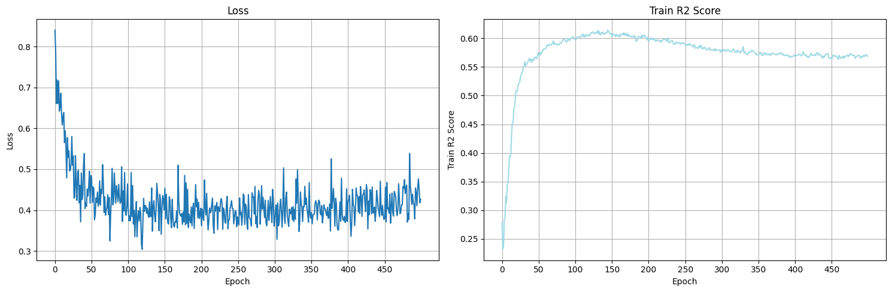
  <br>
  <b>Figure 12.</b> Training History (with BatchNormalization, batch size = 16)
</p>

<p align="center">
  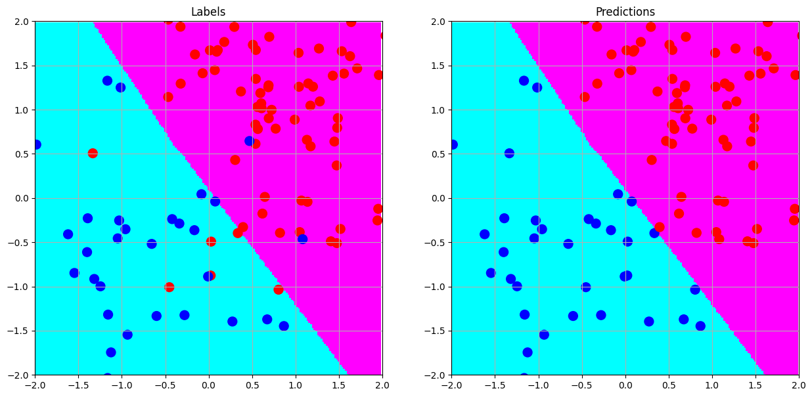
  <br>
  <b>Figure 13.</b> Decision Boundary (with BatchNormalization, batch size = 16)
</p>

As we can see, when the batch size is 16, the loss function stability of the BatchNormalization layer has improved, and the decision boundary looks more reasonable. However, due to the small size of our dataset, we cannot solve the problem of the BatchNormalization layer by increasing the batch size, nor can we explore the sensitivity of the BatchNormalization layer to the batch size in more depth. We hope this will provide a starting point for further exploration.

#### 3.1.6 Classification Problem
We have always considered this problem as a regression problem, but in fact, it is a classification problem. We will use a model containing a Softmax layer and use the cross-entropy loss function to solve this problem. By the way, we have always considered this problem as a regression problem, but in fact, it is a classification problem. We will use a model containing a Softmax layer and use the cross-entropy loss function to solve this problem. By the way, our `Sequential` class adds layers through the `add` method, which is very similar to the `Sequential` class in `Keras`.

```python
model = keras.Sequential()
model.add(keras.layers.Input(2))
model.add(keras.layers.Dense(3, activation='relu', kernel_initializer='he_normal'))
model.add(keras.layers.Dropout(0.2))
model.add(keras.layers.Dense(2, activation='softmax'))
model.compile(loss='sparse_categorical_crossentropy', optimizer='adam', metrics=['accuracy'])
```

<p align="center">
  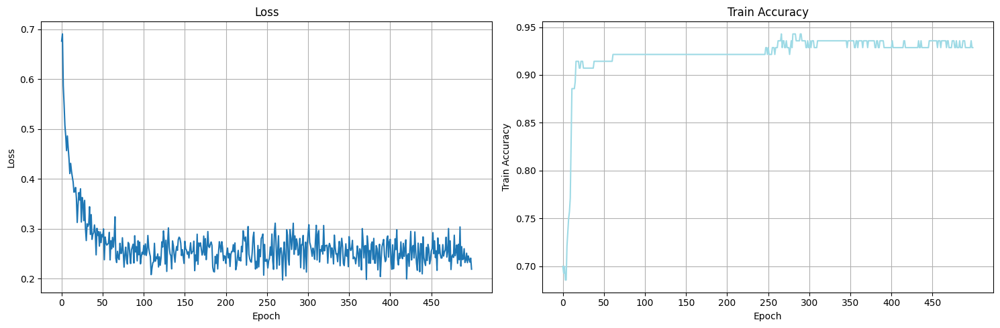
  <br>
  <b>Figure 14.</b> Training History (Classification Problem)
</p>

<p align="center">
  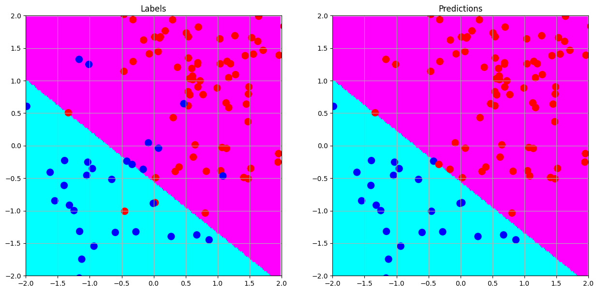
  <br>
  <b>Figure 15.</b> Decision Boundary (Classification Problem)
</p>

### 3.2 Multi-Class Classification Problem
In this section, we will test on a slightly more complex ten-classification problem.

Since we already have test data in our dataset, we will not need to split the dataset. However, in real-world scenarios, we usually split the dataset into a training set, a validation set, and a test set. Typically, the validation set and the test set are often confused, although strictly speaking, this is incorrect, especially in production environments, where the test set often does not have real labels and may also have a different distribution from the training data.

To better understand the performance of the model and the performance that the model can achieve, we will treat the test set as both the test set and the validation set. The former is used to simulate the test set as a separate set, while the latter is treated as a validation set split from the training set.

You can view more details by visiting our [Jupyter Notebook](notebooks/assignment.ipynb).

#### 3.2.1 Load the Dataset
```python
import numpy as np

np.random.seed(42)

X_train = np.load('data/train_data.npy')[:10000]
y_train = np.load('data/train_label.npy').squeeze()[:10000]
X_test = np.load('data/test_data.npy')
y_test = np.load('data/test_label.npy').squeeze()
print(X_train.shape, y_train.shape, X_test.shape, y_test.shape)
```

In general, our dataset contains 50,000 training samples and 10,000 test samples, with a feature dimension of 128. The example below trains on the first 10,000 training samples so that the whole experiment finishes within minutes on an ordinary laptop; remove the slices to train on all 50,000 (about 35-45 minutes with the full 60-epoch budget on the reference machine).

#### 3.2.2 Build the Model
Here, we use `numpy_keras` to build a multi-layer perceptron (MLP) model. We will use a model with 12 hidden layers. We will use the `ELU` activation function and use the `He` uniform initializer to initialize the weights. We will also use the `Dropout` layer to reduce overfitting.

```python
import numpy_keras as keras

model = keras.Sequential()
model.add(keras.layers.Input(shape=X_train.shape[1]))
model.add(keras.layers.Dense(120, activation='elu', kernel_initializer='he_uniform'))
model.add(keras.layers.Dropout(0.25))
model.add(keras.layers.Dense(112, activation='elu', kernel_initializer='he_uniform'))
model.add(keras.layers.Dropout(0.20))
model.add(keras.layers.Dense(96, activation='elu', kernel_initializer='he_uniform'))
model.add(keras.layers.Dropout(0.15))
model.add(keras.layers.Dense(64, activation='elu', kernel_initializer='he_uniform'))
model.add(keras.layers.Dropout(0.10))
model.add(keras.layers.Dense(32, activation='elu', kernel_initializer='he_uniform'))
model.add(keras.layers.Dense(24, activation='elu', kernel_initializer='he_uniform'))
model.add(keras.layers.Dense(16, activation='elu', kernel_initializer='he_uniform'))
model.add(keras.layers.Dense(10, activation='softmax'))
```

In this section, we also provide the model architecture we used. The selected architecture is based on personal experience with deep learning tasks in the past, **and by no means represents an optimal architecture in any practical sense**. We strongly recommend that you choose the appropriate model architecture based on your task requirements and dataset characteristics. Feel free to try different architectures and choose the best one based on experimental results.

<p align="center">
  
  <br>
  <b>Figure 16.</b> A Complex Model Architecture
</p>

#### 3.2.3 Compile the Model
We use the `Adam` optimizer and the `SparseCategoricalCrossentropy` loss. We deliberately do not pass `metrics`: every metric triggers a full-data prediction at the end of each epoch, which on 50,000 samples costs almost as much as the training step itself. The callbacks therefore monitor `val_loss` (always recorded when validation data is given), and the final accuracies are computed once after training.

```python
early_stop = keras.callbacks.EarlyStopping('val_loss', mode='min', patience=5, restore_best_weights=True)
lr_scheduler = keras.callbacks.ReduceLROnPlateau('val_loss', mode='min', factor=0.5, patience=3, min_lr=1e-6)
model.compile(optimizer='adam', loss='sparse_categorical_crossentropy')
```

#### 3.2.4 Train the Model
##### Test Set as Test Set

```python
history = model.fit(X_train, y_train, epochs=60, batch_size=128, verbose=1, callbacks=[early_stop, lr_scheduler], validation_split=0.1)
```

- Performance (10,000-sample subset, `np.random.seed(42)`, compiled kernels, Apple M2 Pro)
    - Accuracy (Training Set): 59.13%
    - Accuracy (Test Set): 45.79%
- Early Stop Epoch: 42

##### Test Set as Validation Set

You can also pass the test set itself as the validation data; the recipe is identical and the main difference is where early stopping lands:

```python
history = model.fit(X_train, y_train, epochs=60, batch_size=128, verbose=1, callbacks=[early_stop, lr_scheduler], validation_data=(X_test, y_test))
```

#### 3.2.5 Visualize the Training History

```python
keras.plot_history(history)
```

<p align="center">
  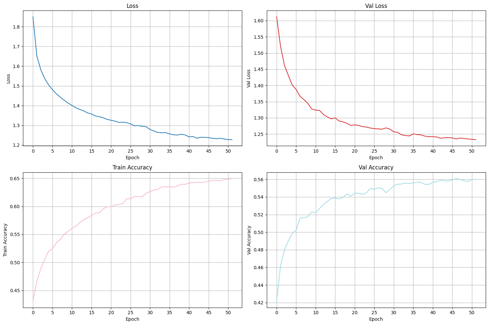
  <br>
  <b>Figure 17.</b> Loss Function and Accuracy Curve
</p>

## :sparkles: 4. Key Modules
### 4.1 [Activations](numpy_keras/activations)
Given the shortcomings of markdown in rendering mathematical formulas, we will only list the functions we have implemented here, rather than displaying the mathematical formulas. However, we highly recommend the [documentation](https://pytorch.org/docs/stable/nn.html#non-linear-activations-weighted-sum-nonlinearity) of `PyTorch`. It provides excellent formulas and figures to help you better understand the activation functions. Our implementation refers to this documentation. We would also like to thank the `PyTorch` development team for their contributions to the open-source community.

- ELU
- Hardshrink
- Hardsigmoid
- Hardtanh
- LeakyReLU
- LogSigmoid
- ReLU
- ReLU6
- SELU
- CELU
- Sigmoid
- Softplus
- Softshrink
- Softsign
- Tanh
- Softmax

In addition to the above activation functions, we have implemented more activation functions in our `autograd` module, which is used for automatic differentiation. In our `autograd` module, we have implemented more activation functions in addition to the above activation functions:

- Hardswish
- GELU
- SiLU
- Mish
- Softsign
- Tanhshrink
- Threshold

For the use of automatic differentiation (`autograd`), you only need to make the following changes to the code:

Replace the following import statement:
```python
import numpy_keras as keras
```
with:
```python
import numpy_keras.autograd as keras
```

you can seamlessly switch to the functionality of `autograd`.

### 4.2 Layers
- **[Dense](numpy_keras/layers/dense.py)**
    -  Fully Connected Layer
    - **Definition**:  
        A dense layer, also known as a fully connected layer, is a layer in a neural network where all input nodes (or neurons) are connected to every output node. It is called "dense" or "fully connected" because all inputs and outputs are connected to each other.
    - **Mathematical Representation**:     
        $y = f(Wx + b)$
    
- **[BatchNormalization](numpy_keras/layers/batch_norm.py)**
    - **Definition**:     
        Batch normalization is a technique used in neural networks to standardize the activations of a given input layer in small batches, helping to normalize and accelerate the training process. 
    - **Mathematical Representation**:    
        For a given mini-batch, $B$, of size $m$, with activations $x$:

        $\mu_B = \frac{1}{m}\Sigma_{i=1}^m x_i$      
        $\sigma_B^2 = \frac{1}{m}\Sigma_{i=1}^m (x_i - \mu_B)^2$      
        $\hat {x_i} = \frac{x_i - \mu_B}{\sqrt{\sigma_B^2 + \epsilon}}$        
        $y_i = \gamma \hat {x_i} + \beta$

- **[Dropout](numpy_keras/layers/dropout.py)**:
    - **Definition**: 
        Dropout is a regularization technique used in neural networks, where a random subset of neurons is "dropped out" (i.e., set to zero) during each iteration. This prevents the network from becoming too dependent on any specific neuron and encourages a more generalized model.   

- **[Activation](numpy_keras/layers/activation.py)**:
    - **Definition**:
        An activation layer in a neural network is a layer that applies a non-linear function to its input, transforming the data to introduce non-linearity into the model. This non-linearity allows the network to learn and make adjustments from errors, which is crucial for learning complex patterns.

- **[Flatten](numpy_keras/layers/flatten.py)**:
    - **Definition**:
        The flatten layer is a layer used in neural networks to flatten the input data into a one-dimensional array. This is useful when connecting a convolutional layer to a fully connected layer, as the fully connected layer requires a one-dimensional input. Its input shape is inferred from the previous layer automatically (`layers.Flatten()`), but can still be passed explicitly.

- **[Conv2D](numpy_keras/layers/conv2d.py)**:
    - **Definition**:
        A 2D convolutional layer: each filter slides over the input image and produces one feature map. It is implemented with the classic **im2col** trick (CS231n style): every kh × kw × C receptive field is rearranged into a row of a matrix, so the whole convolution becomes a single matrix product `cols(X) @ W_flat`, executed by BLAS. The backward pass reverses the operation with a scatter-add (`col2im`).
    - **Mathematical Representation**:    
        For filter $W$ of shape (kh, kw, C), bias $b$, and a receptive field $x$: $y_{i,j} = f(\Sigma_{p,q,c} W_{p,q,c} x_{i+p, j+q, c} + b)$
    - Supports `kernel_size`, `stride`, `padding` (int or `'same'`), `activation`, and per-filter `use_bias`; parameters are stored as `(kh, kw, in_channels, filters)` plus `(filters,)` for the bias.

- **[MaxPool2D](numpy_keras/layers/maxpool2d.py)**:
    - **Definition**:
        Max pooling downsamples the feature maps by taking the maximum of each pooling window; the backward pass routes each gradient to the input position that won the maximum (accumulating with `np.add.at` because overlapping windows share pixels).

- **[SimpleRNN](numpy_keras/layers/simple_rnn.py)**:
    - **Definition**:
        The simplest recurrent layer: at every timestep the same weights combine the current input and the previous hidden state, $h_t = f(x_t W_{xh} + h_{t-1} W_{hh} + b)$, and the hidden state carries memory across the sequence. Training unrolls the chain rule backwards over time (BPTT); with `return_sequences=False` the gradient arrives only at the last timestep and reaches earlier ones solely through the recurrence.
    - Supports `activation` (default `'tanh'`), `return_sequences`, `use_bias`, and separate `kernel_initializer` / `recurrent_initializer`; parameters are `(F, units)`, `(units, units)` and `(units,)`.

- **[LSTM](numpy_keras/layers/lstm.py)**:
    - **Definition**:
        Long Short-Term Memory: an explicit memory cell `c_t` plus three gates, in the Keras layout `[i, f, g, o]`:
        `i, f, o = sigmoid(...)`, `g = tanh(...)` (slices of one shared pre-activation `x_t @ W_xh + h_{t-1} @ W_hh + b`), then `c_t = f * c_{t-1} + i * g` and `h_t = o * tanh(c_t)`. The forget gate decides what old memory to keep, the input gate what new information to store — the mechanism that lets gradients flow through long sequences without vanishing as fast as in a plain RNN.
    - Supports `activation` (the cell candidate, default `'tanh'`), `recurrent_activation` (the gates, default `'sigmoid'`), `return_sequences`, `use_bias`; parameters are `(F, 4U)`, `(U, 4U)` and `(4U,)`.

- **[GRU](numpy_keras/layers/gru.py)**:
    - **Definition**:
        Gated Recurrent Unit — the LSTM's essential mechanism with one less gate, in the Keras layout `[z, r, h̃]` with the classic (reset_after=False) formulation:
        `z = sigmoid(x_t @ W_xh + h_{t-1} @ W_hh + b)`, `r = sigmoid(...)`, `h̃ = tanh(x_t @ W_xh + (r * h_{t-1}) @ W_hh + b_h)`, `h_t = (1 - z) * h_{t-1} + z * h̃`. The update gate `z` interpolates between the old state and the candidate; the reset gate `r` decides how much of the old state the candidate may see.
    - Supports `activation` (the candidate, default `'tanh'`), `recurrent_activation` (the gates, default `'sigmoid'`), `return_sequences`, `use_bias`; parameters are `(F, 3U)`, `(U, 3U)` and `(3U,)`.

> [!NOTE]
> Every layer chains through its *own* activation inside `backward` (evaluated on its cached post-activation output); the criterion only computes the loss and its raw gradient. For RNN layers, whose output is not a single elementwise activation, the gate and candidate derivatives are applied per timestep inside `backward`, and their `activation` property simply reports `None`. Also, a `return_sequences=True` RNN outputs `(N, T, U)`; a `Dense` after it needs a `Flatten` in between (the model raises a helpful error otherwise). The RNN layers are pure NumPy — no Cython kernels, since the per-timestep work is already BLAS matrix products (see §2.1).

- **[Input](numpy_keras/layers/input.py)**:
    - **Definition**:
        The input layer is the first layer in a neural network, which receives input data and passes it to the next layer. The input layer has no weights or biases and is used to define the shape of the input data. It accepts an int (a 1D feature vector of that size) or a full shape tuple such as `(28, 28, 1)`.

A LeNet-style CNN on the bundled MNIST subset (`data/mnist_train_small.csv`) builds exactly like the MLPs above:

```python
import csv
import numpy as np
from numpy_keras import Sequential
from numpy_keras import layers

np.random.seed(0)
with open("data/mnist_train_small.csv") as f:
    rows = list(csv.reader(f))[:2000]    # 2,000 of the 20,000 rows
X = np.array([[float(v) for v in r[1:]] for r in rows]) / 255.0
y = np.array([int(r[0]) for r in rows])
X = X.reshape(-1, 28, 28, 1)             # (N, H, W, C)

model = Sequential()
model.add(layers.Input((28, 28, 1)))
model.add(layers.Conv2D(6, kernel_size=5, activation="relu"))
model.add(layers.MaxPool2D(pool_size=2))
model.add(layers.Conv2D(16, kernel_size=5, activation="relu"))
model.add(layers.MaxPool2D(pool_size=2))
model.add(layers.Flatten())
model.add(layers.Dense(120, activation="tanh"))
model.add(layers.Dense(10, activation="softmax"))
model.compile(loss="sparse_categorical_crossentropy", optimizer="adam",
              metrics=["accuracy"])

history = model.fit(X, y, batch_size=32, epochs=2, shuffle=True)
# Accuracy on the training set: 93.20% after 2 epochs on 2,000 samples
# (np.random.seed(0), pure NumPy mode). On the first 1,000 rows of
# data/mnist_test.csv the same model reaches 89.30%.
```

The same images can be read row by row as a sequence — 28 timesteps of 28 pixels each:

```python
X = X.reshape(-1, 28, 28)                # (N, T, F): one row per timestep
X, y = X[:800], y[:800]                  # keep the example fast

model = Sequential()
model.add(layers.Input((28, 28)))
model.add(layers.LSTM(32))
model.add(layers.Dense(10, activation="softmax"))
model.compile(loss="sparse_categorical_crossentropy", optimizer="adam",
              metrics=["accuracy"])
model.optimizer.learning_rate = 0.01

history = model.fit(X, y, batch_size=32, epochs=10, shuffle=True)
# Accuracy on the training set: ~80-88% after 10 epochs on 800 samples,
# depending on the random seed
```

### 4.3 Optimizers
Right here, we have implemented the optimizers commonly used by beginners to help them better understand the optimization process of deep learning. We believe that these optimizers are very helpful for beginners to understand the optimization process of deep learning.

- [SGD (with Momentum & Nesterov)](numpy_keras/optimizers/sgd.py)
- [Adagrad](numpy_keras/optimizers/adagrad.py)
- [Adadelta](numpy_keras/optimizers/adadelta.py)
- [Adam](numpy_keras/optimizers/adam.py)

### 4.4 Callbacks
- [EarlyStopping](numpy_keras/callbacks/early_stopping.py): When the validation loss no longer decreases, stop training.
- [Learning Rate Scheduler](numpy_keras/callbacks/lr_scheduler.py): Adjust the learning rate during training.
  - MultiplicativeLR
  - StepLR
  - MultiStepLR
  - ConstantLR
  - LinearLR
  - ExponentialLR
  - PolynomialLR
  - CosineAnnealingLR
  - ReduceLROnPlateau

> [!NOTE]
> We believe that the interface of `Keras` regarding learning rate schedulers is not very elegant. From the perspective of usability, it is very worthwhile to optimize the interface of `Keras` regarding learning rate schedulers. Although our implementation in this part did not meet our expected standards, we still decided to adjust the implementation of `LearningRateScheduler` to improve the rationality and usability of the interface. In other words, this part of the implementation is quite different from `Keras`. We also believe that the `torch.optim.lr_scheduler` module of `PyTorch` is very worth learning from. It provides many learning rate schedulers and has a very elegant interface. Therefore, this part of the implementation is mainly inspired by `PyTorch`. Thanks again!
> 
> In addition, although the parameters of the learning rate scheduler are slightly adjusted, the overall interface is very similar to `Keras`. We believe that such adjustments are reasonable because they make the interface more user-friendly and more intuitive, especially for beginners.

## :sparkles: 5. Conclusion
`NumPy-Keras` is a deep learning library implemented using `NumPy`, covering the classic architecture trilogy — multilayer perceptrons, convolutional networks and recurrent networks (SimpleRNN/LSTM/GRU). It aims to provide a simple and easy-to-understand neural network implementation to help users learn and teach deep learning. The library does not depend on any third-party deep learning frameworks such as `TensorFlow` or `PyTorch` and only requires `Python` and `NumPy` to run, making it suitable for beginners to understand the basic principles of deep learning. `NumPy-Keras` provides an API similar to `Keras` and supports features such as visualization of the training process, progress bar display, and training history charts. With this lightweight framework, users can quickly build and train models and explore the basic concepts of deep learning.

## :sparkles: 6. Version Log
- v1
  - v1.0.0 
    - 2023.08.27: Initial release.
  - v1.1.0
    - 2023.09.05
      - **feat**：Integrate the `tqdm` library's `tqdm()` function into the training process.
      - **refactor**：Enhance the `Sequential` class to support the `add` method.
      - **perf**：Improve the performance of the `MultilayerPerceptron` class.
    - 2023.10.02
      - **feat**：Released the dataset.
      - **docs**：Fixed several typos in `README.md`.
    - 2023.10.07
      - **feat**：Introduced a `Jupyter Notebook` named `mlp_quickstart.ipynb` for smooth integration with `Google Colab`.
      - **docs**：For a clearer and better user browsing experience, and integrated emojis and polished content to improve the `README.md`.
  - v1.2.0 
    - 2023.10.18
      - **refactor**：Streamlined the codebase and restructured the codebase to ensure a clearer and more intuitive user experience.
      - **feat**：Successfully integrated the architecture construction and performance testing using the built-in datasets of `Google Colab`.
      - **perf**：Introduced the additional methods to the `MultilayerPerceptron`.
      - **feat**：Integrated `EarlyStopping` and `LearningRateScheduler` to provide refined training control.
      - **docs**：Completed the docstrings for some modules.
  - v1.2.1
    - 2023.11.22
      - **style**: Simplified the implementation, especially the user interface.
      - **perf**: Augmented some functions.
    - 2023.11.24
      - **docs**: Completed the docstrings for all modules, enhancing the clarity and understanding of the entire codebase.
- v2
  - v2.0.0 
    - 2024.12.25
      - **refactor**: Refactored the entire codebase to improve code quality and maintainability.
        - **depd**: Employed pure `numpy` implementation to reduce dependencies on other libraries.
        - **style**: Implemented a more `Keras`-like interface for better usability.
        - **perf**: Optimized the stability of numerical values, code style, and security.
        - **feat**: Offered an automatic training history plot for better monitoring of the training process.
        - **feat**: Provided more callback functions for better model performance optimization.
        - **feat**: Supplied the `autograd` functionality for automatic gradient calculation, avoiding manual calculation, and provided more activation functions.
        - **docs**: Completed the docstrings for all modules, enhancing the clarity and understanding of the entire codebase.
  - v2.1.0
    - 2026.08.15
      - **feat**: Added the RNN layer family — `SimpleRNN`, `LSTM` and `GRU` with pure NumPy BPTT.
      - **feat**: Added a Chinese tutorial series in `tutorials/` (quickstart, activations, losses, backprop, optimizers, learning rate, MLP, ...).
      - **refactor**: Each layer now chains through its own activation inside `backward` (the criterion only computes the loss and its raw gradient) — simpler semantics, and BN/Dropout/custom layers are correct by construction. The softmax layer handles its Jacobian itself.
      - **fix**: Corrected the He (kaiming) initializer scales and the SGD Nesterov update.
      - **build**: Fixed package discovery in `pyproject.toml` and documented `pip install -e .`.
  - v2.2.0
    - 2026.08.16
      - **feat**: Added the optional CuPy GPU backend (`numpy_keras.set_backend` / the `NUMPY_KERAS_BACKEND` environment variable): params/grads/BatchNorm stats/optimizer state auto-sync both ways at the entry of `fit`/`predict`/`evaluate`, RNG stays on the host so same-seed runs are bit-identical across backends, and missing CuPy degrades gracefully — pinned by `tests/test_cupy.py` (44 tests).
      - **feat**: Added fused GPU optimizer kernels (`numpy_keras/optimizers/_gpu_kernels.py`, the device twin of the Cython kernels: one GPU kernel per param array).
      - **feat**: Added a float32 compute dtype (`Sequential(..., dtype="float32")`): params, gradients and every layer output keep the chosen precision (guarding the choke points where cupy scalar promotion would silently produce float64), covered by `tests/test_float32.py` (9 tests).
      - **feat**: Added tutorial chapter 13 (CuPy GPU acceleration).
      - **fix**: Fixed the `autograd/` subpackage (Flatten dispatch, `predict` assembly, best-weights snapshot/restore, import crash without the `autograd` library) and added `tests/test_autograd.py` (7 tests).
      - **perf**: On the GPU, `predict` now decodes labels on the device with one big forward pass; the softmax backward uses the contracted form there (no Jacobian materialization, no slow einsum).
      - **test**: The suite now contains 315 tests (Cython parity, GPU parity, float32, autograd).
      - **test**: Added initializer regression tests; the suite now has 244 tests.