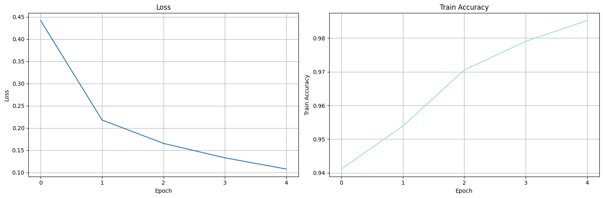
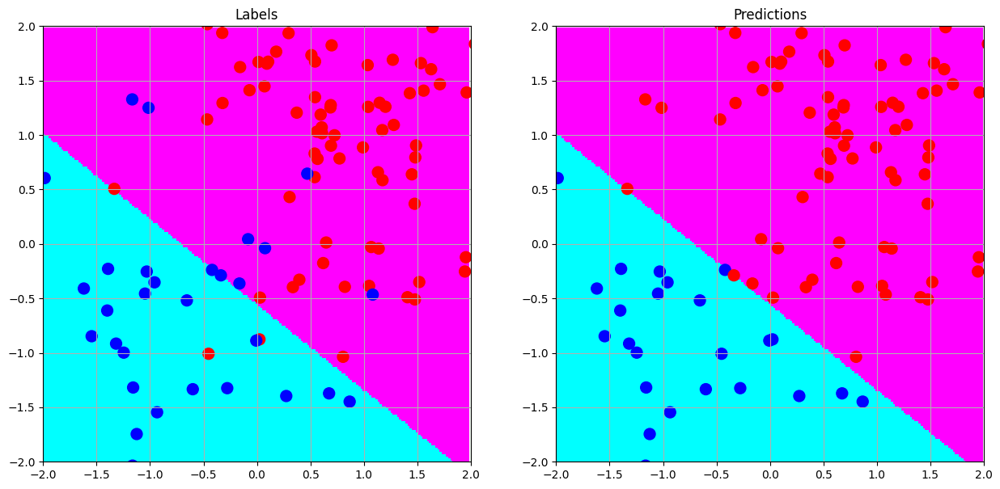

[English](README.md) | 简体中文

# 用 NumPy 从零实现多层感知机 (NumPy-Keras)
<p align="center">
  
  <br>
  <b>NumPy-Keras</b>
</p>

**NumPy-Keras**, 原名 **NumPyMultilayerPerceptron**, 是一个用 `numpy` 实现的多层感知器(MLP)的库。它的目的是为了提供一个简单的、易于理解的实现, 以便于学习和教学。

<p align="center">
  
  <br>
  <b>图 1.</b> 多层感知机
</p>

> [!IMPORTANT]
> 重大更新: 一个全新版本的实现
- 我们重构了整个库, 以便于更好的理解和使用。
    - 在最新的发布中, 我们提供了一个仅需 `Python` 标准库和依赖 `numpy` 的实现。
    - 您不需要安装任何其他的库就可以运行这个库, 甚至常见的 `scipy`, `scikit-learn` 等也不需要。
- 我们提供了一个更加接近 `Keras` 的接口, 以便于更好的使用。
- 我们对代码进行了优化, 以便于更好的性能, 包括: 数值稳定性、代码风格、安全性等。
- 为了起到更好的学习作用, 我们给出了附加功能, 包括:
  - 进度条功能 (需要安装 `tqdm` 库)
  - 绘制训练历史的功能 (需要安装 `matplotlib` 库)
  - 自动求导功能 (需要安装 `autograd` 库)
  - 如果您只对多层感知机如何具体实现感兴趣, 那么仅考虑 `numpy` 库即可, 并且我们采用惰性导入和异常捕捉的方式来避免您未安装相关库时的错误。<u> **再次强调**: 您只需要 `numpy` 库就可以运行这个库。</u>

## 目录
- [0. 快速开始](#sparkles-0-快速开始)
- [1. 引言](#sparkles-1-引言)
- [2. 依赖](#sparkles-2-依赖)
- [3. 其他数据集上的测试](#sparkles-3-其他数据集上的测试)
  - [3.1 玩具样例: 随机数据集](#31-玩具样例-随机数据集)
    - [3.1.1 基础架构](#311-基础架构)
    - [3.1.2 SGD 优化器](#312-sgd-优化器)
    - [3.1.3 Adam 优化器](#313-adam-优化器)
    - [3.1.4 Dropout 的作用](#314-dropout-的作用)
    - [3.1.5 BatchNormalization 的作用](#315-batchnormalization-的作用)
    - [3.1.5 批量大小对 BatchNormalization 的作用](#315-批量大小对-batchnormalization-的作用)
    - [3.1.6 分类问题](#316-分类问题)
  - [3.2 多分类问题](#32-多分类问题)
    - [3.2.1 加载数据](#321-加载数据)
    - [3.2.2 构建模型](#322-构建模型)
    - [3.2.3 编译模型](#323-编译模型)
    - [3.2.4 训练模型](#324-训练模型)
    - [3.2.5 可视化训练历史](#325-可视化训练历史)
- [4. 关键模块](#sparkles-4-关键模块)
  - [4.1 激活函数](#41-激活函数-activations)
  - [4.2 层](#42-层-layers)
  - [4.3 优化器](#43-优化器-optimizers)
  - [4.4 回调](#44-回调-callbacks)
- [5. 版本日志](#sparkles-5-总结)
- [6. 版本日志](#sparkles-6-版本日志)

## :sparkles: 0. 快速开始
- 克隆这个仓库。

```bash
git clone https://github.com/XavierSpycy/NumPy-Keras.git
cd NumPy-Keras
```

- 创建一个虚拟环境。

```bash
conda create -n numpy_keras python=3.12 -y
```

- 激活虚拟环境。

```bash
conda activate numpy_keras
```

- 安装依赖。

```bash
pip3 install -r requirements.txt
```

为了避免安装额外功能所需的依赖, 我们将除 `numpy` 外的依赖通过 `#` 注释掉了。如果您需要这些功能, 您可以取消注释, 并重新运行 `pip3 install -r requirements.txt`。

如果您使用的是 `miniconda`, 您可能还需要额外安装 `Jupyter Notebook` 相关的依赖。

```bash
pip3 install jupyter ipywidgets
```

- 最后, 您可以通过 [notebooks](notebooks) 文件夹中的 Jupyter Notebook 来学习如何使用这个库。

## :sparkles: 1. 引言
多层感知机 (MLP) 是一种最基本的神经网络模型。它由一个输入层、一个或多个隐藏层和一个输出层组成。每一层都由多个神经元组成, 每个神经元都有一个激活函数。MLP 是一种前馈神经网络, 它的输出是由输入层到输出层的前向传播计算得到的。

当前主流的深度学习框架, 如 `TensorFlow`, `PyTorch` 等, 都提供了高效的实现, 但是这些框架的底层实现是复杂的, 并且很难理解。因此, 为了更好地理解深度学习的原理, 我们提供了一个用 `NumPy` 实现的多层感知机框架。

我们提到了 `Keras` 是因为我们的实现受到了 `Keras` 接口的启发。从接口的角度来看, `Keras` 提供了高级的接口, 使得用户可以很容易地构建神经网络模型, 非常适合初学者, 因为它简单, 且易于理解。也正因此, `TensorFlow` 2.0 以及之后的版本, 也采用了 `Keras` 作为其高级接口。

当我们打开 `TensorFlow` 的[官网](https://www.tensorflow.org/)时, 我们可以看到如下的代码示例:

```python
import tensorflow as tf
mnist = tf.keras.datasets.mnist

(x_train, y_train),(x_test, y_test) = mnist.load_data()
x_train, x_test = x_train / 255.0, x_test / 255.0

model = tf.keras.models.Sequential([
  tf.keras.layers.Flatten(input_shape=(28, 28)),
  tf.keras.layers.Dense(128, activation='relu'),
  tf.keras.layers.Dropout(0.2),
  tf.keras.layers.Dense(10, activation='softmax')
])

model.compile(optimizer='adam',
  loss='sparse_categorical_crossentropy',
  metrics=['accuracy'])

model.fit(x_train, y_train, epochs=5)
model.evaluate(x_test, y_test)
```

而当使用我们的框架时, 我们可以看到如下的代码示例:

```python
import numpy_keras as keras

X_train, y_train, X_test, y_test = mnist_load_data()
X_train, X_test = X_train / 255.0, X_test / 255.0

model = keras.models.Sequential([
    keras.layers.Flatten(input_shape=(28, 28)),
    keras.layers.Dense(128, activation='relu', kernel_initializer='he_normal'),
    keras.layers.Dropout(0.2),
    keras.layers.Dense(10, activation='softmax')
])

model.compile(optimizer='adam',
  loss='sparse_categorical_crossentropy',
  metrics=['accuracy'])

history = model.fit(X_train, y_train, epochs=5, verbose=1)
print(f"Accuracy on the training set: {model.evaluate(X_train, y_train):.2%}")
print(f"Accuracy on the test set: {model.evaluate(X_test, y_test):.2%}")
# Outputs:
# Accuracy on the training set: 98.52%
# Accuracy on the test set: 98.52%
```

我们可以看到, 我们的框架与 `Keras` 的接口非常相似, 这使得初学者可以参考比较成熟的框架, 自行动手搭建并训练神经网络模型。

详细的使用方法, 请参考我们的 [Jupyter Notebook](notebooks/beginner.ipynb)。

除了基础的实现外, 我们也提供了一些额外的功能, 例如:
- 当我们训练模型时, 我们提供了一个进度条功能, 以便于更好的监控训练过程。(需要安装 `tqdm` 库)
- 当我们训练模型时, 我们提供了一个绘制训练历史的功能, 以便于更好的可视化训练过程。(需要安装 `matplotlib` 库)
  - 使用 `keras.plot_history(history)` 绘制训练历史。

<p align="center">
  
  <br>
  <b>图 2.</b> 训练历史
</p>

总之, 我们的框架是一个轻量级的框架, 仅依赖 `numpy` 库, 并且提供了一个简单的、易于理解的实现。我们希望这个框架能够帮助用户更好地理解深度学习的原理, 并且能够更好地使用深度学习框架。

## :sparkles: 2. 依赖
由于我们并未进行广泛的测试, 因此我们无法保证在特定版本的 `Python` 和 `numpy` 上能够正常运行。不过, 我们列出我们的开发环境, 以供参考:
- Python 3.12.1
- numpy 1.26.4

尽管我们期望以最轻便的方式实现, 但我们仍然提供了一些额外的功能, 以便于更好的使用。例如, 我们提供了训练过程中的进度条功能, 以便于更好的监控训练过程 (该功能依赖 `tqdm` 库); 我们还提供了一个绘制训练历史的功能, 以便于更好的可视化训练过程 (该功能依赖 `matplotlib` 库)。

我们通过惰性加载的方式实现了这些功能, 因此, 当您无需使用这些功能时, 您仍然仅需要 `numpy` 就可以运行这个库。

为了防止出现错误, 我们建议您使用我们的环境, 或者使用与我们的环境相似的环境。

这里是 `tqdm`, `matplotlib` 以及 `autograd` 的版本:
- tqdm 4.66.1
- matplotlib 3.8.2
- autograd 1.7.0

只要版本没有太大的差异, 我们相信这个库应该可以在其他版本上正常运行。

## :sparkles: 3. 其他数据集上的测试
或许看到这里您会有一个疑问: 我们只在 MNIST 数据集上进行了测试, 从准确率上来看, 我们的模型表现得非常好。但是, 有没有可能是因为我们的模型在 MNIST 数据集上过拟合了呢? 那么在其他数据集上的表现如何呢?

我们将在一个简单的随机数据集和一个稍复杂的十分类问题上进行测试, 以便于更好地了解我们的模型在其他数据集上的表现。

### 3.1 玩具样例: 随机数据集
在介绍这一模块时, 我们可能会涉及一些核心功能的使用。如果您对相关的概念有所疑惑, 我们将会在后续的章节中对这些概念进行详细的介绍, 希望能够帮助您更好地理解这些概念。

我们将在一个简单的随机数据集上进行测试。您可以通过访问我们的 [Jupyter Notebook](notebooks/toy-example.ipynb) 来查看更多的细节。

```python
import numpy as np
import matplotlib.pyplot as plt
```

为了我们实验的复现性以及不同模型之间的比较, 我们设置了一个随机种子。

```python
np.random.seed(3407)

y_1 = np.hstack([np.random.normal(1, 1, size=(100, 2)),  np.ones(shape=(100, 1))])
y_2 = np.hstack([np.random.normal(-1, 1, size=(40, 2)), -np.ones(shape=(40, 1))])
dataset = np.vstack([y_1, y_2])

X_train, y_train = dataset[:, 0:2], dataset[:, 2]
```

接下来, 我们将数据集可视化。

<p align="center">
  
  <br>
  <b>图 3.</b> 随机数据集
</p>

现在, 我们可以导入我们的框架, 来见证我们的模型在这个数据集上的表现。

```python
import numpy_keras as keras
```

为了可视化决策边界, 我们定义了一个函数, 以便于更好地理解我们的模型。

```python 
def plot_decision_boundary(model, X_train, y_train):
    xx, yy = np.meshgrid(np.arange(-2, 2, .02), np.arange(-2, 2, .02))
    Z = model.predict(np.c_[xx.ravel(), yy.ravel()])
    Z = Z.reshape(xx.shape)
    
    plt.figure(figsize=(15,7))
    plt.subplot(1, 2, 1)
    plt.pcolormesh(xx, yy, Z>0, cmap='cool')
    plt.scatter(X_train[:, 0], X_train[:, 1], c=[(['b', 'r'])[int(d>0)] for d in y_train], s=100)
    plt.xlim(-2, 2)
    plt.ylim(-2, 2)
    plt.grid()
    plt.title('Labels')
    plt.subplot(1, 2, 2)
    plt.pcolormesh(xx, yy, Z>0, cmap='cool')
    plt.scatter(X_train[:, 0], X_train[:, 1], c=[(['b', 'r'])[int(d>0)] for d in model.predict(X_train)], s=100)
    plt.xlim(-2, 2)
    plt.ylim(-2, 2)
    plt.grid()
    plt.title('Predictions')
```

#### 3.1.1 基础架构
我们将使用一个简单的模型来解决这个问题。

```python
layers = [
    keras.layers.Input(2),
    keras.layers.Dense(3, activation="relu", kernel_initializer='he_normal'),
    keras.layers.Dense(1, activation='tanh')
]
```

尽管我们在构造数据集时, 实际上生成的是一个分类问题的数据集, 但是实际上任何分类问题都可以转化为回归问题。我们将使用均方误差 (MSE) 作为损失函数, 并使用 $R^2$ 作为评估指标。

#### 3.1.2 SGD 优化器
首先, 我们将使用一个绝大多数初学者最先接触、也是广泛使用的 SGD 优化器来训练我们的模型。为了在相同的学习率下进行比较, 我们将不使用字符串的形式传入优化器, 而是传入优化器类的实例, 并将学习率设置为 $1 \times 10^{-3}$ (通常为 Adam 优化器的默认值)。

```python
model = keras.Sequential(layers)
model.compile(loss='mse', optimizer=keras.optimizers.SGD(1e-3), metrics=['r2_score'])
history = model.fit(X_train, y_train, batch_size=2, epochs=500, verbose=1)
keras.plot_history(history)
```

<p align="center">
  
  <br>
  <b>图 4.</b> 训练历史 (使用 SGD 优化器)
</p>

<p align="center">
  
  <br>
  <b>图 5.</b> 决策边界 (使用 SGD 优化器)
</p>

#### 3.1.3 Adam 优化器
那么, 我们将使用一个更加先进的优化器, Adam 优化器来训练我们的模型。Adam 优化器通过计算梯度的一阶矩估计 (均值) 和二阶矩估计 (不中心方差的指数加权移动平均值) 来调整每个参数的学习率。用更简单的话来说, Adam 优化器是一种自适应学习率的优化器。它可以让我们更快地收敛, 并且更容易地调整学习率。

```python
model.compile(loss='mse', optimizer='adam', metrics=['r2_score'])
```

<p align="center">
  
  <br>
  <b>图 6.</b> 训练历史 (使用 Adam 优化器)
</p>

<p align="center">
  
  <br>
  <b>图 7.</b> 决策边界 (使用 Adam 优化器)
</p>

值得一提的是, 决策边界出现了一个有意思的"拐角"。

#### 3.1.4 Dropout 的作用
我们将使用一个包含 Dropout 层的模型来解决这个问题。Dropout 是一种正则化技术, 它在训练过程中随机丢弃一部分神经元, 以减少过拟合。

```python
layers = [
    keras.layers.Input(2),
    keras.layers.Dense(3, activation="relu", kernel_initializer='he_normal'),
    keras.layers.Dropout(0.2),
    keras.layers.Dense(1, activation='tanh')
]
```
<p align="center">
  
  <br>
  <b>图 8.</b> 训练历史 (含 Dropout)
</p>

<p align="center">
  
  <br>
  <b>图 9.</b> 决策边界 (含 Dropout)
</p>

#### 3.1.5 BatchNormalization 的作用
我们将使用一个包含 BatchNormalization 层的模型来解决这个问题。BatchNormalization 是一种用于神经网络中的技术, 以标准化给定输入层在小批量上的激活函数, 它有助于标准化和加速训练过程。在常见的认知里, 我们通常会遵循 `Linear -> BatchNormalization -> Activation -> Dropout` 的顺序。因此, 我们将在这里尝试这个顺序。

```python
layers = [
    keras.layers.Input(2),
    keras.layers.Dense(3, activation=None),
    keras.layers.BatchNormalization(),
    keras.layers.Activation('relu'),
    keras.layers.Dropout(0.2),
    keras.layers.Dense(1, activation='tanh')
]
```

<p align="center">
  
  <br>
  <b>图 10.</b> 训练历史 (含 BatchNormalization)

<p align="center">
  
  <br>
  <b>图 11.</b> 决策边界 (含 BatchNormalization)
</p>

不幸的是, BatchNormalization 层使得损失函数急剧震荡, 并且从决策边界看, 模型的性能非常不好。这是因为我们的批量大小太小, 以至于 BatchNormalization 层无法正常工作。这也是 BatchNormalization 层的一个缺点, 它对批量大小非常敏感。

#### 3.1.5 批量大小对 BatchNormalization 的作用
鉴于 BatchNormalization 层对批量大小的敏感性, 我们将尝试不同的批量大小, 以便于更好地理解 BatchNormalization 层对批量大小的敏感性。

```python
history = model.fit(X_train, y_train, batch_size=16, epochs=500, verbose=1)
```

<p align="center">
  
  <br>
  <b>图 12.</b> 训练历史 (含 BatchNormalization, 批量大小为 16)
</p>

<p align="center">
  
  <br>
  <b>图 13.</b> 决策边界 (含 BatchNormalization, 批量大小为 16)
</p>

可以看到, 当批量大小为 16 时, BatchNormalization 层的损失函数稳定性有所提升、决策边界看起来也更加合理。但是, 由于我们的数据集过于小, 因此我们无法通过扩大批量大小来解决 BatchNormalization 层的问题, 也无法更加深入地探讨 BatchNormalization 层对批量大小的敏感性。希望这里抛砖引玉, 为大家提供一个思路。

#### 3.1.6 分类问题
我们此前一直将这个问题看作是一个回归问题, 但是, 事实上, 这是一个分类问题。我们将使用一个包含 Softmax 层的模型并使用交叉熵损失函数来解决这个问题。顺便一提的是, 我们的 `Sequential` 类通过 `add` 方法来添加层, 与 `Keras` 的 `Sequential` 类非常相似。

```python
model = keras.Sequential()
model.add(keras.layers.Input(2))
model.add(keras.layers.Dense(3, activation='relu', kernel_initializer='he_normal'))
model.add(keras.layers.Dropout(0.2))
model.add(keras.layers.Dense(2, activation='softmax'))
model.compile(loss='sparse_categorical_crossentropy', optimizer='adam', metrics=['accuracy'])
```

<p align="center">
  
  <br>
  <b>图 14.</b> 训练历史 (分类问题)
</p>

<p align="center">
  
  <br>
  <b>图 15.</b> 决策边界 (分类问题)
</p>

### 3.2 多分类问题
我们将在一个稍复杂的十分类问题上进行测试。

由于在我们的数据集里实际上已经存在了测试数据, 因此我们将不需划分数据集。然而, 在真实的情况下, 我们通常会将数据集划分为训练集 (training set)、验证集 (validation set) 和测试集 (test set)。通常, 验证集和测试集往往会被人们混用, 尽管严格上来说这是不对的, 尤其是在生产环境中, 测试集往往没有真实标签, 并且可能也会与训练数据分布不同。

为了更深入地了解框架及其实现的模型所能达到的性能, 我们将测试集 (test set) 分别视作测试集 (test set) 和验证集 (validation set)。前者用于模拟测试集是单独的, 后者将其视作从训练集中划分出来的验证集。

您可以通过访问我们的 [Jupyter Notebook](notebooks/assignment.ipynb) 来查看更多的细节。

#### 3.2.1 加载数据
```python
import numpy as np

np.random.seed(42)

X_train = np.load('data/train_data.npy')
y_train = np.load('data/train_label.npy').squeeze()
X_test = np.load('data/test_data.npy')
y_test = np.load('data/test_label.npy').squeeze()
print(X_train.shape, y_train.shape, X_test.shape, y_test.shape)
```

总的来说, 我们的数据集包含了 50,000 个训练样本和 10,000 个测试样本, 特征维度为 128。

#### 3.2.2 构建模型
这里, 我们使用 `numpy_keras` 来构建一个多层感知机 (MLP) 模型。我们将使用一个包含 12 个隐藏层的模型。我们将使用 `ELU` 激活函数, 并使用 `He` 均匀分布初始化器来初始化权重。我们还将使用 `Dropout` 层来减少过拟合。

```python
import numpy_keras as keras

model = keras.Sequential()
model.add(keras.layers.Input(shape=X_train.shape[1]))
model.add(keras.layers.Dense(120, activation='elu', kernel_initializer='he_uniform'))
model.add(keras.layers.Dropout(0.25))
model.add(keras.layers.Dense(112, activation='elu', kernel_initializer='he_uniform'))
model.add(keras.layers.Dropout(0.20))
model.add(keras.layers.Dense(96, activation='elu', kernel_initializer='he_uniform'))
model.add(keras.layers.Dropout(0.15))
model.add(keras.layers.Dense(64, activation='elu', kernel_initializer='he_uniform'))
model.add(keras.layers.Dropout(0.10))
model.add(keras.layers.Dense(32, activation='elu', kernel_initializer='he_uniform'))
model.add(keras.layers.Dense(24, activation='elu', kernel_initializer='he_uniform'))
model.add(keras.layers.Dense(16, activation='elu', kernel_initializer='he_uniform'))
model.add(keras.layers.Dense(10, activation='softmax'))
```

我们在这里也给出了我们所使用的模型架构。选定的架构基于个人过往深度学习任务的经验, **绝不代表任何实际意义上的最优架构**。我们强烈建议您根据您的任务需求和数据集特点来选择合适的模型架构。请大胆尝试不同的架构, 并根据实验结果来选择最优的架构。

<p align="center">
  
  <br>
  <b>图 16.</b> 复杂模型架构
</p>

#### 3.2.3 编译模型
我们使用 `Adam` 优化器来编译我们的模型, 并使用 `SparseCategoricalCrossentropy` 作为损失函数, 以及 `Accuracy` 作为评估指标。此外, 我们还将使用 `EarlyStopping` 和 `ReduceLROnPlateau` 回调函数来提高模型性能。

```python
early_stop = keras.callbacks.EarlyStopping('val_accuracy', mode='max', patience=5, restore_best_weights=True)
lr_scheduler = keras.callbacks.ReduceLROnPlateau('val_accuracy', mode='max', factor=0.5, patience=3, min_lr=1e-6)
model.compile(optimizer='adam', loss='sparse_categorical_crossentropy', metrics=['accuracy'])
```

#### 3.2.4 训练模型
##### 测试集作为测试集

```python
history = model.fit(X_train, y_train, epochs=60, batch_size=128, verbose=1, callbacks=[early_stop, lr_scheduler], validation_split=0.1)
```

- 性能
  - 准确率 (训练集): 62.14%
  - 准确率 (测试集): 55.35%
- 早停轮次: 33

##### 验证集作为验证集

```python
history = model.fit(X_train, y_train, epochs=60, batch_size=128, verbose=1, callbacks=[early_stop, lr_scheduler], validation_data=(X_test, y_test))
```

- 性能
  - 准确率 (训练集): 64.98%
  - 准确率 (测试集): 56.02%
- 早停轮次: 51

#### 3.2.5 可视化训练历史

```python
keras.plot_history(history)
```

<p align="center">
  
  <br>
  <b>图 17.</b> 损失函数及准确率曲线
</p>

## :sparkles: 4. 关键模块
### 4.1 [激活函数 (Activations)](numpy_keras/activations)
鉴于 markdown 在渲染数学公式时的不足, 我们只会在这里列出我们实现的函数, 而不会在这里展示数学公式。不过, 我们非常推荐 `PyTorch` 的[文档](https://pytorch.org/docs/stable/nn.html#non-linear-activations-weighted-sum-nonlinearity)。它给出了非常棒的公式以及图示, 希望能够帮助您更好地理解激活函数。我们的实现参考了该文档。同时, 也非常感谢 `PyTorch` 开发团队对开源社区的贡献。

- ELU
- Hardshrink
- Hardsigmoid
- Hardtanh
- LeakyReLU
- LogSigmoid
- ReLU
- ReLU6
- SELU
- CELU
- Sigmoid
- Softplus
- Softshrink
- Softsign
- Tanh
- Softmax

在我们的自动求导 (`autograd`) 模块中, 我们实现了除上述激活函数外的、更多的激活函数:

- Hardswish
- GELU
- SiLU
- Mish
- Softsign
- Tanhshrink
- Threshold

对于使用自动求导 (`autograd`) 的功能, 您只需要将以下的代码做修改即可:
将导言区中对于 `numpy_keras` 的导入

```python
import numpy_keras as keras
```
改为:
```python
import numpy_keras.autograd as keras
```

即可无缝切换到自动求导 (`autograd`) 的功能。

### 4.2 层 (Layers)
- **[Dense](numpy_keras/layers/dense.py)**
  - 稠密层 Dense Layer (全连接层 Fully Connected Layer)
  - **定义**:      
    一个稠密层，也称为全连接层，是神经网络中的一个层，其中所有的输入节点（或神经元）与每一个输出节点连接。它冠以“全连接”或者“稠密”，是因为所有的输入和输出都是互相连接的。
  - **数学表示**:      
    $y = f(Wx + b)$
    
- **[BatchNormalization](numpy_keras/layers/batch_norm.py)**
  - 批量归一化 (Batch Normalization)
  - **定义**:      
    批量归一化是用于神经网络中的一项技术，以标准化给点输入层在小批量上的激活函数，它有助于标准化和加速训练过程。
  - **数学表示**:
    对于一个给定的 mini-batch $B$, 其大小为 $m$, 激活函数 $x$:

    $\mu_B = \frac{1}{m}\Sigma_{i=1}^m x_i$      
    $\sigma_B^2 = \frac{1}{m}\Sigma_{i=1}^m (x_i - \mu_B)^2$      
    $\hat {x_i} = \frac{x_i - \mu_B}{\sqrt{\sigma_B^2 + \epsilon}}$        
    $y_i = \gamma \hat {x_i} + \beta$

- **[Dropout](numpy_keras/layers/dropout.py)**:
  - **定义**:      
    丢弃法 (Dropout) 是一个用于神经网络中的正则化技术，其中，在训练过程中，神经元的随机子集在每次迭代中被“丢弃” (即，设为0)。这避免了网络过于依赖任意特定的神经元，促使一个更加泛化的模型。

- **[Activation](numpy_keras/layers/activation.py)**:
  - 激活层 (Activation Layer)
  - **定义**:
    在神经网络中的激活层是一层将非线性函数用于它的输入，转化数据以引入非线性至模型中。这样的非线性使得网络从错误中学习并做出调整，这是学习复杂模式的关键。

- **[Flatten](numpy_keras/layers/flatten.py)**:
  - 展平层 (Flatten Layer)
  - **定义**:
    展平层是一个用于神经网络中的层，它将输入数据展平为一个向量。这个层通常用于将多维张量展平为一个向量，以便于连接到一个全连接层。

- **[Input](numpy_keras/layers/input.py)**:
  - 输入层 (Input Layer)
  - **定义**:
    输入层是神经网络的第一层，它接收输入数据并将其传递到下一层。输入层的节点数通常等于输入数据的特征数。

### 4.3 优化器 (Optimizers)
在这里, 我们实现了初学者常用的优化器, 以便于更好地使用。我们认为这些优化器非常有助于初学者理解深度学习的优化过程。

- [SGD (含 Momentum 和 Nesterov)](numpy_keras/optimizers/sgd.py)
- [Adagrad](numpy_keras/optimizers/adagrad.py)
- [Adadelta](numpy_keras/optimizers/adadelta.py)
- [Adam](numpy_keras/optimizers/adam.py)

### 4.4 回调 (Callbacks)
- [早停法 (EarlyStopping)](numpy_keras/callbacks/early_stopping.py): 当验证损失不再减小时停止训练。
- [学习率调度器 (Learning Rate Scheduler)](numpy_keras/callbacks/lr_scheduler.py): 调整学习率以提高模型性能。
  - MultiplicativeLR
  - StepLR
  - MultiStepLR
  - ConstantLR
  - LinearLR
  - ExponentialLR
  - PolynomialLR
  - CosineAnnealingLR
  - ReduceLROnPlateau

> [!NOTE]
> 我们认为 `Keras` 关于学习率调度器的接口并不是很优雅, 从易用性的角度, 非常值得优化。尽管我们在这一部分的实现实际上也未能达到我们预期的标准, 但我们还是决定对 `LearningRateScheduler` 的实现作出调整, 以提升接口设计的合理性和易用性, 换言之, 这一部分在接口上与 `Keras` 有较大的差异。我们也认为 `PyTorch` 的 `torch.optim.lr_scheduler` 模块非常值得借鉴, 它提供了非常多的学习率调度器, 并且接口设计非常优雅。因此, 这部分的实现主要受到了 `PyTorch` 的启发。再次感谢!
> 
> 另外, 其他部分类的接口参数虽然也有略微的调整, 但是整体上与 `Keras` 的接口非常相似, 我们认为这样的调整是合理的, 因为这样的调整使得接口更加易用, 并且更加符合直觉, 尤其是对初学者来说。

## :sparkles: 5. 总结
`NumPy-Keras` 是一个用 NumPy 实现的多层感知机（MLP）库，旨在提供简单且易于理解的神经网络实现，帮助学习和教学。该库不依赖任何第三方深度学习框架，如 `TensorFlow` 或 `PyTorch`，仅需要 `Python` 和 `NumPy` 即可运行，适合初学者理解深度学习的基本原理。`NumPy-Keras` 提供了与 `Keras` 接口类似的 API，支持训练过程的可视化、进度条显示以及训练历史图表等功能。通过这个轻量级框架，用户可以快速构建和训练 MLP 模型，探索深度学习的基础概念。

## :sparkles: 6. 版本日志
- v1
  - v1.0.0 
    - 2023.08.27: 首次发布
  - v1.1.0
    - 2023.09.05
      - **feat**：整合 `tqdm` 库中的 `tqdm()` 函数至训练过程中.
      - **refactor**：改进整个仓库结构以提高统一性和标准化。
      - **perf**：提升为特定任务的多层感知机架构。
    - 2023.10.02
      - **feat**：发布数据集。
      - **docs**：修复 `README.md` 中几处笔误。
    - 2023.10.07
      - **feat**：为顺利与谷歌 `Colab` 整合，引入一个名为`mlp_quickstart.ipynb` 的 `Jupyter Notebook`。
      - **docs**：为清晰和更好的用户浏览, 融合表情并润色内容, 以改进`README.md`。
  - v1.2.0 
    - 2023.10.18
      - **refactor**：流水线化并重新分解代码库以确保更清晰、更直观的用户体验。
      - **feat**：顺利地整合了用谷歌 `Colab` 内置数据集的架构构建和性能测试。
      - **perf**：引入新方法至 `MultilayerPerceptron`。
      - **feat**：同时融合 `EarlyStopping` 和 `LearningRateScheduler` , 提供精炼的训练控制。
      - **docs**：完成部分模块的文档字符串。
  - v1.2.1
    - 2023.11.22
      - **style**: 简化了部分实现, 尤其是用户界面。
      - **perf**: 增强了部分功能。
    - 2023.11.24
      - **docs**: 完成了所有模块的文档字符串, 增强了整个代码库的清晰度和开发者理解。
- v2
  - v2.0.0 
    - 2024.12.25
      - **refactor**: 重构了整个代码库, 以提高代码质量和可维护性。
        - **depd**: 使用了纯 `numpy` 实现, 以减少对其他库的依赖;
        - **style**: 实现了更接近 `Keras` 的接口, 以便于更好地使用;
        - **perf**: 优化了数值稳定性、代码风格等;
        - **feat**: 提供了自动绘制训练历史的功能, 以便于更好地监控训练过程;
        - **feat**: 提供了更多的回调功能, 便于优化模型性能;
        - **feat**: 提供了 `autograd` 功能, 可以自动计算梯度, 避免手动计算, 同时提供了更多的激活函数;
        - **docs**: 完成了所有模块的文档字符串, 增强了整个代码库的清晰度和开发者理解。