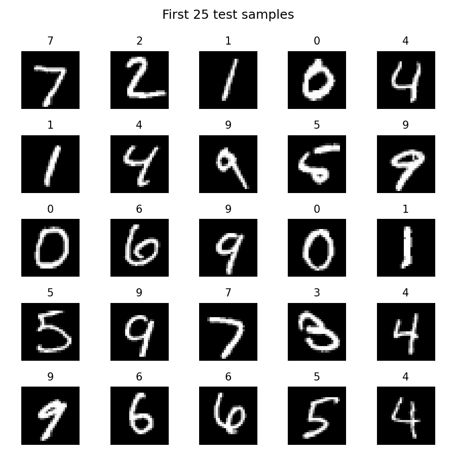
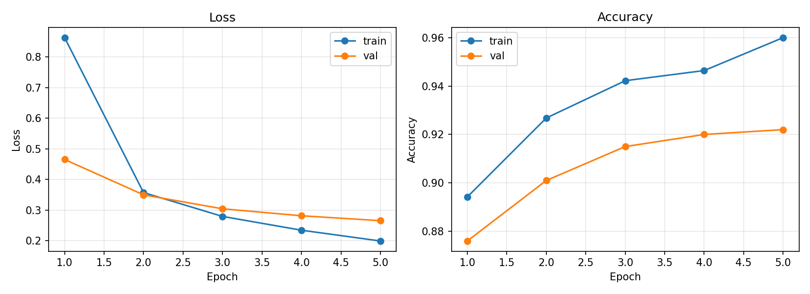

# 00 五分钟上手：训练你的第一个 MNIST 模型

> **前置知识**：Python 基础 + 一点点 NumPy。
> **运行环境**：numpy_keras v2.0.0 / Python 3.12 / NumPy 1.26.4（Apple M2 Pro 实测）。
> **运行时间**：约 15–60 秒（纯 NumPy 模式，与机器负载相关；实测 12.7–58.1 s 之间波动）。
> **随机种子**：`np.random.seed(0)`——本文所有数字均可复现。

## 为什么是 NumPy

如果你学过深度学习，大概已经用过 Keras 或 PyTorch。它们很好，但对初学者有一个共同的问题：**你调的是 API，不知道里面发生了什么**。`model.fit()` 一跑，Loss 在降、准确率在涨，可权重到底怎么更新的、梯度到底怎么传回去的，对大多数人来说是个黑箱。

[numpy_keras](https://github.com/XavierSpycy/NumPy-Keras) 是我写的一个纯 NumPy 教学库：接口长得像 Keras，但每一行实现你都可以点开读，读完就真的懂。它唯一的第三方依赖是 NumPy，没有自动微分框架帮忙——**反向传播是手写的，而且写得刻意像教科书**。

本文先带你跑通第一个模型，之后每篇教程都会翻开对应的源码，把"黑箱"拆成白盒。

## 1. 数据：一次诚实的训练/测试划分

MNIST 是 28×28 的手写数字灰度图，共 10 类。仓库 `data/` 目录下自带了两个 CSV 文件，第一列是标签，后 784 列是像素值（0–255）：

| 文件 | 行数 | 用途 |
|---|---|---|
| `data/mnist_train_small.csv` | 20,000 | 训练集 |
| `data/mnist_test.csv` | 10,000 | 测试集 |

先立一个本系列贯穿始终的规矩：训练和测试**永远来自两个不同的文件**。网上教程动辄 99% 的"测试准确率"，不少是把同一份数据既当训练集又当测试集测出来的——那不是泛化能力，是背答案的能力。测试集准确率是多少就是多少，本系列所有数字都按这个标准来。

加载数据只需要标准库：

```python
# excerpt: 数据加载函数（label-first CSV → NumPy 数组）
def load_mnist(path, n_rows=None):
    """读取 label-first 的 MNIST CSV：第一列是标签，其余 784 列是像素（0-255）。"""
    with open(path) as f:
        rows = list(itertools.islice(csv.reader(f), n_rows))
    y = np.array([int(r[0]) for r in rows])
    X = np.array([[float(v) for v in r[1:]] for r in rows]) / 255.0
    return X, y
```

本文取训练集前 5000 行、测试集前 1000 行，保证整个实验在几十秒内跑完：

```python
# excerpt: 数据加载与划分
X_train, y_train = load_mnist(ROOT / "data" / "mnist_train_small.csv", n_rows=5000)
X_test, y_test = load_mnist(ROOT / "data" / "mnist_test.csv", n_rows=1000)
print(f"训练集: {X_train.shape}, 测试集: {X_test.shape}")
```

测试集的前 25 个样本长这样：



## 2. 模型：两层 MLP

一个 784 维的向量输入，经一层 128 个神经元的隐层，最后输出 10 类的概率分布：

```python
# excerpt: 模型构建
model = keras.Sequential()
model.add(keras.layers.Input(784))
model.add(keras.layers.Dense(128, activation="relu", kernel_initializer="he_normal"))
model.add(keras.layers.Dense(10, activation="softmax"))
model.compile(
    loss="sparse_categorical_crossentropy",
    optimizer="adam",
    metrics=["accuracy"],
)
```

三个值得留意的点：

- **`relu` 配 `he_normal` 初始化**不是随便写的：ReLU 会把一半的神经元输出置 0（信号丢掉一半），而 `he_normal` 按 √(2/fan_in) 缩放权重，恰好把这一半补回来。激活函数与初始化的配对关系，本系列《激活函数全解》会展开。
- **`sparse_categorical_crossentropy`** 意思是"标签直接用整数，不用自己 one-hot"——库内部帮你转换。它的梯度是"预测减标签"的极简形式，因此必须和 `softmax` 配对，本系列《损失函数》会展开。
- **`optimizer="adam"`** 是个字符串快捷方式，也可以传入 `keras.optimizers.Adam(learning_rate=0.001)` 实例细调。Adam 为每个参数维护梯度的一阶、二阶矩滑动平均，步长自适应，本系列《优化器进化史》会展开。

`summary()` 打印模型结构，顺便看到参数量：`784×128 + 128 = 100,480`，`128×10 + 10 = 1,290`，共 101,770 个参数：

```text
Model: Sequential
_________________________________________________________________
Layer (type)         Output Shape         Param #   
=================================================================
input_1              (784,)               0         
dense_1              128                  100,480   
dense_2              10                   1,290     
=================================================================
Total params: 101,770
_________________________________________________________________
```

## 3. 训练与测试

```python
# excerpt: 训练
history = model.fit(
    X_train, y_train,
    batch_size=64, epochs=5, verbose=0,
    validation_data=(X_test, y_test),
)
```

训练结束后，用 `evaluate` 在测试集上评估：

```python
# excerpt: 测试
test_acc = model.evaluate(X_test, y_test, batch_size=64)
print(f"\n测试集准确率: {test_acc:.4f}")
```

每个 epoch 结束后库都会在验证集上算一遍指标，存在 `history` 里。5 个 epoch 的轨迹（`np.random.seed(0)`，可复现）：

```text
epoch 1: loss=0.8631, train_acc=0.8942, val_acc=0.8760
epoch 2: loss=0.3572, train_acc=0.9268, val_acc=0.9010
epoch 3: loss=0.2794, train_acc=0.9422, val_acc=0.9150
epoch 4: loss=0.2343, train_acc=0.9464, val_acc=0.9200
epoch 5: loss=0.1991, train_acc=0.9600, val_acc=0.9220

测试集准确率: 0.9220
```



两个观察：

1. **训练集 96.00%，测试集 92.20%**——这个 3.8 个百分点的差距就是**泛化误差**，是正常且健康的。网上教程动辄 99% 的"测试准确率"，不少就是开头说的那种"同一份数据既当训练又当测试"测出来的。
2. **`evaluate()` 返回的是准确率而不是 loss**。这是库的一个容易被误解的设计：`compile` 时传了 `metrics`，`evaluate` 就返回第一个指标（`sequential.py:104-127`）。想要 loss 就别传 metrics，或直接用 `history` 里的记录。

## 4. 完整代码

下面是可以直接运行的完整脚本（与仓库 `tutorials/code/00_quickstart.py` 完全一致），复制保存后 `python 00_quickstart.py` 即可：

```python
"""00_quickstart.py — 五分钟上手 numpy_keras：训练你的第一个 MNIST 模型

运行方式（在任意目录均可）：
    pip install -e .   # 仓库根目录执行一次
    python tutorials/code/00_quickstart.py

说明：
- 固定全局随机种子 np.random.seed(0)：网络初始化、数据洗牌全部可复现
- 训练集取 data/mnist_train_small.csv 前 5000 行，
  测试集取 data/mnist_test.csv 前 1000 行（两个不同的文件，真实泛化测试）
- 本文所有数字在纯 NumPy 模式下测量（NUMPY_KERAS_DISABLE_CYTHON=1），
  启用 Cython 加速时训练轨迹一致、仅耗时不同
- 环境：Apple M2 Pro / macOS / Python 3.12 / NumPy 1.26.4
"""

import csv
import itertools
import time
from pathlib import Path

import matplotlib
matplotlib.use("Agg")          # 无图形界面（如服务器）也能生成图片
import matplotlib.pyplot as plt
import numpy as np

ROOT = Path(__file__).resolve().parents[2]   # tutorials/code/ 的上级的上级 = 仓库根

import numpy_keras as keras    # pip install -e . 之后任意目录都可导入

ASSETS = ROOT / "tutorials" / "assets"
ASSETS.mkdir(parents=True, exist_ok=True)

np.random.seed(0)              # 全局种子：参数初始化、shuffle 全部可复现


def load_mnist(path, n_rows=None):
    """读取 label-first 的 MNIST CSV：第一列是标签，其余 784 列是像素（0-255）。"""
    with open(path) as f:
        rows = list(itertools.islice(csv.reader(f), n_rows))
    y = np.array([int(r[0]) for r in rows])
    X = np.array([[float(v) for v in r[1:]] for r in rows]) / 255.0
    return X, y


# 1. 数据：训练与测试来自两个不同的文件 —— 这是"测试集"二字的底线
X_train, y_train = load_mnist(ROOT / "data" / "mnist_train_small.csv", n_rows=5000)
X_test, y_test = load_mnist(ROOT / "data" / "mnist_test.csv", n_rows=1000)
print(f"训练集: {X_train.shape}, 测试集: {X_test.shape}")

# 2. 模型：两层 MLP。relu 配合 he_normal 初始化（原因见 01 激活函数一文）
model = keras.Sequential()
model.add(keras.layers.Input(784))
model.add(keras.layers.Dense(128, activation="relu", kernel_initializer="he_normal"))
model.add(keras.layers.Dense(10, activation="softmax"))
model.compile(
    loss="sparse_categorical_crossentropy",
    optimizer="adam",
    metrics=["accuracy"],
)
model.summary()

# 3. 训练：5 个 epoch，验证集独立于训练集
t0 = time.time()
history = model.fit(
    X_train, y_train,
    batch_size=64, epochs=5, verbose=0,
    validation_data=(X_test, y_test),
)
print(f"\n训练耗时: {time.time() - t0:.1f} s\n")

print("每个 epoch 的指标:")
for e in range(len(history["loss"])):
    print(
        f"epoch {e + 1}: loss={history['loss'][e]:.4f}, "
        f"train_acc={history['metrics']['train_accuracy'][e]:.4f}, "
        f"val_acc={history['metrics']['val_accuracy'][e]:.4f}"
    )

# 4. 测试：compile 时传了 metrics，evaluate 返回的是准确率而不是 loss
test_acc = model.evaluate(X_test, y_test, batch_size=64)
print(f"\n测试集准确率: {test_acc:.4f}")

# 5. 配图
fig, axes = plt.subplots(1, 2, figsize=(11, 4))
epochs = range(1, len(history["loss"]) + 1)
axes[0].plot(epochs, history["loss"], "o-", label="train")
axes[0].plot(epochs, history["metrics"]["val_loss"], "o-", label="val")
axes[0].set_title("Loss")
axes[0].set_xlabel("Epoch")
axes[0].set_ylabel("Loss")
axes[0].legend()
axes[0].grid(alpha=0.3)
axes[1].plot(epochs, history["metrics"]["train_accuracy"], "o-", label="train")
axes[1].plot(epochs, history["metrics"]["val_accuracy"], "o-", label="val")
axes[1].set_title("Accuracy")
axes[1].set_xlabel("Epoch")
axes[1].set_ylabel("Accuracy")
axes[1].legend()
axes[1].grid(alpha=0.3)
fig.tight_layout()
fig.savefig(ASSETS / "00_history.png", dpi=150)
plt.close(fig)

fig, axes = plt.subplots(5, 5, figsize=(6, 6))
for ax, img, label in zip(axes.ravel(), X_test[:25], y_test[:25]):
    ax.imshow(img.reshape(28, 28), cmap="gray")
    ax.set_title(str(label), fontsize=10)
    ax.axis("off")
fig.suptitle("First 25 test samples")
fig.tight_layout()
fig.savefig(ASSETS / "00_mnist_samples.png", dpi=150)
plt.close(fig)

print("图片已保存: tutorials/assets/00_history.png, tutorials/assets/00_mnist_samples.png")
```

完整运行输出（纯 NumPy 模式，训练耗时随机器负载波动）：

```text
训练集: (5000, 784), 测试集: (1000, 784)
Model: Sequential
_________________________________________________________________
Layer (type)         Output Shape         Param #   
=================================================================
input_1              (784,)               0         
dense_1              128                  100,480   
dense_2              10                   1,290     
=================================================================
Total params: 101,770
_________________________________________________________________

训练耗时: 41.7 s

每个 epoch 的指标:
epoch 1: loss=0.8631, train_acc=0.8942, val_acc=0.8760
epoch 2: loss=0.3572, train_acc=0.9268, val_acc=0.9010
epoch 3: loss=0.2794, train_acc=0.9422, val_acc=0.9150
epoch 4: loss=0.2343, train_acc=0.9464, val_acc=0.9200
epoch 5: loss=0.1991, train_acc=0.9600, val_acc=0.9220

测试集准确率: 0.9220
图片已保存: tutorials/assets/00_history.png, tutorials/assets/00_mnist_samples.png
```

## 5. 接下来

现在你有一个能跑的白盒了。本系列会把它彻底拆开，从最小的零件开始：激活函数为什么分这么多族、损失函数为什么"分类必选交叉熵"、`fit()` 内部的梯度到底怎么传回去——每一篇都对着源码逐行讲。

**练习**：把 `batch_size` 改成 128，把 `epochs` 改成 10，数字会怎么变？把 `relu`/`he_normal` 换成 `sigmoid`/`glorot_uniform` 再跑一遍——准确率掉多少？这个差距的根源，正是激活函数一篇要讲的核心。
