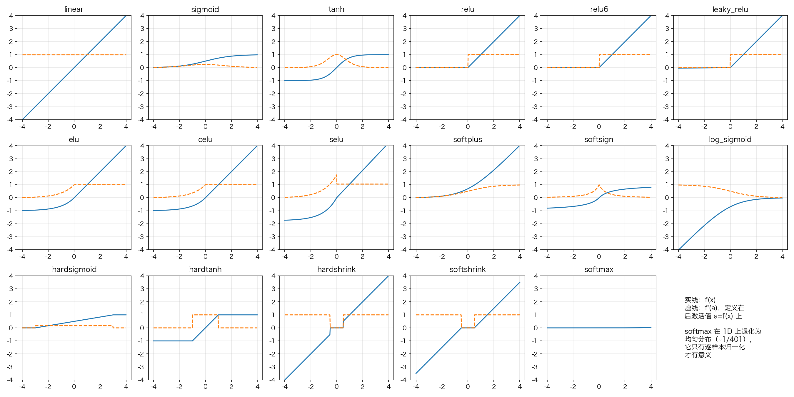
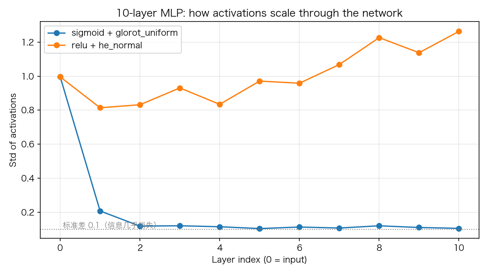

# 01 激活函数全解：17 个函数、导数与梯度消失

> **前置知识**：会跑 `model.fit()`（参见本系列开篇《五分钟上手》）
> **运行环境**：numpy_keras v2.0.0 / Python 3.12 / NumPy 1.26.4（Apple M2 Pro 实测）
> **运行时间**：数秒（本文只有前向与绘图，不训练）
> **随机种子**：`np.random.seed(0)`

## 为什么要激活函数

一个没有激活函数的网络，不管堆多少层，都等价于一层：

$$y = W_2(W_1 x + b_1) + b_2 = (W_2 W_1) x + (W_2 b_1 + b_2)$$

矩阵乘法是线性的，线性复合还是线性。激活函数引入非线性，网络才"深"得有意义。本文把 numpy_keras 里全部 **17 个激活函数**过一遍，并讲清一个贯穿整个库的核心约定：**导数定义在后激活值上**。最后用一个 10 层网络实验，让你亲眼看见"梯度消失"。

## 1. 17 个激活函数

全部实现在 `numpy_keras/activations/functional.py`，画出来是这样的（实线 f(x)，虚线 f'(a)）：



分族来看：

| 家族 | 成员 | 特点 |
|---|---|---|
| 饱和族 | `sigmoid`, `tanh` | 输出有界、平滑；两端导数趋零——梯度消失的元凶，现代网络只在"门控"（如 LSTM）里用 |
| ReLU 族 | `relu`, `relu6`, `leaky_relu`, `elu`, `celu`, `selu` | 正半轴导数恒 1，梯度不衰减；`relu` 是默认选择，负半轴的各种变体各有用途 |
| 平滑/近似族 | `softplus`, `softsign`, `log_sigmoid`, `hardsigmoid`, `hardtanh` | `hardsigmoid`/`hardtanh` 是 sigmoid/tanh 的廉价近似（适合硬件加速） |
| shrink 族 | `hardshrink`, `softshrink` | 把小信号压成 0，稀疏编码用的冷门工具 |
| 归一化 | `softmax` | 把任意向量变成概率分布，**只放在分类输出层** |
| 恒等 | `linear` | 就是 f(x)=x，回归任务的输出层用它 |

注意图里 `softmax` 是一条贴着 0 的横线：它在 1D 输入上退化成均匀分布（每个值 ≈ 1/401），因为 softmax 的语义是**逐样本归一化**，只有在"一个样本输出一个向量"时才有意义。还有 `selu` 这种自带归一化特性的函数（论文证明在特定条件下 SELU 网络输出会自归一化），但本系列不做理论展开，重点是学会读它们。

## 2. 核心约定：导数定义在后激活值上

打开 `numpy_keras/activations/functional.py`，看 sigmoid 的导数：

```python
# excerpt: numpy_keras/activations/functional.py
def sigmoid_deriv(a):
    return a * (1 - a)
```

注意参数名是 `a` 而不是 `x`：**它接收的是激活函数的输出 a = f(x)，不是预激活值 x**。数学上 σ'(x) = σ(x)(1 − σ(x))，而 σ(x) 恰好就是 a，所以两种写法都成立；但对 tanh：

```python
# excerpt: numpy_keras/activations/functional.py
def tanh_deriv(a):
    return 1 - a ** 2
```

tanh'(x) = 1 − tanh²(x) = 1 − a²。写成"a 的函数"之后，**反向传播时直接用缓存的前向输出 a 就能算导数，不需要重新计算 tanh(x)**。这是实现上的刻意设计：层在前向时缓存的是后激活输出，backward 拿到它就能求导。而且**每层只对自己的激活负责**——你在《反向传播逐行拆解》里会看到完整链条，这里先看 `Dense.backward` 的关键几行：

```python
# excerpt: numpy_keras/layers/dense.py
        # own activation, evaluated on the cached post-activation output:
        # dz = grad ⊙ f'(y); the parameter gradients use dz, and dx = dz @ W.T
        grad = self.__activation_mapper.backward(
            self.__activation, self.output, grad, self.__activation_config)
        self.grads["W"] = np.dot(self.inputs.T, grad)
        if "b" in self.grads:
            self.grads["b"] = np.sum(grad, axis=0)
        return np.dot(grad, self.params["W"].T)
```

`self.output` 是本层前向时缓存的激活输出 a——`f'(a)` 就在这上面取值。梯度先乘自己的导数（∂L/∂z = ∂L/∂y ⊙ f'(y)），再用来算 dW/db 并传回上一层。**上一层的激活由上一层自己处理**，每个导数在网络里恰好被应用一次——由构造保证，不需要任何跨层约定。

两个实现细节值得知道：

- **`softmax` 没有逐元素导数**：`_ActivationMapper` 里只有 `softmax` 本身。softmax 的雅可比矩阵不是逐元素的——它由 softmax 层在自己的 backward 里做**雅可比乘积**完成（《损失函数》一篇推导了完整过程并验证）。
- **`linear_deriv` 返回标量 `1`**（而不是全 1 数组）：导数恒为 1，写成标量也成立，链式法则乘它等于没乘，所以 `mapper.backward` 对 `linear`/`None` 原样返回梯度。

## 3. 梯度消失：从数学到实验

饱和族的问题在于导数上界。用库实测：

```python
# excerpt: 梯度消失的数学根源
grid = np.linspace(0, 1, 10001)
sigmoid_max_deriv = float(np.max(F.sigmoid_deriv(grid)))
print(f"sigmoid 导数的最大值: {sigmoid_max_deriv:.4f}")
print(f"tanh 导数在 a=0 处: {F.tanh_deriv(0.0):.4f}")
print(f"relu 导数在 a>0 处: {F.relu_deriv(1.0):.4f}")
print(f"10 层 sigmoid 链的导数乘积上界: {sigmoid_max_deriv ** 10:.2e}")
```

输出：

```text
sigmoid 导数的最大值: 0.2500
tanh 导数在 a=0 处: 1.0000
relu 导数在 a>0 处: 1.0000
10 层 sigmoid 链的导数乘积上界: 9.54e-07
```

链式法则把 10 个导数乘起来，sigmoid 链的上界是 0.25¹⁰ ≈ 1e-6——**梯度传到第一层时已经缩小了一百万倍**，前面的层几乎学不到东西。relu 的导数在正半轴恒为 1，梯度原样穿过。

前向侧也有对应的现象：信号逐层衰减。搭一个 10 层 MLP，不做训练，只看激活值的标准差如何随层数变化：

```python
# excerpt: 10 层 MLP 前向实验
def build_chain(activation, initializer):
    model = keras.Sequential()
    model.add(keras.layers.Input(64))
    for _ in range(10):
        model.add(keras.layers.Dense(
            64, activation=activation, kernel_initializer=initializer))
    return model


def layer_stds(model, x):
    """逐层前向，记录每层输出的标准差（Input 层无 forward，直接跳过）。"""
    stds = [float(x.std())]
    a = x
    for layer in model.layers.values():
        if not hasattr(layer, "forward"):
            continue
        a = layer.forward(a, is_training=False)
        stds.append(float(a.std()))
    return stds
```

输入标准差 1.0 的高斯信号，两条链的对比：

```text
sigmoid + glorot_uniform 各层激活标准差: 1.00 0.21 0.12 0.12 0.12 0.11 0.11 0.11 0.12 0.11 0.11
      relu + he_normal 各层激活标准差: 1.00 0.81 0.83 0.93 0.83 0.97 0.96 1.07 1.23 1.14 1.26
```



sigmoid 链第一层就把信号压到 0.21，之后停在 0.11 附近；relu 链的信号则稳定在 1.0 上下波动。**这不是运气，是初始化刻意设计的结果**：He 初始化按 `sqrt(2/fan_in)` 缩放权重，恰好补偿 ReLU 丢掉的一半方差。

## 4. 实践建议

| 场景 | 选择 |
|---|---|
| 隐藏层默认 | `relu` + `he_normal`（即 `kernel_initializer="he_normal"`） |
| 隐藏层备选 | `leaky_relu`、`elu`（对"死亡 ReLU"敏感的场合） |
| 二分类/门控 | `sigmoid`；RNN 内部的门与候选（见本系列《RNN 三部曲》） |
| 多分类输出层 | `softmax` + 交叉熵（为什么必须配对，《损失函数》一篇有答案） |
| 回归输出层 | `linear` |

## 5. 完整代码

```python
"""01_activations.py — 激活函数全解：17 个函数、导数与梯度消失

运行方式（在任意目录均可）：
    pip install -e .   # 仓库根目录执行一次
    python tutorials/code/01_activations.py

说明：
- 画出库里全部 17 个激活函数及其导数；导数按库的约定定义在
  **后激活值** a = f(x) 上（f'(a)），图中虚线即 f'(f(x))
- 用一个 10 层 MLP 的纯前向实验展示梯度消失：sigmoid+glorot 与
  relu+he_normal 两条链，逐层激活标准差对比
- 固定种子 np.random.seed(0)，数字可复现；纯 NumPy 模式与
  Cython 模式结果一致（本文只有前向，不涉及内核）
- 环境：Apple M2 Pro / macOS / Python 3.12 / NumPy 1.26.4
"""

from pathlib import Path

import matplotlib
matplotlib.use("Agg")
import matplotlib.pyplot as plt
import numpy as np

# 中文字体回退链：macOS 用苹方、Windows 用雅黑，其他系统退化为英文渲染
plt.rcParams["font.sans-serif"] = [
    "PingFang SC", "Hiragino Sans GB", "Arial Unicode MS",
    "Microsoft YaHei", "sans-serif",
]
plt.rcParams["axes.unicode_minus"] = False

ROOT = Path(__file__).resolve().parents[2]

import numpy_keras as keras
from numpy_keras.activations import functional as F

ASSETS = ROOT / "tutorials" / "assets"
ASSETS.mkdir(parents=True, exist_ok=True)

np.random.seed(0)

# 1. 17 个激活函数及其导数（softmax 无导数，见 02 损失函数）
X = np.linspace(-4, 4, 401)
ACTIVATIONS = [
    "linear", "sigmoid", "tanh", "relu", "relu6", "leaky_relu",
    "elu", "celu", "selu", "softplus", "softsign", "log_sigmoid",
    "hardsigmoid", "hardtanh", "hardshrink", "softshrink", "softmax",
]

fig, axes = plt.subplots(3, 6, figsize=(18, 9))
for ax, name in zip(axes.ravel(), ACTIVATIONS):
    f = getattr(F, name)
    y = f(X)
    ax.plot(X, y, label="f(x)")
    if name != "softmax":           # softmax 没有导数（设计如此，见正文）
        deriv = getattr(F, name + "_deriv")
        d = deriv(y)
        # linear_deriv 返回标量 1（导数恒为 1，写成标量也成立）
        d = np.full_like(y, d) if np.isscalar(d) else d
        ax.plot(X, d, "--", label="f'(a)")
    ax.set_title(name)
    ax.grid(alpha=0.3)
    ax.set_ylim(-4, 4)
axes.ravel()[-1].axis("off")
axes.ravel()[-1].text(0.1, 0.5,
    "实线：f(x)\n虚线：f'(a)，定义在\n后激活值 a=f(x) 上\n\nsoftmax 在 1D 上退化为\n均匀分布（~1/401），\n它只有逐样本归一化\n才有意义",
    fontsize=11, va="center")
fig.tight_layout()
fig.savefig(ASSETS / "01_activations.png", dpi=150)
plt.close(fig)

# 2. 梯度消失的数学根源：导数的上界
grid = np.linspace(0, 1, 10001)
sigmoid_max_deriv = float(np.max(F.sigmoid_deriv(grid)))
print(f"sigmoid 导数的最大值: {sigmoid_max_deriv:.4f}")
print(f"tanh 导数在 a=0 处: {F.tanh_deriv(0.0):.4f}")
print(f"relu 导数在 a>0 处: {F.relu_deriv(1.0):.4f}")
print(f"10 层 sigmoid 链的导数乘积上界: {sigmoid_max_deriv ** 10:.2e}")

# 3. 前向实验：10 层 MLP，逐层激活标准差
def build_chain(activation, initializer):
    model = keras.Sequential()
    model.add(keras.layers.Input(64))
    for _ in range(10):
        model.add(keras.layers.Dense(
            64, activation=activation, kernel_initializer=initializer))
    return model


def layer_stds(model, x):
    """逐层前向，记录每层输出的标准差（Input 层无 forward，直接跳过）。"""
    stds = [float(x.std())]
    a = x
    for layer in model.layers.values():
        if not hasattr(layer, "forward"):
            continue
        a = layer.forward(a, is_training=False)
        stds.append(float(a.std()))
    return stds


x = np.random.randn(1000, 64)
chains = [
    ("sigmoid + glorot_uniform", build_chain("sigmoid", "glorot_uniform")),
    ("relu + he_normal", build_chain("relu", "he_normal")),
]
for name, model in chains:
    stds = layer_stds(model, x)
    print(f"{name:>22} 各层激活标准差: " + " ".join(f"{s:.2f}" for s in stds))

fig, ax = plt.subplots(figsize=(8, 4.5))
for name, model in chains:
    ax.plot(range(11), layer_stds(model, x), "o-", label=name)
ax.axhline(0.1, color="gray", ls=":", lw=1)
ax.text(0, 0.1, " 标准差 0.1（信息几乎消失）", va="bottom", fontsize=9, color="gray")
ax.set_xlabel("Layer index (0 = input)")
ax.set_ylabel("Std of activations")
ax.set_title("10-layer MLP: how activations scale through the network")
ax.legend()
ax.grid(alpha=0.3)
fig.tight_layout()
fig.savefig(ASSETS / "01_vanishing.png", dpi=150)
plt.close(fig)

print("图片已保存: tutorials/assets/01_activations.png, tutorials/assets/01_vanishing.png")
```

完整运行输出：

```text
sigmoid 导数的最大值: 0.2500
tanh 导数在 a=0 处: 1.0000
relu 导数在 a>0 处: 1.0000
10 层 sigmoid 链的导数乘积上界: 9.54e-07
sigmoid + glorot_uniform 各层激活标准差: 1.00 0.21 0.12 0.12 0.12 0.11 0.11 0.11 0.12 0.11 0.11
      relu + he_normal 各层激活标准差: 1.00 0.81 0.83 0.93 0.83 0.97 0.96 1.07 1.23 1.14 1.26
图片已保存: tutorials/assets/01_activations.png, tutorials/assets/01_vanishing.png
```

## 6. 小结

- 激活函数引入非线性，否则多层网络坍缩成一层
- 库的约定：**f'(a) 定义在后激活值上，且由本层自己在 backward 里应用**——每层只对自己的激活负责，每个导数恰好被应用一次（由构造保证）
- softmax 没有导数——正确写法必须和交叉熵合并，下一篇揭晓
- 梯度消失有两个面孔：导数上界（sigmoid 0.25）与信号衰减（前向）；relu + He 初始化是标准解药
- 实验对不上理论时，去读源码——最小实验是检验理解的试金石

**练习**：回到《五分钟上手》里的模型，把 `relu`/`he_normal` 换成 `tanh`/`glorot_uniform`，同样 5 个 epoch，准确率差多少？再试试把隐层换成 `leaky_relu`——它和 `relu` 的差别在什么情况下才会显现？

下一篇：《损失函数：MSE 与交叉熵》——softmax 为什么没有导数，答案在那里。
