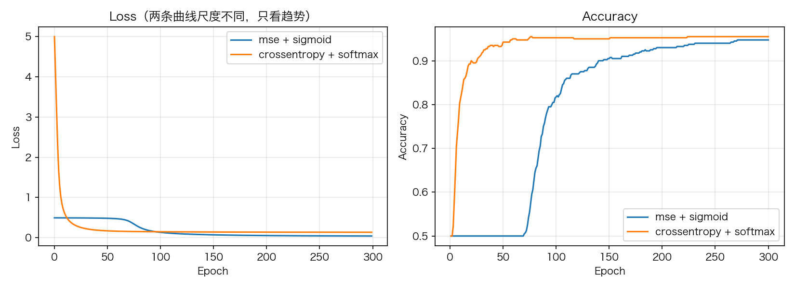

# 02 损失函数：MSE 与交叉熵，softmax+CE 的隐藏合体

> **前置知识**：本系列《五分钟上手》与《激活函数全解》（特别是 softmax 没有导数一节）
> **运行环境**：numpy_keras v2.0.0 / Python 3.12 / NumPy 1.26.4（Apple M2 Pro 实测）
> **运行时间**：约 20–60 秒（两个 300 epoch 的单神经元训练）
> **随机种子**：`np.random.seed(0)`

## 损失函数在训练循环里的位置

损失函数是整个反向传播的**种子**。每个 batch 的训练循环就三件事：前向算出预测 `y_hat`，损失函数给出标量 loss 和梯度 grad，然后把 grad 从最后一层传回去。numpy_keras 里这一步叫 `__criterion`（`numpy_keras/models/sequential.py`）：

```python
# excerpt: numpy_keras/models/sequential.py
        loss = self.__loss_func(y, y_hat)
        grad = self.__loss_func.grad(y, y_hat)
```

所以损失函数有两个职责：`__call__` 报一个标量给人类看（训练曲线），`grad` 报一个梯度给优化器用。本文把库里的两个损失函数拆开讲：**MSE** 和**交叉熵**，并回答上一篇文章留下的悬念——**softmax 为什么没有导数**。

## 1. MSE：回归的默认选择

```python
# excerpt: numpy_keras/losses/mse.py
    def grad(
            self, 
            y_true: np.ndarray, 
            y_pred: np.ndarray,
        ) -> np.ndarray:
        return -2 * (y_true - y_pred) / y_true.size
```

$$L = \frac{1}{N}\sum (y - \hat y)^2, \qquad \frac{\partial L}{\partial \hat y} = -\frac{2(y - \hat y)}{N}$$

MSE 的语义是"距离的平方"，天然适合**回归**（预测房价、温度这种连续值）。它假设误差服从高斯分布——分类任务不满足这个假设，强行用 MSE 做分类会遇到本文第 3 节的"学习减速"。

## 2. 交叉熵：分类的默认选择

```python
# excerpt: numpy_keras/losses/categorical_crossentropy.py
        y_pred_clipped = np.clip(y_pred, 1e-10, 1 - 1e-10)
        return -np.sum(y_true * np.log(y_pred_clipped)) / y_true.shape[0]
```

$$L = -\frac{1}{N}\sum_i \sum_c y_{i,c} \log \hat y_{i,c}$$

三个实现细节：

1. **`np.clip(..., 1e-10, 1-1e-10)`**：log(0) 是 −∞，clamp 到一个很小的正数区间，数值稳定且损失函数输出永远有限。注意 grad 里用的是**同一个** clipped 值——保证 loss 和 grad 自洽。
2. **`sparse_categorical_crossentropy` 只是名字别名**：`losses/_mapper.py` 里它构造的是 `CategoricalCrossEntropy(name="sparse_categorical_crossentropy")`，数学完全一样。"稀疏"的差异发生在 `Sequential.fit` 里——看到这个名字就把整数标签 one-hot 化，你只是省了手工 `one_hot_encode` 这一步。
3. **它必须和 softmax 配对**。原因就是那个"隐藏的合体"。

## 3. 隐藏的合体：softmax + CE 的梯度

01 篇留了个悬念：`_ActivationMapper` 里没有 `softmax_deriv`。答案与库的层间约定有关：**每层只对自己的激活负责**。criterion 只做两件事——算损失、算损失对预测的原始梯度（`numpy_keras/models/sequential.py`）：

```python
# excerpt: numpy_keras/models/sequential.py
        y = asarray(y)             # move labels to the same device as y_hat
        if y.dtype != y_hat.dtype:
            # follow the model dtype, or a float64 y would promote a
            # float32 model's loss/gradients back to float64
            y = asarray(y, dtype=y_hat.dtype)
        loss = self.__loss_func(y, y_hat)
        grad = self.__loss_func.grad(y, y_hat)
        if grad.dtype != y_hat.dtype:
            # same promotion leak on the gradient side (loss functions
            # like CCE clip with Python scalars)
            grad = asarray(grad, dtype=y_hat.dtype)
        # Each layer chains through its own activation inside its backward,
        # so the criterion only computes the loss and its gradient w.r.t.
        # the network output.
        return item(loss), grad
```

softmax 层的 backward 拿到 ∂L/∂ŷ 后，用**雅可比乘积**穿回 logits——softmax 没有逐元素导数，这是唯一正确的穿法。动手验证（`np.random.seed(0)`）：

```python
# excerpt: 合体梯度验证
z = np.array([[-1.0, 2.0, 0.5]])            # 预激活 logits（单个样本）
y = np.array([[0.0, 1.0, 0.0]])             # one-hot 标签
y_hat = F.softmax(z)
print(f"  y_hat = softmax(z) = {y_hat[0]}")

# CE 对 softmax 输出的梯度: ∂L/∂ŷ = -y / ŷ / N
grad_wrt_yhat = -y / np.clip(y_hat, 1e-10, 1 - 1e-10) / y.shape[0]
# softmax 的雅可比: J[i, j] = ŷ_i * (δ_ij - ŷ_j)
J = y_hat[:, :, None] * (np.eye(3)[None, :, :] - y_hat[:, None, :])
# 链式法则: ∂L/∂z = (∂L/∂ŷ) @ J
grad_by_chain = np.einsum("bi,bij->bj", grad_wrt_yhat, J)
# 库的两步走：CE 返回对 ŷ 的原始梯度，softmax 层在自己的 backward 里
# 做雅可比乘积（每层自持激活导数的约定）
ce = keras.losses.CategoricalCrossEntropy()
grad_by_lib = _ActivationMapper().backward("softmax", y_hat, ce.grad(y, y_hat), {})
print(f"  链式法则手算 ∂L/∂z = {grad_by_chain[0]}")
print(f"  库（softmax 层 backward）∂L/∂z = {grad_by_lib[0]}")
print(f"  两者一致: {np.allclose(grad_by_chain, grad_by_lib)}")
```

```text
  y_hat = softmax(z) = [0.03911257 0.78559703 0.17529039]
  链式法则手算 ∂L/∂z = [ 0.03911257 -0.21440297  0.17529039]
  库（softmax 层 backward）∂L/∂z = [ 0.03911257 -0.21440297  0.17529039]
  两者一致: True
```

手推的链条：∂L/∂ŷ = −y/ŷ/N；softmax 的雅可比 J[i,j] = ŷᵢ(δᵢⱼ − ŷⱼ)；两者相乘逐项抵消，化简后 ∂L/∂z = (ŷ − y)/N——**一个"预测减标签"的极简形式**。所以库不需要 `softmax_deriv`：CE 的 `grad` 只返回原始形式（`categorical_crossentropy.py` 里那句 `return -y_true / y_pred_clipped / N`），softmax 层的 backward 完成剩下的雅可比乘积。这也带来一个语义升级：**softmax 不再必须配交叉熵**——雅可比乘积对任何损失都成立，softmax + MSE 在数学上同样是正确的（只是实践上依然不推荐）。

顺带看数值稳定（脚本第一部分）：`np.exp(1000)` 溢出成 `inf`，但 `softmax([1000,1000,1000])` 平安无事——因为实现里先减了行最大值再 exp，这是 softmax 的标准写法。

## 4. 学习减速实验：为什么分类不用 MSE

故事从一个"刻意使坏"的初始化讲起：单神经元模型，`W=0、b=5`，sigmoid 输出 ≈ 0.993——**自信地错**（一半样本预测反了）。这时候 sigmoid 的导数 σ'(0.993) ≈ 0.0067，几乎为零。

MSE 的梯度要经过 sigmoid 导数（`__criterion` 会乘上最后一层的 `sigmoid_deriv`，01 篇讲过这个约定），于是梯度被压到几乎为零；交叉熵的梯度是 (ŷ−y)/N，**没有这个因子**。同样从"自信地错"出发，两者差距一目了然：

```python
# excerpt: 学习减速实验的模型构造
def build_single_neuron(mode):
    m = keras.Sequential()
    m.add(keras.layers.Input(2))
    if mode == "mse":
        m.add(keras.layers.Dense(1, activation="sigmoid"))
        m.compile(loss="mse", optimizer="sgd")
    else:
        m.add(keras.layers.Dense(2, activation="softmax"))
        m.compile(loss="sparse_categorical_crossentropy", optimizer="sgd")
    m.optimizer.learning_rate = 0.6
    # 刻意"自信地错"：W=0、b 拉大，初始预测 ≈ 0.993 却错一半样本
    last = list(m.layers.values())[-1]
    last.params["W"][:] = 0.0
    last.params["b"][:] = np.array([5.0] if mode == "mse" else [5.0, -5.0])
    return m
```

400 个样本全批量 SGD，300 轮（lr=0.6，两个模型同种子）：

```text
           mse + sigmoid: 第   5 轮准确率 0.5000
           mse + sigmoid: 第  20 轮准确率 0.5000
           mse + sigmoid: 第 100 轮准确率 0.8175
           mse + sigmoid: 第 300 轮准确率 0.9475
  crossentropy + softmax: 第   5 轮准确率 0.6400
  crossentropy + softmax: 第  20 轮准确率 0.9000
  crossentropy + softmax: 第 100 轮准确率 0.9525
  crossentropy + softmax: 第 300 轮准确率 0.9550
```



MSE 模型前 20 轮**纹丝不动**（准确率钉死在 0.50），而交叉熵第 20 轮已经 0.90。这个现象叫 **learning slowdown（学习减速）**：当预测"错得很自信"时，饱和激活的导数把 MSE 的梯度压没了，网络学得极慢——直到预测被慢慢拖回非饱和区才恢复。交叉熵没有这个因子，起步就是满速。

两个诚实的补充：第一，这个实验刻意放大了效应（单神经元 + 自信地错 + 全批量）；实践中用 relu 隐层和正常初始化，MSE 的减速没那么夸张——但"分类用交叉熵"仍是唯一正确的默认。第二，MSE 最终也能爬到 0.9475，说明它不是学不会，是学得慢。

## 5. 完整代码

```python
"""02_losses.py — 损失函数：MSE 与交叉熵，softmax+CE 的隐藏合体

运行方式（在任意目录均可）：
    pip install -e .   # 仓库根目录执行一次
    python tutorials/code/02_losses.py

说明：
- 第一部分验证 softmax+CE 的"合体梯度"：CE 对 softmax 输出的原始梯度
  乘上 softmax 的雅可比矩阵，化简后就是 (y_hat - y)/N —— 库里由
  softmax 层在自己的 backward 里做这个雅可比乘积（CE 只返回对 ŷ 的
  原始梯度），所以 softmax 不需要独立的逐元素导数
- 第二部分在同一个二分类玩具数据上训练两个同样的单神经元模型，
  一个用 MSE、一个用稀疏交叉熵，对比收敛速度与最终准确率
- 固定种子 np.random.seed(0)，数字可复现
- 环境：Apple M2 Pro / macOS / Python 3.12 / NumPy 1.26.4
"""

from pathlib import Path

import matplotlib
matplotlib.use("Agg")
import matplotlib.pyplot as plt
import numpy as np

# 中文字体回退链：macOS 用苹方、Windows 用雅黑，其他系统退化为英文渲染
plt.rcParams["font.sans-serif"] = [
    "PingFang SC", "Hiragino Sans GB", "Arial Unicode MS",
    "Microsoft YaHei", "sans-serif",
]
plt.rcParams["axes.unicode_minus"] = False

ROOT = Path(__file__).resolve().parents[2]

import numpy_keras as keras
from numpy_keras.activations import functional as F
from numpy_keras.activations._mapper import _ActivationMapper

ASSETS = ROOT / "tutorials" / "assets"
ASSETS.mkdir(parents=True, exist_ok=True)

np.random.seed(0)

# 1. softmax 的数值稳定：先减最大值，exp 永不溢出
print("softmax 数值稳定:")
with np.errstate(over="ignore"):
    print(f"  np.exp(1000) = {np.exp(1000)}")
print(f"  softmax([1000, 1000, 1000]) = {F.softmax(np.array([[1000., 1000., 1000.]]))[0]}")

# 2. softmax + CE 的合体梯度：雅可比矩阵 × CE 梯度 = (y_hat - y)/N
print("\nsoftmax+CE 合体梯度验证:")
z = np.array([[-1.0, 2.0, 0.5]])            # 预激活 logits（单个样本）
y = np.array([[0.0, 1.0, 0.0]])             # one-hot 标签
y_hat = F.softmax(z)
print(f"  y_hat = softmax(z) = {y_hat[0]}")

# CE 对 softmax 输出的梯度: ∂L/∂ŷ = -y / ŷ / N
grad_wrt_yhat = -y / np.clip(y_hat, 1e-10, 1 - 1e-10) / y.shape[0]
# softmax 的雅可比: J[i, j] = ŷ_i * (δ_ij - ŷ_j)
J = y_hat[:, :, None] * (np.eye(3)[None, :, :] - y_hat[:, None, :])
# 链式法则: ∂L/∂z = (∂L/∂ŷ) @ J
grad_by_chain = np.einsum("bi,bij->bj", grad_wrt_yhat, J)
# 库的两步走：CE 返回对 ŷ 的原始梯度，softmax 层在自己的 backward 里
# 做雅可比乘积（每层自持激活导数的约定）
ce = keras.losses.CategoricalCrossEntropy()
grad_by_lib = _ActivationMapper().backward("softmax", y_hat, ce.grad(y, y_hat), {})
print(f"  链式法则手算 ∂L/∂z = {grad_by_chain[0]}")
print(f"  库（softmax 层 backward）∂L/∂z = {grad_by_lib[0]}")
print(f"  两者一致: {np.allclose(grad_by_chain, grad_by_lib)}")

# 3. 学习减速实验：MSE vs 交叉熵
#    经典设计（Nielsen《Neural Networks and Deep Learning》第 3 章同款）：
#    单神经元、全批量 SGD、并且刻意"自信地错"——W=0、b 拉大，
#    初始预测 ≈ 0.993 却错一半样本，让 sigmoid 导数接近 0。
#    MSE 的梯度带着 sigmoid'(ŷ) 因子，会被压得几乎不动；
#    交叉熵的梯度没有这个因子，起步就快。
def make_blobs(n=200, seed=0):
    rng = np.random.default_rng(seed)
    centers = np.array([[1.0, 1.0], [-1.0, -1.0]])
    X = np.vstack([rng.normal(c, 0.9, (n, 2)) for c in centers])
    y = np.array([0] * n + [1] * n)
    idx = rng.permutation(2 * n)
    return X[idx], y[idx]


X, y = make_blobs()
print(f"\n玩具数据: {X.shape}, 标签 {np.unique(y)}")


class AccTracker:
    """每个 epoch 结束时评估准确率（callback 的 on_epoch_end 钩子）。"""

    def __init__(self, X, y, mode):
        self.X, self.y, self.mode = X, y, mode
        self.accs = []

    def on_epoch_end(self, model=None):
        pred = model.predict(self.X)
        if self.mode == "mse":
            pred = (pred > 0.5).astype(int)              # sigmoid 输出按 0.5 定类
        self.accs.append(float(np.mean(pred == self.y)))


def build_single_neuron(mode):
    m = keras.Sequential()
    m.add(keras.layers.Input(2))
    if mode == "mse":
        m.add(keras.layers.Dense(1, activation="sigmoid"))
        m.compile(loss="mse", optimizer="sgd")
    else:
        m.add(keras.layers.Dense(2, activation="softmax"))
        m.compile(loss="sparse_categorical_crossentropy", optimizer="sgd")
    m.optimizer.learning_rate = 0.6
    # 刻意"自信地错"：W=0、b 拉大，初始预测 ≈ 0.993 却错一半样本
    last = list(m.layers.values())[-1]
    last.params["W"][:] = 0.0
    last.params["b"][:] = np.array([5.0] if mode == "mse" else [5.0, -5.0])
    return m


histories, acc_curves = {}, {}
for name, mode in [
        ("mse + sigmoid", "mse"),
        ("crossentropy + softmax", "ce"),
    ]:
    np.random.seed(0)                                    # 两个模型同种子、同初始化条件
    m = build_single_neuron(mode)
    tracker = AccTracker(X, y, mode)
    y_fit = y.astype(float).reshape(-1, 1) if mode == "mse" else y
    h = m.fit(X, y_fit, batch_size=400, epochs=300, verbose=0, callbacks=[tracker])
    histories[name] = h
    acc_curves[name] = tracker.accs
    for ep in (4, 19, 99, 299):
        print(f"{name:>24}: 第 {ep + 1:>3} 轮准确率 {tracker.accs[ep]:.4f}")

fig, axes = plt.subplots(1, 2, figsize=(11, 4))
for name in histories:
    axes[0].plot(histories[name]["loss"], label=name)
axes[0].set_title("Loss（两条曲线尺度不同，只看趋势）")
axes[0].set_xlabel("Epoch")
axes[0].set_ylabel("Loss")
axes[0].legend()
axes[0].grid(alpha=0.3)
for name in acc_curves:
    axes[1].plot(range(1, len(acc_curves[name]) + 1), acc_curves[name], label=name)
axes[1].set_title("Accuracy")
axes[1].set_xlabel("Epoch")
axes[1].set_ylabel("Accuracy")
axes[1].legend()
axes[1].grid(alpha=0.3)
fig.tight_layout()
fig.savefig(ASSETS / "02_mse_vs_ce.png", dpi=150)
plt.close(fig)

print("\n图片已保存: tutorials/assets/02_mse_vs_ce.png")
```

完整运行输出：

```text
softmax 数值稳定:
  np.exp(1000) = inf
  softmax([1000, 1000, 1000]) = [0.33333333 0.33333333 0.33333333]

softmax+CE 合体梯度验证:
  y_hat = softmax(z) = [0.03911257 0.78559703 0.17529039]
  链式法则手算 ∂L/∂z = [ 0.03911257 -0.21440297  0.17529039]
  库（softmax 层 backward）∂L/∂z = [ 0.03911257 -0.21440297  0.17529039]
  两者一致: True

玩具数据: (400, 2), 标签 [0 1]
           mse + sigmoid: 第   5 轮准确率 0.5000
           mse + sigmoid: 第  20 轮准确率 0.5000
           mse + sigmoid: 第 100 轮准确率 0.8175
           mse + sigmoid: 第 300 轮准确率 0.9475
  crossentropy + softmax: 第   5 轮准确率 0.6400
  crossentropy + softmax: 第  20 轮准确率 0.9000
  crossentropy + softmax: 第 100 轮准确率 0.9525
  crossentropy + softmax: 第 300 轮准确率 0.9550

图片已保存: tutorials/assets/02_mse_vs_ce.png
```

## 6. 小结

- 损失函数是反向传播的种子：`__call__` 给人类看标量，`grad` 给优化器用梯度
- MSE 的梯度带 sigmoid' 因子 → "自信地错"时学习减速；交叉熵没有这个因子
- **softmax + CE 的合体梯度 = (ŷ − y)/N**：CE 返回原始梯度，softmax 层用雅可比乘积收尾——库因此不需要 `softmax_deriv`，且 softmax 现在对任何损失都数学正确
- `sparse_categorical_crossentropy` 是名字别名，one-hot 发生在 `fit` 内部
- 数值稳定无处不在：CE 的 clip(1e-10)，softmax 的减最大值

**练习**：把实验里的 `b` 从 5.0 改成 0.5（不那么自信地错），MSE 的减速还会那么夸张吗？再试试把 `learning_rate` 从 0.6 提到 2.0——MSE 会不会开始震荡？这两个现象在《优化器进化史》和《学习率与调度器》里都会再见面。

下一篇：《反向传播逐行拆解》——把 `fit()` 的引擎室拆开，用有限差分亲手验证上面所有梯度。
