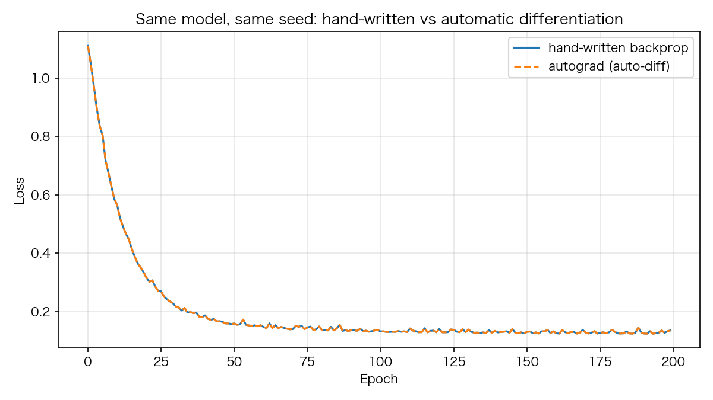

# 03 反向传播逐行拆解：链式法则、数值梯度校验与 autograd 对照

> **前置知识**：本系列《激活函数全解》（导数定义在后激活值上）与《损失函数》（criterion 是梯度的种子）
> **运行环境**：numpy_keras v2.0.0 / Python 3.12 / NumPy 1.26.4（Apple M2 Pro 实测）
> **运行时间**：约 10–30 秒（两个 200 epoch 的小模型训练）
> **随机种子**：`np.random.seed(0)`

## 反向传播是训练循环的第三步

`fit()` 的每个 batch 只有四件事：

```text
y_hat        = 前向传播          # __forward
loss, grad   = 损失函数          # __criterion  ← 梯度的"种子"
grad         = 反向传播          # __backward   ← 本文的主角
params       = 优化器更新        # optimizer.update  ← 下一篇的主角
```

反向传播的全部任务：**拿到种子梯度 ∂L/∂ŷ，沿着计算图一层层倒推，算出每个参数的 ∂L/∂W**。本文把 numpy_keras 的 `__backward` 逐行拆开，然后用两种独立方法证明它是对的：有限差分（数值梯度）和 autograd（自动微分）。

## 1. 链式法则：三层就够

一个两层的 MLP：a₁ = f₁(W₁x + b₁)，ŷ = f₂(W₂a₁ + b₂)，L = loss(y, ŷ)。对 W₂ 求梯度，链式法则走两步：

$$\frac{\partial L}{\partial W_2} = a_1^\top \cdot \frac{\partial L}{\partial z_2}, \qquad \frac{\partial L}{\partial z_1} = \left(\frac{\partial L}{\partial \hat y} \odot f_2'(\hat y)\right) \cdot W_2^\top, \qquad \frac{\partial L}{\partial x} = \frac{\partial L}{\partial z_1} \cdot W_1^\top$$

其中 z₁ = W₁x + b₁ 是第一个隐层的预激活。每个等式的含义：**先乘自己的激活导数得到 ∂L/∂z，再做矩阵乘**。01 篇说过导数定义在后激活值上——f'(y) 就在本层前向时缓存的输出上取值。看库里的实现（`numpy_keras/layers/dense.py` 的纯 NumPy 路径）：

```python
# excerpt: numpy_keras/layers/dense.py
        # own activation, evaluated on the cached post-activation output:
        # dz = grad ⊙ f'(y); the parameter gradients use dz, and dx = dz @ W.T
        grad = self.__activation_mapper.backward(
            self.__activation, self.output, grad, self.__activation_config)
        self.grads["W"] = np.dot(self.inputs.T, grad)
        if "b" in self.grads:
            self.grads["b"] = np.sum(grad, axis=0)
        return np.dot(grad, self.params["W"].T)
```

四行对应四个数学操作：

1. `grad = mapper.backward(自己的激活, self.output, grad)`——∂L/∂z = ∂L/∂y ⊙ f'(y)，导数在**本层缓存的后激活输出**上取值；
2. `dW = inputs.T @ grad`——注意用的是**乘完导数**的 ∂L/∂z，不是原始 grad；
3. `db = sum(grad, axis=0)`——偏置的梯度是每行梯度之和；
4. `return grad @ W.T`——把 ∂L/∂z 送回上一层。

## 2. 每层自持：建模型时只传形状

因为每层在 backward 里乘**自己**的激活导数，建模型时根本不需要跨层传递任何导数信息——`__build` 只剩形状链（`numpy_keras/models/sequential.py`）：

```python
# excerpt: numpy_keras/models/sequential.py
        output_dim = None
        output_shape = None
        for layer in self.layers.values():
            # 4D-aware layers (Conv2D, MaxPool2D, ...) need the full input
            # shape; the scalar output_dim is not enough for them.
            if output_shape is not None and hasattr(layer, 'set_input_shape'):
                layer.set_input_shape(output_shape)
            if output_dim and hasattr(layer, 'init_params'):
                layer.init_params(output_dim)
            if hasattr(layer, 'set_output_dim'):
                layer.set_output_dim(output_dim)
            output_dim = layer.output_dim
            output_shape = getattr(layer, 'output_shape', None)
```

`__criterion` 同样被简化成两件事——算损失、算损失对预测的**原始梯度**：

```python
# excerpt: numpy_keras/models/sequential.py
        y = asarray(y)             # move labels to the same device as y_hat
        if y.dtype != y_hat.dtype:
            # follow the model dtype, or a float64 y would promote a
            # float32 model's loss/gradients back to float64
            y = asarray(y, dtype=y_hat.dtype)
        loss = self.__loss_func(y, y_hat)
        grad = self.__loss_func.grad(y, y_hat)
        if grad.dtype != y_hat.dtype:
            # same promotion leak on the gradient side (loss functions
            # like CCE clip with Python scalars)
            grad = asarray(grad, dtype=y_hat.dtype)
        # Each layer chains through its own activation inside its backward,
        # so the criterion only computes the loss and its gradient w.r.t.
        # the network output.
        return item(loss), grad
```

这个"每层自持"的约定有一个漂亮的副作用：**任何层插在任何位置都天然正确**。BatchNormalization、Dropout、自定义层——它们不需要知道上游是什么激活，上游也不关心它们改不改值。每个激活导数恰好被应用一次，**由构造保证**。RNN 层也遵循同一约定：门与候选的导数在 backward 里逐时间步应用（它们的 `activation` 属性只是自省标记，返回 None）。

`__backward` 本身简单得不像话：

```python
# excerpt: numpy_keras/models/sequential.py
        reversed_layers = reversed(self.layers.values())
        grad = next(reversed_layers).backward(grad)
        for layer in reversed_layers:
            if not hasattr(layer, 'backward'):
                continue
            grad = layer.backward(grad)
```

从最后一层倒着走，每层吃进 grad、吐出 dX，顺带把参数梯度存进自己的 `grads` 字典。没有 backward 方法的层（Input）自动跳过。

## 3. 追踪一次真实的梯度流

看形状变化比看公式直观。一个 Input(2) → Dense(3, tanh) → Dense(2, linear) 的模型，4 个样本，mse 损失：

```python
# excerpt: 追踪一次反向传播
y_hat = model._Sequential__forward(X, is_training=True)
loss, grad = model._Sequential__criterion(y, y_hat)
print(f"loss = {loss:.6f}")
print(f"criterion 给出的种子梯度 grad 形状: {grad.shape}  (= y_hat 形状)\n")

for name in reversed(list(model.layers.keys())):
    layer = model.layers[name]
    if not hasattr(layer, "backward"):
        continue
    grad = layer.backward(grad)
    grads = {k: v.shape for k, v in layer.grads.items()} if hasattr(layer, "grads") else {}
    print(f"{name:<9} 返回 dX 形状 {grad.shape}, 参数梯度 {grads}")
```

```text
loss = 1.151179
criterion 给出的种子梯度 grad 形状: (4, 2)  (= y_hat 形状)

dense_2   返回 dX 形状 (4, 3), 参数梯度 {'W': (3, 2), 'b': (2,)}
dense_1   返回 dX 形状 (4, 2), 参数梯度 {'W': (2, 3), 'b': (3,)}
```

梯度从 (4,2) 出发，穿过 dense_2 变成 (4,3)（顺带攒下 W₂ 的梯度 (3,2)），穿过 dense_1 变回 (4,2)（攒下 W₁ 的 (2,3)）。`_Sequential__forward` 这种写法是 Python 的名字改写（name mangling）——双下划线方法会变成 `_类名__方法名`，测试和教学代码用它来手工驱动 fit 的内部三步。

## 4. 有限差分：不信任手写代码，用定义验证

梯度校验（gradient checking）的思路极其朴素：**用导数的定义验证导数**。对每个参数 p，分别让它 ±ε，重新前向算 loss，中央差分逼近 ∂L/∂p，和解析梯度对比：

```python
# excerpt: 梯度校验
def gradcheck(model, X, y, eps=1e-6):
    """中央差分 (loss(p+eps)-loss(p-eps))/2eps 逼近解析梯度。"""

    def loss_of():
        y_hat = model._Sequential__forward(X, is_training=True)
        loss, _ = model._Sequential__criterion(y, y_hat)
        return loss

    y_hat = model._Sequential__forward(X, is_training=True)
    _, seed_grad = model._Sequential__criterion(y, y_hat)
    model._Sequential__backward(seed_grad)

    max_rel = 0.0
    n_checked = 0
    for name, params in model.parameters.items():
        for key, p in params.items():
            g = model.layers[name].grads[key]
            flat_p, flat_g = p.ravel(), g.ravel()
            for i in range(flat_p.size):
                old = flat_p[i]
                flat_p[i] = old + eps
                loss_plus = loss_of()
                flat_p[i] = old - eps
                loss_minus = loss_of()
                flat_p[i] = old
                num = (loss_plus - loss_minus) / (2 * eps)
                rel = abs(num - flat_g[i]) / max(1e-12, abs(num) + abs(flat_g[i]))
                max_rel = max(max_rel, rel)
                n_checked += 1
    return max_rel, n_checked
```

17 个参数全部查一遍（np.random.seed(0)）：

```text
梯度校验: 共检查 17 个参数, 解析梯度与数值梯度的最大相对误差 = 7.30e-10
(误差在 1e-8 以下 => 手写的反向传播是正确的)
```

7.30e-10 的相对误差——手写的反向传播与导数的定义吻合到小数点后第 9 位。这个工具不是玩具：本系列的 RNN 层（《RNN 三部曲》会细讲）在发布前就靠它把 BPTT 的每个参数逐一校验过。凡是手写过梯度的代码，都该这样验一遍再上线。

## 5. autograd 对照：两种哲学，同一个答案

最后做一个更狠的对照：库的 `autograd` 子包用 [autograd](https://github.com/HIPS/autograd) 库做自动微分（在计算图上逐节点应用求导规则），与我们手写的反向传播是**两套完全独立的实现**。同一个模型、同一个种子、同样的训练循环：

```python
# excerpt: autograd 对照（手写版）
np.random.seed(0)
hand = keras.Sequential()
hand.add(keras.layers.Input(2))
hand.add(keras.layers.Dense(8, activation="relu", kernel_initializer="he_normal"))
hand.add(keras.layers.Dense(2, activation="softmax"))
hand.compile(loss="sparse_categorical_crossentropy", optimizer="adam")
h_hand = hand.fit(X, y, batch_size=32, epochs=200, verbose=0)
```

```text
手写反向传播 200 轮后 loss: 0.135474
autograd 自动微分 200 轮后 loss: 0.135474
```



200 轮训练后的 loss 在小数点后六位完全相同（0.135474）。两条曲线重合不是巧合——两套实现都正确时，从同一个随机种子出发，每一步的梯度相同、参数更新相同、轨迹必然相同。这也回答了"为什么还要手写反向传播"：**自动微分帮你省去实现，手写实现帮你真正理解**。写完这一篇，你应该能回答任何一层 backward 里每一行矩阵乘法的数学含义。

## 6. 完整代码

```python
"""03_backprop.py — 反向传播逐行拆解：链式法则、数值梯度校验与 autograd 对照

运行方式（在任意目录均可）：
    pip install -e .   # 仓库根目录执行一次
    python tutorials/code/03_backprop.py

说明：
- 第一部分追踪一次完整反向传播：criterion 给出的种子梯度如何在
  各层之间逐层变形（每层返回的 dX 与累积的参数梯度形状）
- 第二部分是有限差分梯度校验：逐一扰动 17 个参数，用中央差分
  (loss(p+eps) - loss(p-eps)) / 2eps 逼近真梯度，与解析梯度对比
- 第三部分把同一个模型用 numpy_keras.autograd（基于 autograd 库
  的自动微分实现）训练一遍，两条 loss 曲线应重合
- 固定种子 np.random.seed(0)，数字可复现
- 环境：Apple M2 Pro / macOS / Python 3.12 / NumPy 1.26.4
"""

from pathlib import Path

import matplotlib
matplotlib.use("Agg")
import matplotlib.pyplot as plt
import numpy as np

# 中文字体回退链：macOS 用苹方、Windows 用雅黑，其他系统退化为英文渲染
plt.rcParams["font.sans-serif"] = [
    "PingFang SC", "Hiragino Sans GB", "Arial Unicode MS",
    "Microsoft YaHei", "sans-serif",
]
plt.rcParams["axes.unicode_minus"] = False

ROOT = Path(__file__).resolve().parents[2]

import numpy_keras as keras

ASSETS = ROOT / "tutorials" / "assets"
ASSETS.mkdir(parents=True, exist_ok=True)

np.random.seed(0)

# 1. 追踪一次反向传播：梯度在各层之间如何变形
model = keras.Sequential()
model.add(keras.layers.Input(2))
model.add(keras.layers.Dense(3, activation="tanh"))
model.add(keras.layers.Dense(2, activation="linear"))
model.compile(loss="mse", optimizer="sgd")

X = np.array([[0.5, -0.8], [1.2, 0.3], [-0.4, 0.9], [0.7, -0.2]])
y = np.array([[0.3, 0.8], [0.1, -0.5], [-0.6, 0.4], [0.9, 0.2]])

# 私有方法（名字改写为 _Sequential__forward 等）：教学与测试用，
# 等价于 fit 内部的 前向 -> criterion -> backward 三步
y_hat = model._Sequential__forward(X, is_training=True)
loss, grad = model._Sequential__criterion(y, y_hat)
print(f"loss = {loss:.6f}")
print(f"criterion 给出的种子梯度 grad 形状: {grad.shape}  (= y_hat 形状)\n")

for name in reversed(list(model.layers.keys())):
    layer = model.layers[name]
    if not hasattr(layer, "backward"):
        continue
    grad = layer.backward(grad)
    grads = {k: v.shape for k, v in layer.grads.items()} if hasattr(layer, "grads") else {}
    print(f"{name:<9} 返回 dX 形状 {grad.shape}, 参数梯度 {grads}")
print()

# 2. 有限差分梯度校验：逐一扰动每个参数
def gradcheck(model, X, y, eps=1e-6):
    """中央差分 (loss(p+eps)-loss(p-eps))/2eps 逼近解析梯度。"""

    def loss_of():
        y_hat = model._Sequential__forward(X, is_training=True)
        loss, _ = model._Sequential__criterion(y, y_hat)
        return loss

    y_hat = model._Sequential__forward(X, is_training=True)
    _, seed_grad = model._Sequential__criterion(y, y_hat)
    model._Sequential__backward(seed_grad)

    max_rel = 0.0
    n_checked = 0
    for name, params in model.parameters.items():
        for key, p in params.items():
            g = model.layers[name].grads[key]
            flat_p, flat_g = p.ravel(), g.ravel()
            for i in range(flat_p.size):
                old = flat_p[i]
                flat_p[i] = old + eps
                loss_plus = loss_of()
                flat_p[i] = old - eps
                loss_minus = loss_of()
                flat_p[i] = old
                num = (loss_plus - loss_minus) / (2 * eps)
                rel = abs(num - flat_g[i]) / max(1e-12, abs(num) + abs(flat_g[i]))
                max_rel = max(max_rel, rel)
                n_checked += 1
    return max_rel, n_checked


max_rel, n_checked = gradcheck(model, X, y)
print(f"梯度校验: 共检查 {n_checked} 个参数, 解析梯度与数值梯度的最大相对误差 = {max_rel:.2e}")
print("(误差在 1e-8 以下 => 手写的反向传播是正确的)\n")

# 3. autograd 对照：同一模型、同一种子，手写反向 vs 自动微分
def make_blobs(n=200, seed=0):
    rng = np.random.default_rng(seed)
    centers = np.array([[1.0, 1.0], [-1.0, -1.0]])
    X = np.vstack([rng.normal(c, 0.9, (n, 2)) for c in centers])
    y = np.array([0] * n + [1] * n)
    idx = rng.permutation(2 * n)
    return X[idx], y[idx]


X, y = make_blobs()

np.random.seed(0)
hand = keras.Sequential()
hand.add(keras.layers.Input(2))
hand.add(keras.layers.Dense(8, activation="relu", kernel_initializer="he_normal"))
hand.add(keras.layers.Dense(2, activation="softmax"))
hand.compile(loss="sparse_categorical_crossentropy", optimizer="adam")
h_hand = hand.fit(X, y, batch_size=32, epochs=200, verbose=0)

np.random.seed(0)
auto = keras.autograd.Sequential()
auto.add(keras.autograd.layers.Input(2))
auto.add(keras.autograd.layers.Dense(8, activation="relu", kernel_initializer="he_normal"))
auto.add(keras.autograd.layers.Dense(2, activation="softmax"))
auto.compile(loss="sparse_categorical_crossentropy", optimizer="adam")
h_auto = auto.fit(X, y, batch_size=32, epochs=200, verbose=0)

print(f"手写反向传播 200 轮后 loss: {h_hand['loss'][-1]:.6f}")
print(f"autograd 自动微分 200 轮后 loss: {h_auto['loss'][-1]:.6f}")

fig, ax = plt.subplots(figsize=(8, 4.5))
ax.plot(h_hand["loss"], label="hand-written backprop")
ax.plot(h_auto["loss"], "--", label="autograd (auto-diff)")
ax.set_xlabel("Epoch")
ax.set_ylabel("Loss")
ax.set_title("Same model, same seed: hand-written vs automatic differentiation")
ax.legend()
ax.grid(alpha=0.3)
fig.tight_layout()
fig.savefig(ASSETS / "03_autograd_compare.png", dpi=150)
plt.close(fig)

print("图片已保存: tutorials/assets/03_autograd_compare.png")
```

完整运行输出（纯 NumPy 模式）：

```text
loss = 1.151179
criterion 给出的种子梯度 grad 形状: (4, 2)  (= y_hat 形状)

dense_2   返回 dX 形状 (4, 3), 参数梯度 {'W': (3, 2), 'b': (2,)}
dense_1   返回 dX 形状 (4, 2), 参数梯度 {'W': (2, 3), 'b': (3,)}

梯度校验: 共检查 17 个参数, 解析梯度与数值梯度的最大相对误差 = 7.30e-10
(误差在 1e-8 以下 => 手写的反向传播是正确的)

手写反向传播 200 轮后 loss: 0.135474
autograd 自动微分 200 轮后 loss: 0.135474
图片已保存: tutorials/assets/03_autograd_compare.png
```

## 7. 小结

- 反向传播 = 沿计算图倒推参数梯度；每个 batch 四步曲的前三步本文已全部拆开
- Dense.backward 四行 = 链式法则四步：先乘自己的导数（∂L/∂z = ∂L/∂y ⊙ f'(y)，在缓存输出上取值），再用它算 dW、db，最后 `@ W.T` 回传
- 每层自持：`__build` 只传形状、criterion 只算损失与原始梯度——任何层插在任何位置都天然正确
- 手写梯度必须用有限差分验证——包括本系列的 RNN（BPTT）也在发布前逐参数校验过
- 手写实现与 autograd 自动微分在同一个种子下轨迹完全重合：理解与正确，可以兼得

**练习**：把 gradcheck 的 eps 从 1e-6 改成 1e-3 再跑——误差为什么变大了？把模型换成 `Input(2) → Dense(3, relu) → Dense(2, linear)`，gradcheck 还能通过吗？relu 在转折点处不可导，为什么中央差分依然可行？

下一篇：《优化器进化史》——梯度算出来了，怎么用它更新参数才最快？
