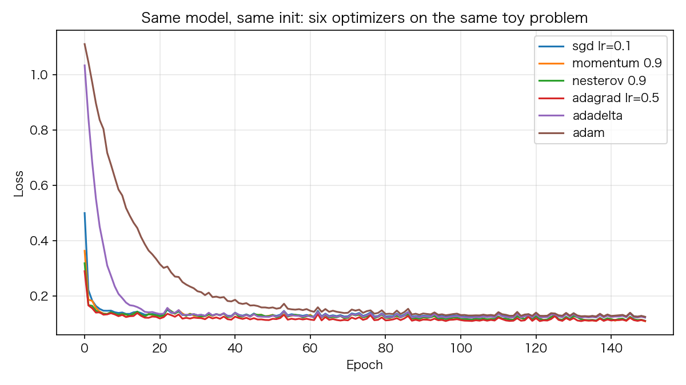

# 04 优化器进化史：SGD → Momentum → NAG → Adagrad → Adadelta → Adam

> **前置知识**：本系列《反向传播逐行拆解》（梯度从哪里来）
> **运行环境**：numpy_keras v2.0.0 / Python 3.12 / NumPy 1.26.4（Apple M2 Pro 实测）
> **运行时间**：约 30–90 秒（6 个优化器各 150 epoch）
> **随机种子**：`np.random.seed(0)`

## 优化器是训练循环的第四步

回顾《反向传播逐行拆解》的四步曲：前向 → criterion → 反向传播 → **`optimizer.update(layers)`**。优化器的全部职责：拿到各层 `grads` 字典里的梯度，决定每个参数**这一步移动多少**。库里有 4 个优化器（SGD 家族算一个），接口都一样——构造时给 `learning_rate`，之后每轮 `update` 遍历所有层原地更新 `params`。注意 `learning_rate` 只是个普通属性，**运行中途改它立刻生效**——这是下一篇（学习率调度器）的全部机制基础。

## 1. 六个更新规则，一张表

| 方法 | 更新规则 | 直觉 |
|---|---|---|
| SGD | θ ← θ − lr·g | 最朴素：沿负梯度走 lr 步 |
| Momentum | v ← μv + lr·g；θ ← θ − v | 给梯度加"惯性"，滚过小坑洼 |
| NAG | v ← μv − lr·g；θ ← θ − μv_prev + (1+μ)v | 先按惯性走一步，**在目标位置**算梯度（lookahead） |
| Adagrad | G ← G + g²；θ ← θ − lr·g/(√G+ε) | 每个参数自己的学习率：历史梯度大的参数走小步。缺点是 G 只增不减，学到后面步长趋零 |
| Adadelta | E[g²]←ρE[g²]+(1−ρ)g²；Δθ←−√(E[Δθ²]+ε)/√(E[g²]+ε)·g；θ←θ+lr·Δθ | Adagrad 的修复版：滑动平均替代累加，步长用"历史步长"自适应，几乎不需要调 lr |
| Adam | m̂/(√v̂+ε)，一阶/二阶矩的滑动平均 + 偏差校正 | 动量 + 自适应步长的合体，默认 lr=1e-3 |

## 2. 逐行读实现

SGD 的 momentum / NAG / weight_decay 在一个分支里（`numpy_keras/optimizers/sgd.py`，注释已删减）：

```python
# excerpt: numpy_keras/optimizers/sgd.py
                    # Get the gradient
                    grad = layer.grads[key]
                    # Add weight decay
                    grad += self.weight_decay * layer.params[key]
                    # If SGD with Nesterov accelerated gradient (NAG) is used
                    if self.nesterov:
                        # Update the velocity
                        self.velocity_prev[key] = self.velocity[i][key]
                        self.velocity[i][key] = self.momentum * self.velocity_prev[key] - self.learning_rate * grad
                        # Update the parameters
                        layer.params[key] -= self.momentum * self.velocity_prev[key] - (1 + self.momentum) * self.velocity[i][key]
                    else:
                        # Update the velocity
                        self.velocity[i][key] = self.momentum * self.velocity[i][key] + self.learning_rate * grad
                        # Update the parameters
                        layer.params[key] -= self.velocity[i][key]
```

两个细节：第一，`grad += weight_decay * params` 是**原地修改** `layer.grads`——所以训练后层里存的是加了衰减的梯度，调试时看到梯度莫名变大别慌。第二，NAG 的 v 约定是 `v ← μv − lr·g`（存"负梯度方向"的动量），于是参数更新写作 `θ −= μ·v_prev − (1+μ)·v`——这个符号约定在第 4 节的闭式解验证里会直接用上。

Adam 的核心（`numpy_keras/optimizers/adam.py`）：

```python
# excerpt: numpy_keras/optimizers/adam.py
                    # Get the gradient
                    grad = layer.grads[key]
                    # Add weight decay
                    grad += self.weight_decay * layer.params[key]
                    # Update biased first moment estimate
                    self.first_moment[i][key] *= self.beta1
                    # Update biased second raw moment estimate
                    self.second_moment[i][key] *= self.beta2
                    # Correct bias
                    self.first_moment[i][key] += (1 - self.beta1) * grad
                    self.second_moment[i][key] += (1 - self.beta2) * np.square(grad)
                    # Update parameters
                    first_moment_hat = self.first_moment[i][key] / (1 - self.beta1 ** self.t)
                    second_moment_hat = self.second_moment[i][key] / (1 - self.beta2 ** self.t)
                    layer.params[key] -= self.learning_rate * first_moment_hat / (np.sqrt(second_moment_hat) + self.epsilon)
```

先乘 β 再累加，等价于滑动平均；除以 `(1−βᵗ)` 是偏差校正——m 和 v 从 0 起步，前几步会低估，除以这个因子把它拉回无偏。`t` 每轮自增，所以偏差校正只在训练早期有存在感。

Adagrad 和 Adadelta 各一行核心：

```python
# excerpt: numpy_keras/optimizers/adagrad.py
                    self.grad_square[i][key] += np.square(grad)
                    # Update the parameters
                    layer.params[key] -= self.learning_rate * grad / (np.sqrt(self.grad_square[i][key]) + self.epsilon)
```

```python
# excerpt: numpy_keras/optimizers/adadelta.py
                    # Calculate the delta
                    delta = - np.sqrt(self.accum_delta_square[i][key] + self.epsilon) / np.sqrt(self.accum_grad_square[i][key] + self.epsilon) * grad
```

## 3. 对比实验：六个优化器，同一个起点

同一个玩具数据、同一个模型、同一个初始化种子（每个优化器从**同一个初始点**出发），150 epoch：

```text
      sgd lr=0.1: ep1=0.500 ep5=0.154 ep10=0.139 ep150=0.1248
    momentum 0.9: ep1=0.364 ep5=0.144 ep10=0.132 ep150=0.1096
    nesterov 0.9: ep1=0.319 ep5=0.141 ep10=0.133 ep150=0.1112
  adagrad lr=0.5: ep1=0.290 ep5=0.142 ep10=0.128 ep150=0.1103
        adadelta: ep1=1.034 ep5=0.451 ep10=0.208 ep150=0.1225
            adam: ep1=1.111 ep5=0.837 ep10=0.585 ep150=0.1256
```



两个反直觉的观察，恰恰是这个实验的价值：

1. **Adam 起步反而最慢**。Adam 的更新幅度 ≈ m̂/√v̂ 与梯度**尺度无关**（g 放大 k 倍，m̂/√v̂ 不变），所以实际步长就是 lr 的量级——1e-3 的小碎步自然慢。SGD lr=0.1 一步顶它一百步。"Adam 不用调参"是流传甚广的误解：它对 lr 的**敏感性并不低**，下一篇我们会用 lr 扫描看得更清楚。
2. **最终 momentum 赢，Adam 垫底**。在这个 400 样本的小问题上，所有方法都收敛（0.11–0.13），惯性法略胜。这同样诚实：**简单问题上朴素方法不差**，Adam 的舞台是稀疏梯度、大规模、深层网络——而不是"处处碾压"。

## 4. 在最小例子上验证 NAG

面对任何更新公式，最可靠的检验是把它放到一个能手算的最小例子上。f(x) = ½x²（梯度就是 x），x₀ = 1，lr = 0.1，μ = 0.9：NAG 前两步有闭式解——

$$x_1 = 0.81, \qquad x_2 = 0.5751$$

库的实测轨迹（脚本第二部分）：

```text
+0.8100 +0.5751 +0.3273 +0.0939 -0.1046 -0.2549 ... 10 步后 -0.3466
```

前两步与闭式解逐位吻合，之后在 |x| < 1 内有界收敛——先越过最小值、再振荡回头，正是带惯性方法在凸函数上的典型行为。**先在小例子上验证，再上真数据**，这是读源码式学习最有回报的习惯。

## 5. 完整代码

```python
"""04_optimizers.py — 优化器进化史：SGD → Momentum → NAG → Adagrad → Adadelta → Adam

运行方式（在任意目录均可）：
    pip install -e .   # 仓库根目录执行一次
    python tutorials/code/04_optimizers.py

说明：
- 第一部分在同一个二分类玩具数据、同一个模型上对比 6 种优化器
  （每个都用独立种子重新初始化，保证公平）
- 第二部分用一维二次函数 f(x)=0.5x^2 验证 NAG 的更新公式
  （闭式解对照：x1=0.81, x2=0.5751）
- 固定种子，数字可复现；纯 NumPy 模式与 Cython 模式轨迹一致
- 环境：Apple M2 Pro / macOS / Python 3.12 / NumPy 1.26.4
"""

from pathlib import Path

import matplotlib
matplotlib.use("Agg")
import matplotlib.pyplot as plt
import numpy as np

# 中文字体回退链：macOS 用苹方、Windows 用雅黑，其他系统退化为英文渲染
plt.rcParams["font.sans-serif"] = [
    "PingFang SC", "Hiragino Sans GB", "Arial Unicode MS",
    "Microsoft YaHei", "sans-serif",
]
plt.rcParams["axes.unicode_minus"] = False

ROOT = Path(__file__).resolve().parents[2]

import numpy_keras as keras

ASSETS = ROOT / "tutorials" / "assets"
ASSETS.mkdir(parents=True, exist_ok=True)

np.random.seed(0)

# 1. 同一模型、同一数据，6 种优化器对比
def make_blobs(n=200, seed=0):
    rng = np.random.default_rng(seed)
    centers = np.array([[1.0, 1.0], [-1.0, -1.0]])
    X = np.vstack([rng.normal(c, 0.9, (n, 2)) for c in centers])
    y = np.array([0] * n + [1] * n)
    idx = rng.permutation(2 * n)
    return X[idx], y[idx]


def build_model(optimizer):
    m = keras.Sequential()
    m.add(keras.layers.Input(2))
    m.add(keras.layers.Dense(8, activation="relu", kernel_initializer="he_normal"))
    m.add(keras.layers.Dense(2, activation="softmax"))
    m.compile(loss="sparse_categorical_crossentropy", optimizer=optimizer)
    return m


X, y = make_blobs()
print(f"玩具数据: {X.shape}, 标签 {np.unique(y)}")

OPTIMIZERS = [
    ("sgd lr=0.1", keras.optimizers.SGD(learning_rate=0.1)),
    ("momentum 0.9", keras.optimizers.SGD(learning_rate=0.1, momentum=0.9)),
    ("nesterov 0.9", keras.optimizers.SGD(learning_rate=0.1, momentum=0.9, nesterov=True)),
    ("adagrad lr=0.5", keras.optimizers.Adagrad(learning_rate=0.5)),
    ("adadelta", keras.optimizers.Adadelta(learning_rate=1.0)),
    ("adam", keras.optimizers.Adam(learning_rate=1e-3)),
]

histories = {}
for name, opt in OPTIMIZERS:
    np.random.seed(0)                    # 每个优化器从同一个初始点出发
    m = build_model(opt)
    h = m.fit(X, y, batch_size=32, epochs=150, verbose=0)
    histories[name] = h["loss"]
    print(f"{name:>16}: ep1={h['loss'][0]:.3f} ep5={h['loss'][4]:.3f} "
          f"ep10={h['loss'][9]:.3f} ep150={h['loss'][-1]:.4f}")

fig, ax = plt.subplots(figsize=(8, 4.5))
for name, loss in histories.items():
    ax.plot(loss, label=name)
ax.set_xlabel("Epoch")
ax.set_ylabel("Loss")
ax.set_title("Same model, same init: six optimizers on the same toy problem")
ax.legend()
ax.grid(alpha=0.3)
fig.tight_layout()
fig.savefig(ASSETS / "04_optimizers_compare.png", dpi=150)
plt.close(fig)

# 2. NAG 公式验证：f(x) = 0.5 x^2 上应有界收敛到 0
class FakeLayer:
    def __init__(self, x0):
        self.params = {"w": np.array([x0])}
        self.grads = {"w": np.zeros(1)}


def nag_trace(mu=0.9, lr=0.1, steps=10, x0=1.0):
    layer = FakeLayer(x0)
    opt = keras.optimizers.SGD(learning_rate=lr, momentum=mu, nesterov=True)
    trace = []
    for _ in range(steps):
        layer.grads["w"] = layer.params["w"].copy()   # f=0.5x^2 的梯度就是 x
        opt.update([layer])
        trace.append(float(layer.params["w"][0]))
    return trace


print("\nNAG 在 f(x)=0.5x^2 上的轨迹（lr=0.1, momentum=0.9, x0=1.0）:")
print("  " + " ".join(f"{x:+.4f}" for x in nag_trace()[:6]) + " ...")
print(f"  10 步后: {nag_trace()[-1]:+.4f}（应保持在 |x| < 1 内收敛）")

print("\n图片已保存: tutorials/assets/04_optimizers_compare.png")
```

完整运行输出（纯 NumPy 模式）：

```text
玩具数据: (400, 2), 标签 [0 1]
      sgd lr=0.1: ep1=0.500 ep5=0.154 ep10=0.139 ep150=0.1248
    momentum 0.9: ep1=0.364 ep5=0.144 ep10=0.132 ep150=0.1096
    nesterov 0.9: ep1=0.319 ep5=0.141 ep10=0.133 ep150=0.1112
  adagrad lr=0.5: ep1=0.290 ep5=0.142 ep10=0.128 ep150=0.1103
        adadelta: ep1=1.034 ep5=0.451 ep10=0.208 ep150=0.1225
            adam: ep1=1.111 ep5=0.837 ep10=0.585 ep150=0.1256

NAG 在 f(x)=0.5x^2 上的轨迹（lr=0.1, momentum=0.9, x0=1.0）:
  +0.8100 +0.5751 +0.3273 +0.0939 -0.1046 -0.2549 ...
  10 步后: -0.3466（应保持在 |x| < 1 内收敛）

图片已保存: tutorials/assets/04_optimizers_compare.png
```

## 6. 小结

- 四个优化器共用一个接口：`update(layers)` 原地更新；`learning_rate` 是可热改的普通属性
- 进化主线：朴素 SGD → 惯性（momentum/NAG）→ 每参数自适应步长（Adagrad/Adadelta）→ 两者合体 + 偏差校正（Adam）
- 实证结论：小问题上惯性法往往最优；Adam 的步长与梯度尺度无关，实际步长 ≈ lr，起步未必快
- NAG 的更新公式在 ½x² 上与闭式解逐位吻合——任何更新公式都该先过最小实验这一关

**练习**：把 Adam 的 lr 改成 1e-2 重跑对比——它的曲线会发生什么变化？把 Adagrad 的 lr 改回默认值 1.0，观察前 20 轮是否震荡。这两个问题下一篇直接回答。

下一篇：《学习率与九大调度器》——lr 才是训练里最值钱的超参数。
