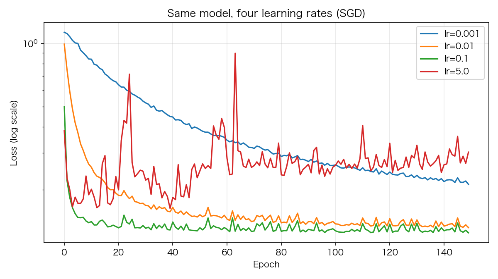
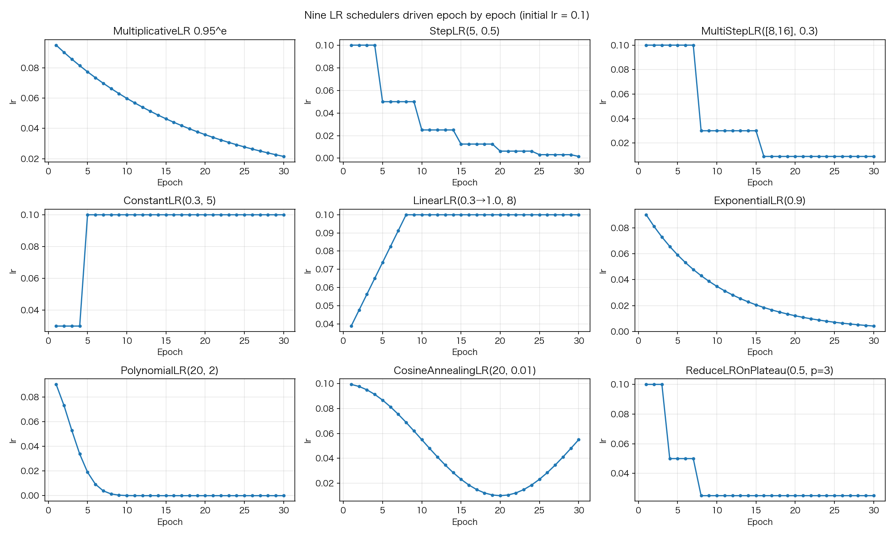
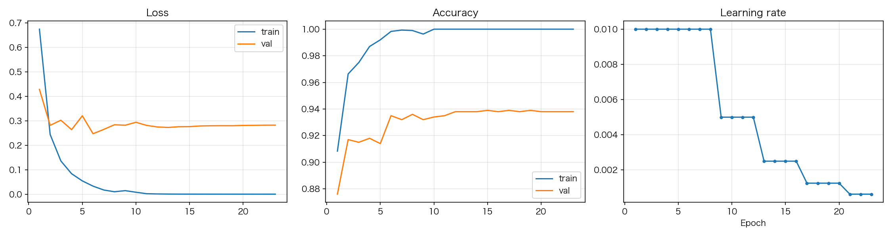

# 05 学习率与九大调度器

> **前置知识**：本系列《优化器进化史》（`learning_rate` 是个可热改的属性）
> **运行环境**：numpy_keras v2.0.0 / Python 3.12 / NumPy 1.26.4（Apple M2 Pro 实测）
> **运行时间**：约 60–120 秒（MNIST 子集 23 个 epoch）
> **随机种子**：`np.random.seed(0)`

## 学习率：唯一的必调超参数

层数、宽度、激活、损失、优化器——这些都有"默认值就够好"的答案。**学习率没有**：同一个模型，lr 差一个数量级，结果就是"没学"和"学飞"的差别。实测（SGD，同一个初始点，150 epochs）：

```python
# excerpt: lr 扫描
X, y = make_blobs()
print("lr 扫描（SGD, 150 epochs, 同一个初始点）:")
sweep = {}
for lr in (0.001, 0.01, 0.1, 5.0):
    np.random.seed(0)
    m = build_model(lr)
    h = m.fit(X, y, batch_size=32, epochs=150, verbose=0)
    sweep[lr] = h["loss"]
    print(f"  lr={lr:<5}: 最终 loss = {h['loss'][-1]:.4f}")
```

```text
  lr=0.001: 最终 loss = 0.2125
  lr=0.01 : 最终 loss = 0.1321
  lr=0.1  : 最终 loss = 0.1248
  lr=5.0  : 最终 loss = 0.3030
```



两端各有一个经典失败模式：lr=0.001 走得太慢，150 轮还没到终点；lr=5.0 步长超过损失曲面的"安全区"，参数在谷底来回弹跳甚至把损失越打越高（注意它的曲线是振荡上升的）。中间 0.01~0.1 都能收敛，0.1 最好。这就是调 lr 的全部经验本质：**往大调直到开始失稳，退半档**。

## 调度器的机制：一个属性 + 一个钩子

上一篇说过，`optimizer.learning_rate` 只是个普通属性。调度器做的就是每个 epoch 结束时改它。`fit` 在每个 epoch 收尾时调用所有 callback 的 `on_epoch_end`：

```python
# excerpt: numpy_keras/models/sequential.py
            for callback in callbacks or []:
                if hasattr(callback, 'on_epoch_end'):
                    callback.on_epoch_end(
                        model=self,
                    )
```

所以任何一个带 `on_epoch_end(model)` 方法的对象都是合法 callback——《损失函数》一篇里的 AccTracker 就是。库里的九个调度器都长这样，最小的一个（StepLR）核心就三行：

```python
# excerpt: numpy_keras/callbacks/lr_scheduler.py
        self.current_iters += 1
        if self.current_iters % self.step_size == 0:
            model.optimizer.learning_rate *= self.gamma
```

九个调度器的 lr-epoch 曲线（程序直接驱动调度器画出来的，初始 lr=0.1）：



按家族记：

| 家族 | 成员 | 一句话 |
|---|---|---|
| 乘法/步进 | MultiplicativeLR, StepLR, MultiStepLR, ExponentialLR | 每到条件就 lr ×= γ |
| 线性 | ConstantLR, LinearLR | 前 N 轮保持/爬升到目标值，需要 `on_train_begin` 记录初始 lr |
| 曲线 | PolynomialLR, CosineAnnealingLR | 按多项式/余弦曲线衰减到 `eta_min`，同样需要 `on_train_begin` |
| 自适应 | ReduceLROnPlateau | 不看轮数，看**指标**：连续 patience 轮没改善就降 lr |

注意 `ConstantLR` 的曲线在 epoch 5 弹回 0.1：它在 `total_iters` 结束后**恢复初始学习率**（`if self.current_iters == self.total_iters: lr = init_lr`）。这几个调度器按 epoch 计数（fit 每轮只调用一次 step），所以 `step_size`/`total_iters` 的单位都是 epoch。

ReduceLROnPlateau 是唯一"有大脑"的：

```python
# excerpt: numpy_keras/callbacks/lr_scheduler.py
        curr = model.history.metrics[self.monitor][-1]
```

```python
# excerpt: numpy_keras/callbacks/lr_scheduler.py
            if self.wait >= self.patience:
                new_lr = max(self.min_lr, model.optimizer.learning_rate * self.factor)
                if model.optimizer.learning_rate - new_lr > self.eps:
                    model.optimizer.learning_rate = new_lr
                self.cooldown_counter = self.cooldown
                self.wait = 0
            else:
                self.wait += 1
```

它从 `model.history.metrics[monitor]` 读监控值——**这带来两个必知的坑**：

1. **没有验证数据就 KeyError**。`val_loss`/`val_accuracy` 只在 `fit` 传了 `validation_data`（或 `validation_split`）时存在。不带验证集用 ReduceLROnPlateau 或 EarlyStopping，第一轮就崩。
2. **监控准确率时必须 `mode="max"`**。`EarlyStopping` 和 ReduceLROnPlateau 的默认 `mode="min"` 语义是"越小越好"——对 loss 正确，对 accuracy 则把**下降**当改善。本文初稿就踩了：`EarlyStopping(monitor="val_accuracy")` 忘传 mode，`restore_best_weights=True` 恢复出来的不是最佳权重而是**最差**权重（插桩输出显示 prev_value 一路跟着准确率的谷底走）。加 `mode="max"` 后一切正常。

## 实战：ReduceLROnPlateau + EarlyStopping

两个调度器协同是训练的标准姿势：Plateau 负责在平台期降 lr 继续榨性能，EarlyStopping 负责在彻底没戏时止损并**恢复最佳权重**。恢复机制是 fit 里的深拷贝快照（`sequential.py:241-255`：优化器是原地更新参数的，所以快照必须 `value.copy()`，否则"最佳权重"会跟着后面的训练被改掉）。

MNIST 3000 样本，Adam lr=0.01，`ReduceLROnPlateau(monitor="val_loss", factor=0.5, patience=3)` + `EarlyStopping(monitor="val_accuracy", mode="max", patience=8, restore_best_weights=True)`：

```text
实际训练了 23 个 epoch（EarlyStopping 提前终止）
最佳 val_accuracy: 0.9390
测试集准确率（恢复最佳权重后）: 0.9390
学习率轨迹: 0.0100 0.0100 0.0100 0.0100 0.0100 0.0100 0.0100 0.0100 0.0050 0.0050 0.0050 0.0050 0.0025 0.0025 0.0025 0.0025 0.0013 0.0013 0.0013 0.0013 0.0006 0.0006 0.0006
```



三张图连起来看：val_loss 进入平台 → lr 开始每 4 轮砍半（0.01 → 0.005 → 0.0025 → 0.0013 → 0.0006）→ 每次砍半都带来一点精度回升 → 直到 patience 耗尽，EarlyStopping 在第 23 轮叫停。恢复后的测试准确率 0.9390 与最佳 val_accuracy 完全一致——恢复机制工作正常（对照 00 篇：同样 128 神经元 + Adam，固定 lr=0.01 时只有 0.9220，调度器白赚了 1.7 个百分点）。

顺带复习一个《五分钟上手》讲过的点：这里 val 和 test 是同一个 X_test，所以 0.9390 = 0.9390；测试集与验证集分离时两者会有差距。

## 完整代码

```python
"""05_learning_rate.py — 学习率与九大调度器

运行方式（在任意目录均可）：
    pip install -e .   # 仓库根目录执行一次
    python tutorials/code/05_learning_rate.py

说明：
- 第一部分：同一个模型在 4 档学习率下的训练曲线（lr 扫描）
- 第二部分：9 个调度器的 lr-epoch 曲线（程序直接驱动 scheduler，
  不训练网络；ReduceLROnPlateau 喂的是合成的 val_loss 序列）
- 第三部分：ReduceLROnPlateau + EarlyStopping 在 MNIST 子集上的实战
- 固定种子 np.random.seed(0)，数字可复现
- 环境：Apple M2 Pro / macOS / Python 3.12 / NumPy 1.26.4
"""

import csv
import itertools
from pathlib import Path

import matplotlib
matplotlib.use("Agg")
import matplotlib.pyplot as plt
import numpy as np

# 中文字体回退链：macOS 用苹方、Windows 用雅黑，其他系统退化为英文渲染
plt.rcParams["font.sans-serif"] = [
    "PingFang SC", "Hiragino Sans GB", "Arial Unicode MS",
    "Microsoft YaHei", "sans-serif",
]
plt.rcParams["axes.unicode_minus"] = False

ROOT = Path(__file__).resolve().parents[2]

import numpy_keras as keras

ASSETS = ROOT / "tutorials" / "assets"
ASSETS.mkdir(parents=True, exist_ok=True)

np.random.seed(0)

# 1. lr 扫描：同一个模型，4 档学习率
def make_blobs(n=200, seed=0):
    rng = np.random.default_rng(seed)
    centers = np.array([[1.0, 1.0], [-1.0, -1.0]])
    X = np.vstack([rng.normal(c, 0.9, (n, 2)) for c in centers])
    y = np.array([0] * n + [1] * n)
    idx = rng.permutation(2 * n)
    return X[idx], y[idx]


def build_model(lr):
    m = keras.Sequential()
    m.add(keras.layers.Input(2))
    m.add(keras.layers.Dense(8, activation="relu", kernel_initializer="he_normal"))
    m.add(keras.layers.Dense(2, activation="softmax"))
    m.compile(loss="sparse_categorical_crossentropy",
              optimizer=keras.optimizers.SGD(learning_rate=lr))
    return m


X, y = make_blobs()
print("lr 扫描（SGD, 150 epochs, 同一个初始点）:")
sweep = {}
for lr in (0.001, 0.01, 0.1, 5.0):
    np.random.seed(0)
    m = build_model(lr)
    h = m.fit(X, y, batch_size=32, epochs=150, verbose=0)
    sweep[lr] = h["loss"]
    print(f"  lr={lr:<5}: 最终 loss = {h['loss'][-1]:.4f}")

fig, ax = plt.subplots(figsize=(8, 4.5))
for lr, loss in sweep.items():
    ax.semilogy(loss, label=f"lr={lr}")
ax.set_xlabel("Epoch")
ax.set_ylabel("Loss (log scale)")
ax.set_title("Same model, four learning rates (SGD)")
ax.legend()
ax.grid(alpha=0.3)
fig.tight_layout()
fig.savefig(ASSETS / "05_lr_sweep.png", dpi=150)
plt.close(fig)

# 2. 九个调度器的 lr-epoch 曲线（直接驱动调度器，不训练）
def tiny_model(lr0=0.1):
    m = keras.Sequential()
    m.add(keras.layers.Input(2))
    m.add(keras.layers.Dense(1))
    m.compile(loss="mse", optimizer="sgd")
    m.optimizer.learning_rate = lr0
    return m


def lr_curve(scheduler, epochs=30, lr0=0.1):
    m = tiny_model(lr0)
    if hasattr(scheduler, "on_train_begin"):
        scheduler.on_train_begin(model=m)
    curve = []
    for _ in range(epochs):
        scheduler.on_epoch_end(model=m)
        curve.append(m.optimizer.learning_rate)
    return curve


def plateau_curve(scheduler, epochs=30, lr0=0.1):
    """ReduceLROnPlateau 需要 history 里的监控值：喂一条合成的曲线，
    前 10 轮停在 0.5（平台），第 11 轮起每轮降 0.02（稳步改善）。"""
    m = tiny_model(lr0)
    vals = [0.5] * 10 + [0.5 - 0.02 * i for i in range(1, epochs - 10 + 1)]
    curve = []
    for v in vals:
        if "val_loss" not in m.history.metrics:
            m.history.metrics["val_loss"] = []
        m.history.metrics["val_loss"].append(v)   # 与 fit 内的顺序一致
        scheduler.on_epoch_end(model=m)
        curve.append(m.optimizer.learning_rate)
    return curve


SCHEDULERS = [
    ("MultiplicativeLR 0.95^e", keras.callbacks.MultiplicativeLR(lambda e: 0.95)),
    ("StepLR(5, 0.5)", keras.callbacks.StepLR(step_size=5, gamma=0.5)),
    ("MultiStepLR([8,16], 0.3)", keras.callbacks.MultiStepLR([8, 16], gamma=0.3)),
    ("ConstantLR(0.3, 5)", keras.callbacks.ConstantLR(factor=0.3, total_iters=5)),
    ("LinearLR(0.3→1.0, 8)", keras.callbacks.LinearLR(start_factor=0.3, end_factor=1.0, total_iters=8)),
    ("ExponentialLR(0.9)", keras.callbacks.ExponentialLR(gamma=0.9)),
    ("PolynomialLR(20, 2)", keras.callbacks.PolynomialLR(total_iters=20, power=2)),
    ("CosineAnnealingLR(20, 0.01)", keras.callbacks.CosineAnnealingLR(T_max=20, eta_min=0.01)),
    ("ReduceLROnPlateau(0.5, p=3)", keras.callbacks.ReduceLROnPlateau(monitor="val_loss", factor=0.5, patience=3)),
]

fig, axes = plt.subplots(3, 3, figsize=(15, 9))
for ax, (name, sched) in zip(axes.ravel(), SCHEDULERS):
    curve = plateau_curve(sched) if name.startswith("Reduce") else lr_curve(sched)
    ax.plot(range(1, len(curve) + 1), curve, "o-", markersize=3)
    ax.set_title(name)
    ax.set_xlabel("Epoch")
    ax.set_ylabel("lr")
    ax.grid(alpha=0.3)
fig.suptitle("Nine LR schedulers driven epoch by epoch (initial lr = 0.1)")
fig.tight_layout()
fig.savefig(ASSETS / "05_schedulers.png", dpi=150)
plt.close(fig)

# 3. ReduceLROnPlateau + EarlyStopping 实战（MNIST 子集）
def load_mnist(path, n_rows=None):
    with open(path) as f:
        rows = list(itertools.islice(csv.reader(f), n_rows))
    y = np.array([int(r[0]) for r in rows])
    X = np.array([[float(v) for v in r[1:]] for r in rows]) / 255.0
    return X, y


X_train, y_train = load_mnist(ROOT / "data" / "mnist_train_small.csv", n_rows=3000)
X_test, y_test = load_mnist(ROOT / "data" / "mnist_test.csv", n_rows=1000)
print(f"\nMNIST 子集: 训练 {X_train.shape}, 测试 {X_test.shape}")


class LRTracker:
    """每个 epoch 记录当前学习率（调度器是原地改属性的）。"""

    def __init__(self):
        self.lrs = []

    def on_epoch_end(self, model=None):
        self.lrs.append(model.optimizer.learning_rate)


np.random.seed(0)
m = keras.Sequential()
m.add(keras.layers.Input(784))
m.add(keras.layers.Dense(128, activation="relu", kernel_initializer="he_normal"))
m.add(keras.layers.Dense(10, activation="softmax"))
m.compile(loss="sparse_categorical_crossentropy", optimizer="adam",
          metrics=["accuracy"])
m.optimizer.learning_rate = 0.01

lr_tracker = LRTracker()
h = m.fit(
    X_train, y_train,
    batch_size=64, epochs=30, verbose=0,
    validation_data=(X_test, y_test),
    callbacks=[
        keras.callbacks.ReduceLROnPlateau(monitor="val_loss", factor=0.5, patience=3),
        # 监控准确率时务必 mode="max"：默认 mode="min" 会把"准确率下降"
        # 当成改善，恢复最佳权重时会恢复到最差的一轮
        keras.callbacks.EarlyStopping(monitor="val_accuracy", mode="max",
                                      patience=8, restore_best_weights=True),
        lr_tracker,
    ],
)
print(f"实际训练了 {len(h['loss'])} 个 epoch（EarlyStopping 提前终止）")
print(f"最佳 val_accuracy: {max(h['metrics']['val_accuracy']):.4f}")
print(f"测试集准确率（恢复最佳权重后）: {m.evaluate(X_test, y_test, batch_size=64):.4f}")
print(f"学习率轨迹: {' '.join(f'{lr:.4f}' for lr in lr_tracker.lrs)}")

fig, axes = plt.subplots(1, 3, figsize=(15, 4))
epochs = range(1, len(h["loss"]) + 1)
axes[0].plot(epochs, h["loss"], label="train")
axes[0].plot(epochs, h["metrics"]["val_loss"], label="val")
axes[0].set_title("Loss")
axes[0].legend()
axes[0].grid(alpha=0.3)
axes[1].plot(epochs, h["metrics"]["train_accuracy"], label="train")
axes[1].plot(epochs, h["metrics"]["val_accuracy"], label="val")
axes[1].set_title("Accuracy")
axes[1].legend()
axes[1].grid(alpha=0.3)
axes[2].plot(epochs, lr_tracker.lrs, "o-", markersize=3)
axes[2].set_title("Learning rate")
axes[2].set_xlabel("Epoch")
axes[2].grid(alpha=0.3)
fig.tight_layout()
fig.savefig(ASSETS / "05_plateau.png", dpi=150)
plt.close(fig)

print("图片已保存: tutorials/assets/05_lr_sweep.png, "
      "tutorials/assets/05_schedulers.png, tutorials/assets/05_plateau.png")
```

完整运行输出（纯 NumPy 模式）：

```text
lr 扫描（SGD, 150 epochs, 同一个初始点）:
  lr=0.001: 最终 loss = 0.2125
  lr=0.01 : 最终 loss = 0.1321
  lr=0.1  : 最终 loss = 0.1248
  lr=5.0  : 最终 loss = 0.4733

MNIST 子集: 训练 (3000, 784), 测试 (1000, 784)
实际训练了 23 个 epoch（EarlyStopping 提前终止）
最佳 val_accuracy: 0.9390
测试集准确率（恢复最佳权重后）: 0.9390
学习率轨迹: 0.0100 0.0100 0.0100 0.0100 0.0100 0.0100 0.0100 0.0100 0.0050 0.0050 0.0050 0.0050 0.0025 0.0025 0.0025 0.0025 0.0013 0.0013 0.0013 0.0013 0.0006 0.0006 0.0006
图片已保存: tutorials/assets/05_lr_sweep.png, tutorials/assets/05_schedulers.png, tutorials/assets/05_plateau.png
```

## 小结

- lr 是唯一必调超参数：往大调到失稳再退半档；调度器只是"按计划改 lr"的自动化
- 调度器的机制就两行：`learning_rate` 可变属性 + `on_epoch_end(model)` 钩子；任何带这个方法的对象都是合法 callback
- 九个调度器分四族：乘法/步进、线性、曲线、自适应（Plateau 是唯一看指标的）
- 两个坑：没验证数据时 `val_*` 键不存在会 KeyError；监控 accuracy 必须 `mode="max"`
- 实战收益：Plateau + EarlyStopping 让 00 篇的模型从 0.9220 涨到 0.9390，且早停 23/30 轮

**练习**：把 `patience=3` 改成 `patience=10`，lr 轨迹和最终准确率怎么变？把 EarlyStopping 的 `restore_best_weights` 关掉，比较最终准确率——差了多少，为什么？

下一篇：《MLP 深入：初始化器与深层网络》——把前面所有零件装进一个 12 层的深网里。
