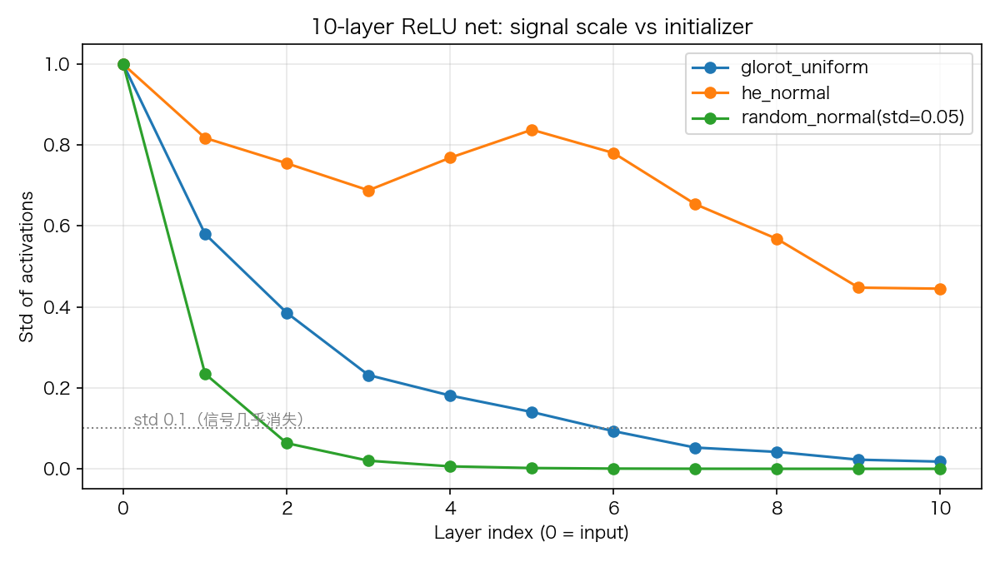
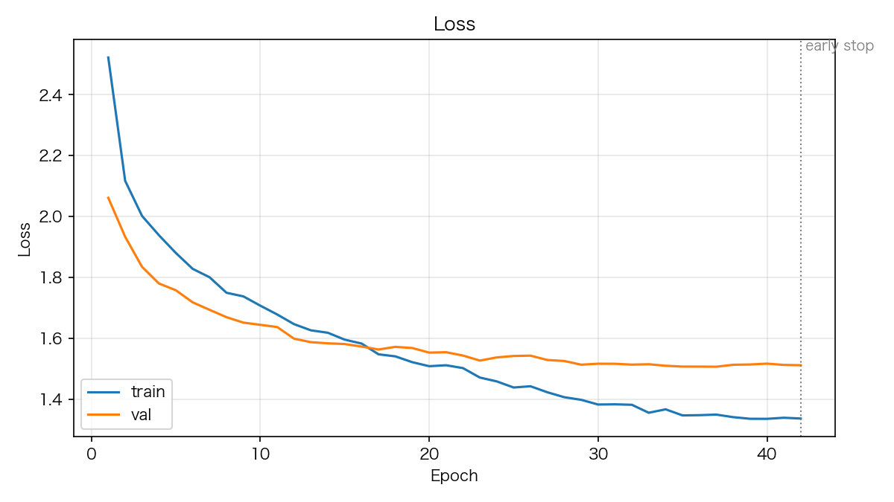

# 06 MLP 深入：初始化器与深层网络

> **前置知识**：本系列《反向传播逐行拆解》与《学习率与九大调度器》
> **运行环境**：numpy_keras v2.1.0 / Python 3.12 / NumPy 1.26.4（Apple M2 Pro 实测）
> **运行时间**：约 10 秒（编译内核，低负载实测；纯 NumPy 模式轨迹一致、耗时约 1.5 倍。两种模式都随机器负载显著变慢——本机高负载时曾测到 448.5 s）
> **随机种子**：`np.random.seed(0)`（初始化器实验）+ `np.random.seed(42)`（深网训练）

前面五篇拆完了零件，这一篇把它们装进一个真正的**深层** MLP 里。主角有两个：**初始化器**（决定深层网络能不能开始训练）和**参数量**（决定你能训多深）。

## 1. MLP 作为架构：参数从哪来

一个 Dense 层只有两个参数：`W (fan_in, fan_out)` 和 `b (fan_out,)`。所以一层 120 个神经元的参数个数是 `128×120 + 120 = 15,480`。12 层的总参数 49,530，`summary()` 逐层列得清清楚楚（Dropout 没有参数，是 0）：

```text
Layer (type)         Output Shape         Param #   
=================================================================
input_1              (128,)               0         
dense_1              120                  15,480    
dropout_1            120                  0         
dense_2              112                  13,552    
...
dense_8              10                   170       
=================================================================
Total params: 49,530
```

一个直觉：**网络越宽（fan 越大），参数增长是平方级的**——120×128 到 112×120，只减 8 个神经元就少了两千参数。所以深网通常设计成"漏斗形"：前宽后窄，让参数集中在前几层。

## 2. 初始化器：三个数字决定生死

初始化器的全部本质就是**权重初值的尺度**。同一形状 (64, 128) 下实测各初始化器：

```python
# excerpt: 初始化器尺度表
print("初始化器尺度 (shape=(64, 128), fan_in=64, fan_out=128):")
INITIALIZERS = [
    ("glorot_uniform", F.xavier_uniform),
    ("glorot_normal", F.xavier_normal),
    ("he_uniform", F.kaiming_uniform),
    ("he_normal", F.kaiming_normal),
    ("random_uniform", lambda s: F.uniform(s, -0.05, 0.05)),
    ("random_normal", lambda s: F.normal(s, 0.0, 0.05)),
]
for name, init_fn in INITIALIZERS:
    w = init_fn((64, 128))
    print(f"  {name:>16}: std={w.std():.4f}, |max|={np.abs(w).max():.4f}")
```

```text
    glorot_uniform: std=0.1023, |max|=0.1768
     glorot_normal: std=0.1011, |max|=0.3770
        he_uniform: std=0.1778, |max|=0.3061
         he_normal: std=0.1761, |max|=0.8238
    random_uniform: std=0.0289, |max|=0.0500
     random_normal: std=0.0497, |max|=0.1886
```

两个家族差一个 √2，这是**故意**的：

- **Glorot/Xavier** 按 `sqrt(2/(fan_in+fan_out))` 缩放，为的是让前向和反向的方差都守恒——它假设激活函数**关于原点对称**（tanh 时代的标准选择）。
- **He/Kaiming** 按 `sqrt(2/fan_in)` 缩放，多出来的 √2 补偿 ReLU 砍掉的那一半信号（负半轴输出全 0）。ReLU 系网络用它。
- `random_normal(0.05)` 是上古默认：不随 fan 缩放，网络稍深信号就没了。

用 10 层 ReLU 网络实测（前向，不训练，逐层看激活标准差）：

```text
          glorot_uniform: 1.00 0.58 0.39 0.23 0.18 0.14 0.09 0.05 0.04 0.02 0.02
               he_normal: 1.00 0.82 0.75 0.69 0.77 0.84 0.78 0.65 0.57 0.45 0.45
  random_normal(std=0.05): 1.00 0.23 0.06 0.02 0.01 0.00 0.00 0.00 0.00 0.00 0.00
```



he_normal 的信号在 10 层后还活着（0.45）；glorot 衰减到 0.02——不是 glorot 错了，是它**不是为 ReLU 设计的**；random_normal 五层之内信号归零。这就是《激活函数全解》里"relu 必须配 he_normal"这句话的完整证据链。

## 3. 12 层深网实战

数据集：128 维特征的十分类问题（`data/train_data.npy`，50,000 样本）。为了让整个实验在普通笔记本上几分钟内可复现，本文在**前 10,000 行**上训练——去掉切片就是全量。架构沿用 README §3.2：7 个 elu 隐层（120→112→96→64→32→24→16）+ 递减 Dropout + softmax 输出，`he_uniform` 初始化。

```python
# excerpt: 训练配置（监控 val_loss，不传 metrics）
# 刻意不传 metrics：metrics 会在每个 epoch 结束后对全量数据做 predict，
# 对 50k 样本的 12 层网络几乎等于把训练再做一遍。监控改用 val_loss
# （只要有验证数据就存在），最终准确率训练结束后一次测出。
early_stop = keras.callbacks.EarlyStopping('val_loss', mode='min', patience=5, restore_best_weights=True)
lr_scheduler = keras.callbacks.ReduceLROnPlateau('val_loss', mode='min', factor=0.5, patience=3, min_lr=1e-6)
model.compile(optimizer='adam', loss='sparse_categorical_crossentropy')
```

这是《学习率与九大调度器》实战配方的直接延续，一个变化：**不传 `metrics`**。`metrics=['accuracy']` 会在每个 epoch 结束后对训练集+验证集做一次全量 predict，对 50k 样本的深网几乎等于把训练再做一遍——监控 `val_loss` 不需要 metrics 就存在，最终准确率训练结束后一次测出即可。这是一个普适的省时技巧。

用一个 5 行的小回调把每轮的 val_loss 和学习率打出来，训练全程可见：

```python
# excerpt: 每轮日志
class EpochLogger:
    """每轮打印验证损失与学习率（调度器原地改属性，能看到降 lr 的时刻）。"""

    def on_epoch_end(self, model=None):
        n = len(model.history.loss)
        print(f"  epoch {n:>2}: val_loss={model.history.metrics['val_loss'][-1]:.4f}, "
              f"lr={model.optimizer.learning_rate:.6f}")
```

训练过程（节选关键转折，完整输出见文末）：

```text
  epoch  1: val_loss=2.0619, lr=0.001000
  epoch 25: val_loss=1.5429, lr=0.001000
  epoch 26: val_loss=1.5439, lr=0.000500   ← 平台期触发第一次降 lr
  epoch 32: val_loss=1.5145, lr=0.000250
  epoch 40: val_loss=1.5177, lr=0.000125
  epoch 42: val_loss=1.5125, lr=0.000125
实际 epoch: 42（EarlyStopping 提前终止）
训练集准确率（恢复最佳权重后，一次全量 predict）: 0.5913
测试集准确率（恢复最佳权重后，一次全量 predict）: 0.4579
```



学习率从 1e-3 一路砍到 1.25e-4，每次砍半都换来一次小幅下降；早停在第 42 轮触发，`restore_best_weights` 把模型恢复到最佳验证点。

**如实解读这两个数字**：训练 59.13%、测试 45.79%。10 个类随机猜是 10%，45.79% 说明模型学到了东西；训练与测试之间 13.3 个百分点的差距，说明模型在记住训练集（过拟合）——10k 样本对 49,530 个参数的 12 层网络来说太薄。**这是本次实测数字能证明的全部**：至于去掉切片换成全量 50k 会得到什么数字，留给练习去实测，本篇不做未经测量的预测。

## 4. 完整代码

```python
"""06_mlp.py — MLP 深入：初始化器与深层网络

运行方式（在任意目录均可）：
    pip install -e .   # 仓库根目录执行一次
    python tutorials/code/06_mlp.py

说明：
- 第一部分：各初始化器在同一形状下的实际尺度（std 与最大绝对值）
- 第二部分：10 层 ReLU 网络在三种初始化下的逐层激活标准差
- 第三部分：README §3.2 的 12 层深网在 data/train_data.npy 的前 10,000 行
  上训练（数据集本为 50000×128 十分类；10k 子集让实验在普通笔记本上
  几分钟内可复现，用全部 50k 样本只需去掉切片）。
  EarlyStopping + ReduceLROnPlateau 监控 val_loss；不传 metrics 以免
  每轮全量 predict，最终准确率训练后一次测出。
- 固定种子 np.random.seed(42)，数字可复现
- 环境：Apple M2 Pro / macOS / Python 3.12 / NumPy 1.26.4
"""

import time
from pathlib import Path

import matplotlib
matplotlib.use("Agg")
import matplotlib.pyplot as plt
import numpy as np

# 中文字体回退链：macOS 用苹方、Windows 用雅黑，其他系统退化为英文渲染
plt.rcParams["font.sans-serif"] = [
    "PingFang SC", "Hiragino Sans GB", "Arial Unicode MS",
    "Microsoft YaHei", "sans-serif",
]
plt.rcParams["axes.unicode_minus"] = False

ROOT = Path(__file__).resolve().parents[2]

import numpy_keras as keras
from numpy_keras.initializers import functional as F

ASSETS = ROOT / "tutorials" / "assets"
ASSETS.mkdir(parents=True, exist_ok=True)

np.random.seed(0)

# 1. 各初始化器的实际尺度（同一个形状）
print("初始化器尺度 (shape=(64, 128), fan_in=64, fan_out=128):")
INITIALIZERS = [
    ("glorot_uniform", F.xavier_uniform),
    ("glorot_normal", F.xavier_normal),
    ("he_uniform", F.kaiming_uniform),
    ("he_normal", F.kaiming_normal),
    ("random_uniform", lambda s: F.uniform(s, -0.05, 0.05)),
    ("random_normal", lambda s: F.normal(s, 0.0, 0.05)),
]
for name, init_fn in INITIALIZERS:
    w = init_fn((64, 128))
    print(f"  {name:>16}: std={w.std():.4f}, |max|={np.abs(w).max():.4f}")

# 2. 10 层 ReLU 网络：三种初始化，逐层激活标准差
def build_relu_chain(initializer):
    m = keras.Sequential()
    m.add(keras.layers.Input(64))
    for _ in range(10):
        m.add(keras.layers.Dense(64, activation="relu", kernel_initializer=initializer))
    return m


def layer_stds(model, x):
    stds = [float(x.std())]
    a = x
    for layer in model.layers.values():
        if not hasattr(layer, "forward"):
            continue
        a = layer.forward(a, is_training=False)
        stds.append(float(a.std()))
    return stds


x = np.random.randn(1000, 64)
chains = [
    ("glorot_uniform", build_relu_chain("glorot_uniform")),
    ("he_normal", build_relu_chain("he_normal")),
    ("random_normal(std=0.05)", build_relu_chain("random_normal")),
]
print("\n10 层 ReLU 网络逐层激活标准差:")
for name, m in chains:
    stds = layer_stds(m, x)
    print(f"  {name:>22}: " + " ".join(f"{s:.2f}" for s in stds))

fig, ax = plt.subplots(figsize=(8, 4.5))
for name, m in chains:
    ax.plot(range(11), layer_stds(m, x), "o-", label=name)
ax.axhline(0.1, color="gray", ls=":", lw=1)
ax.text(0, 0.1, "  std 0.1（信号几乎消失）", va="bottom", fontsize=9, color="gray")
ax.set_xlabel("Layer index (0 = input)")
ax.set_ylabel("Std of activations")
ax.set_title("10-layer ReLU net: signal scale vs initializer")
ax.legend()
ax.grid(alpha=0.3)
fig.tight_layout()
fig.savefig(ASSETS / "06_initializer_compare.png", dpi=150)
plt.close(fig)

# 3. 12 层深网实战（README §3.2 的架构）
np.random.seed(42)                     # README 同款种子
X_train = np.load(ROOT / "data" / "train_data.npy")[:10000]   # 10k 子集，几分钟内可复现
y_train = np.load(ROOT / "data" / "train_label.npy").squeeze()[:10000]
X_test = np.load(ROOT / "data" / "test_data.npy")
y_test = np.load(ROOT / "data" / "test_label.npy").squeeze()
print(f"\n数据集: train {X_train.shape} {y_train.shape}, test {X_test.shape} {y_test.shape}")

model = keras.Sequential()
model.add(keras.layers.Input(shape=X_train.shape[1]))
model.add(keras.layers.Dense(120, activation='elu', kernel_initializer='he_uniform'))
model.add(keras.layers.Dropout(0.25))
model.add(keras.layers.Dense(112, activation='elu', kernel_initializer='he_uniform'))
model.add(keras.layers.Dropout(0.20))
model.add(keras.layers.Dense(96, activation='elu', kernel_initializer='he_uniform'))
model.add(keras.layers.Dropout(0.15))
model.add(keras.layers.Dense(64, activation='elu', kernel_initializer='he_uniform'))
model.add(keras.layers.Dropout(0.10))
model.add(keras.layers.Dense(32, activation='elu', kernel_initializer='he_uniform'))
model.add(keras.layers.Dense(24, activation='elu', kernel_initializer='he_uniform'))
model.add(keras.layers.Dense(16, activation='elu', kernel_initializer='he_uniform'))
model.add(keras.layers.Dense(10, activation='softmax'))
model.summary()

# 刻意不传 metrics：metrics 会在每个 epoch 结束后对全量数据做 predict，
# 对 50k 样本的 12 层网络几乎等于把训练再做一遍。监控改用 val_loss
# （只要有验证数据就存在），最终准确率训练结束后一次测出。
early_stop = keras.callbacks.EarlyStopping('val_loss', mode='min', patience=5, restore_best_weights=True)
lr_scheduler = keras.callbacks.ReduceLROnPlateau('val_loss', mode='min', factor=0.5, patience=3, min_lr=1e-6)
model.compile(optimizer='adam', loss='sparse_categorical_crossentropy')

class EpochLogger:
    """每轮打印验证损失与学习率（调度器原地改属性，能看到降 lr 的时刻）。"""

    def on_epoch_end(self, model=None):
        n = len(model.history.loss)
        print(f"  epoch {n:>2}: val_loss={model.history.metrics['val_loss'][-1]:.4f}, "
              f"lr={model.optimizer.learning_rate:.6f}")


t0 = time.time()
history = model.fit(X_train, y_train, epochs=60, batch_size=128, verbose=0,
                    callbacks=[early_stop, lr_scheduler, EpochLogger()],
                    validation_split=0.1)
print(f"\n训练耗时: {time.time() - t0:.1f} s")
print(f"实际 epoch: {len(history['loss'])}（EarlyStopping 提前终止）")
print(f"最终学习率: {model.optimizer.learning_rate:.6f}")
# predict 会把 softmax 输出解码回整数标签（fit 时已记录类别映射）
train_acc = float(np.mean(model.predict(X_train, batch_size=128) == y_train))
test_acc = float(np.mean(model.predict(X_test, batch_size=128) == y_test))
print(f"训练集准确率（恢复最佳权重后，一次全量 predict）: {train_acc:.4f}")
print(f"测试集准确率（恢复最佳权重后，一次全量 predict）: {test_acc:.4f}")

fig, ax = plt.subplots(figsize=(8, 4.5))
epochs = range(1, len(history["loss"]) + 1)
ax.plot(epochs, history["loss"], label="train")
ax.plot(epochs, history["metrics"]["val_loss"], label="val")
ax.axvline(len(history["loss"]), color="gray", ls=":", lw=1)
ax.text(len(history["loss"]), ax.get_ylim()[1], " early stop", va="top", fontsize=9, color="gray")
ax.set_title("Loss")
ax.set_xlabel("Epoch")
ax.set_ylabel("Loss")
ax.legend()
ax.grid(alpha=0.3)
fig.tight_layout()
fig.savefig(ASSETS / "06_deep_mlp_history.png", dpi=150)
plt.close(fig)

print("图片已保存: tutorials/assets/06_initializer_compare.png, "
      "tutorials/assets/06_deep_mlp_history.png")```

完整运行输出（编译内核模式）：

```text
初始化器尺度 (shape=(64, 128), fan_in=64, fan_out=128):
    glorot_uniform: std=0.1023, |max|=0.1768
     glorot_normal: std=0.1011, |max|=0.3770
        he_uniform: std=0.1778, |max|=0.3061
         he_normal: std=0.1761, |max|=0.8238
    random_uniform: std=0.0289, |max|=0.0500
     random_normal: std=0.0497, |max|=0.1886

10 层 ReLU 网络逐层激活标准差:
          glorot_uniform: 1.00 0.58 0.39 0.23 0.18 0.14 0.09 0.05 0.04 0.02 0.02
               he_normal: 1.00 0.82 0.75 0.69 0.77 0.84 0.78 0.65 0.57 0.45 0.45
  random_normal(std=0.05): 1.00 0.23 0.06 0.02 0.01 0.00 0.00 0.00 0.00 0.00 0.00

数据集: train (10000, 128) (10000,), test (10000, 128) (10000,)
Model: Sequential
_________________________________________________________________
Layer (type)         Output Shape         Param #   
=================================================================
input_1              (128,)               0         
dense_1              120                  15,480    
dropout_1            120                  0         
dense_2              112                  13,552    
dropout_2            112                  0         
dense_3              96                   10,848    
dropout_3            96                   0         
dense_4              64                   6,208     
dropout_4            64                   0         
dense_5              32                   2,080     
dense_6              24                   792       
dense_7              16                   400       
dense_8              10                   170       
=================================================================
Total params: 49,530
_________________________________________________________________
  epoch  1: val_loss=2.0619, lr=0.001000
  epoch  2: val_loss=1.9339, lr=0.001000
  epoch  3: val_loss=1.8353, lr=0.001000
  epoch  4: val_loss=1.7807, lr=0.001000
  epoch  5: val_loss=1.7586, lr=0.001000
  epoch  6: val_loss=1.7188, lr=0.001000
  epoch  7: val_loss=1.6943, lr=0.001000
  epoch  8: val_loss=1.6702, lr=0.001000
  epoch  9: val_loss=1.6524, lr=0.001000
  epoch 10: val_loss=1.6451, lr=0.001000
  epoch 11: val_loss=1.6379, lr=0.001000
  epoch 12: val_loss=1.5996, lr=0.001000
  epoch 13: val_loss=1.5881, lr=0.001000
  epoch 14: val_loss=1.5844, lr=0.001000
  epoch 15: val_loss=1.5820, lr=0.001000
  epoch 16: val_loss=1.5737, lr=0.001000
  epoch 17: val_loss=1.5642, lr=0.001000
  epoch 18: val_loss=1.5728, lr=0.001000
  epoch 19: val_loss=1.5689, lr=0.001000
  epoch 20: val_loss=1.5539, lr=0.001000
  epoch 21: val_loss=1.5552, lr=0.001000
  epoch 22: val_loss=1.5443, lr=0.001000
  epoch 23: val_loss=1.5277, lr=0.001000
  epoch 24: val_loss=1.5381, lr=0.001000
  epoch 25: val_loss=1.5429, lr=0.001000
  epoch 26: val_loss=1.5439, lr=0.000500
  epoch 27: val_loss=1.5297, lr=0.000500
  epoch 28: val_loss=1.5264, lr=0.000500
  epoch 29: val_loss=1.5143, lr=0.000500
  epoch 30: val_loss=1.5174, lr=0.000500
  epoch 31: val_loss=1.5173, lr=0.000500
  epoch 32: val_loss=1.5145, lr=0.000250
  epoch 33: val_loss=1.5158, lr=0.000250
  epoch 34: val_loss=1.5107, lr=0.000250
  epoch 35: val_loss=1.5081, lr=0.000250
  epoch 36: val_loss=1.5080, lr=0.000250
  epoch 37: val_loss=1.5076, lr=0.000250
  epoch 38: val_loss=1.5140, lr=0.000250
  epoch 39: val_loss=1.5149, lr=0.000250
  epoch 40: val_loss=1.5177, lr=0.000125
  epoch 41: val_loss=1.5136, lr=0.000125
  epoch 42: val_loss=1.5125, lr=0.000125

训练耗时: 10.7 s
实际 epoch: 42（EarlyStopping 提前终止）
最终学习率: 0.000125
训练集准确率（恢复最佳权重后，一次全量 predict）: 0.5913
测试集准确率（恢复最佳权重后，一次全量 predict）: 0.4579
图片已保存: tutorials/assets/06_initializer_compare.png, tutorials/assets/06_deep_mlp_history.png

```

## 5. 小结

- MLP 的参数 = 每层 `W (fan_in, fan_out) + b`；宽度的参数代价是平方级的，深网常做成漏斗形
- 初始化器的全部本质是**尺度**：glorot 为对称激活设计（√(2/(in+out))），he 为 ReLU 设计（√(2/in)，多出的 √2 补回被 ReLU 砍掉的信号）
- 10 层实测：he_normal 信号存活（0.45），glorot 衰减（0.02），固定小尺度初始化五层内归零
- 实战配方要点：val_loss 监控 + 不传 metrics（每轮全量 predict 是隐形大头）、5 行回调做逐轮日志、恢复最佳权重
- 诚实面对数字：10k 样本上训练 59.13% / 测试 45.79%，13.3 个百分点的差距是过拟合的信号

**练习**：把 10 层实验的激活换成 `tanh`，glorot 和 he 两条曲线会怎么对调？把深网实战的切片去掉（50k 全量，按测速约 35-45 分钟），测试准确率能到多少？

下一篇：《Dropout：最简单的正则化》——本篇深网里那些"不要紧的 0 参数层"，其实是控制过拟合的主力。
