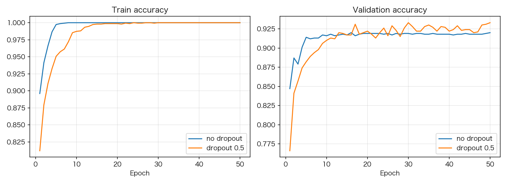

# 07 Dropout：最简单的正则化

> **前置知识**：本系列《MLP 深入》（过拟合的信号：训练与验证的差距）
> **运行环境**：numpy_keras v2.1.0 / Python 3.12 / NumPy 1.26.4（Apple M2 Pro 实测）
> **运行时间**：约 1-2 分钟（纯 NumPy 模式）
> **随机种子**：`np.random.seed(0)`

## 过拟合：大模型 + 小数据的必然结果

上一篇的 12 层深网在 10k 样本上出现了 14 个百分点的训练/验证差距——模型在**记住训练集**。对抗过拟合最经典的两招：加数据，和加约束。Dropout 是约束里最便宜的一种：**训练时每个神经元以概率 p 随机"罢工"**，逼着网络学出冗余的、不依赖任何单个神经元的表示。

## 倒置 Dropout：一个期望值为 1 的 mask

看库的实现（`numpy_keras/layers/dropout.py`，注释已删减）：

```python
# excerpt: numpy_keras/layers/dropout.py
        if is_training:
            # Generate the dropout mask on the host (seed parity), cast to the
            # input dtype (a float64 mask would promote float32 models), then
            # move it to the active device via asarray (identity under numpy).
            self.__mask = np.asarray(
                (_np.random.rand(*inputs.shape) > self.__rate) / (1.0 - self.__rate),
                dtype=inputs.dtype)
            return inputs * self.__mask # Multiply the inputs by the dropout mask
        # Otherwise, return the inputs
        else:
            return inputs
```

两行里藏着一个精妙的设计。mask 每个元素有 (1−rate) 的概率取 `1/(1−rate)`、rate 的概率取 0，所以**期望值恰好是 1**：

```text
rate=0.5 时 mask 的期望值: 0.9989
```

这就是"倒置 Dropout"（inverted dropout）的由来：训练时随机置零**并且按 1/(1−rate) 放大幸存者**，输出期望不变；于是推理时什么都**不用做**——`is_training=False` 直接原样返回（`evaluate`/`predict` 内部走的就是这条路）。老式的 Dropout 反过来：训练时不放大、推理时乘 (1−rate)，所有用到推理的代码都要记得缩放，还影响调试。倒置版把复杂度全部关在训练分支里。

两个配套细节：

- **backward 用同一个 mask**（`return delta * self.__mask`）：前向被置零的神经元不参与本轮梯度，逻辑自洽。
- **没有 seed 参数**：mask 用全局 `np.random`，所以复现全靠脚本顶部的 `np.random.seed(0)`。也意味着**同一个模型跑两次数字不同**——这是期望行为，不是 bug（正则化本身就是随机的）。

## 实验：同一个大 MLP，加与不加

MNIST 1500 个训练样本喂一个 512-256 的大 MLP——故意制造过拟合条件（大模型 + 小数据）。两个模型同种子、同初始点，唯一的区别是两个隐层后面有没有 `Dropout(0.5)`：

```python
# excerpt: 过拟合对比实验
histories = {}
for name, rate in [("no dropout", None), ("dropout 0.5", 0.5)]:
    np.random.seed(0)                    # 两个模型同种子、同初始点
    m = build(rate)
    h = m.fit(X_train, y_train, batch_size=64, epochs=50, verbose=0,
              validation_data=(X_test, y_test))
    histories[name] = h
    ta = h["metrics"]["train_accuracy"][-1]
    va = h["metrics"]["val_accuracy"][-1]
    print(f"{name:>12}: train_acc={ta:.4f}, val_acc={va:.4f}, "
          f"gap={ta - va:.4f}")
```

```text
  no dropout: train_acc=1.0000, val_acc=0.9200, gap=0.0800
 dropout 0.5: train_acc=1.0000, val_acc=0.9330, gap=0.0670
```



读数字：不加 Dropout 时训练集被完整背下（1.0），验证集只有 0.92，**8 个百分点的泛化差距**；加 Dropout 后验证集涨到 0.933，差距收窄到 6.7 个百分点。方向完全符合预期——验证准确率提升、泛化差距收窄。

如实交代两点：第一，效果是温和的（+1.3 个百分点）——MNIST 对 512-256 的模型来说仍然偏简单，Dropout 的收益在更难的数据上更明显。第二，50 轮后 dropout 模型的训练准确率也到了 1.0——dropout **延缓**记忆，但给足轮数，小数据最终还是会被背下来。正则化不是魔法，它买的是"验证集先到顶"的时间窗口，通常配合早停一起用（《学习率与九大调度器》里见过）。

## 完整代码

```python
"""07_dropout.py — Dropout：最简单的正则化

运行方式（在任意目录均可）：
    pip install -e .   # 仓库根目录执行一次
    python tutorials/code/07_dropout.py

说明：
- 第一部分验证"倒置 Dropout"的核心性质：mask 的期望值为 1，
  所以训练时随机置零并按 1/(1-rate) 放大，推理时什么都不用做
- 第二部分在 MNIST 子集上训练同一个大 MLP（两个隐层 512/256），
  一个不加 Dropout、一个加 0.5，对比训练/验证准确率的差距
- 固定种子 np.random.seed(0)，数字可复现
- 环境：Apple M2 Pro / macOS / Python 3.12 / NumPy 1.26.4
"""

import csv
import itertools
from pathlib import Path

import matplotlib
matplotlib.use("Agg")
import matplotlib.pyplot as plt
import numpy as np

# 中文字体回退链：macOS 用苹方、Windows 用雅黑，其他系统退化为英文渲染
plt.rcParams["font.sans-serif"] = [
    "PingFang SC", "Hiragino Sans GB", "Arial Unicode MS",
    "Microsoft YaHei", "sans-serif",
]
plt.rcParams["axes.unicode_minus"] = False

ROOT = Path(__file__).resolve().parents[2]

import numpy_keras as keras

ASSETS = ROOT / "tutorials" / "assets"
ASSETS.mkdir(parents=True, exist_ok=True)

np.random.seed(0)

# 1. 倒置 Dropout 的核心性质：mask 期望值为 1
rate = 0.5
mask = (np.random.rand(100000) > rate) / (1.0 - rate)
print(f"rate={rate} 时 mask 的期望值: {mask.mean():.4f}")
print("  （期望不变：训练时随机置零并按 1/(1-rate) 放大，推理时无需任何缩放）\n")

# 2. 过拟合演示：同一个大 MLP，with/without Dropout
def load_mnist(path, n_rows=None):
    with open(path) as f:
        rows = list(itertools.islice(csv.reader(f), n_rows))
    y = np.array([int(r[0]) for r in rows])
    X = np.array([[float(v) for v in r[1:]] for r in rows]) / 255.0
    return X, y


X_train, y_train = load_mnist(ROOT / "data" / "mnist_train_small.csv", n_rows=1500)
X_test, y_test = load_mnist(ROOT / "data" / "mnist_test.csv", n_rows=1000)
print(f"数据: 训练 {X_train.shape}, 测试 {X_test.shape}")


def build(dropout_rate=None):
    m = keras.Sequential()
    m.add(keras.layers.Input(784))
    m.add(keras.layers.Dense(512, activation="relu", kernel_initializer="he_normal"))
    if dropout_rate:
        m.add(keras.layers.Dropout(dropout_rate))
    m.add(keras.layers.Dense(256, activation="relu", kernel_initializer="he_normal"))
    if dropout_rate:
        m.add(keras.layers.Dropout(dropout_rate))
    m.add(keras.layers.Dense(10, activation="softmax"))
    m.compile(loss="sparse_categorical_crossentropy", optimizer="adam",
              metrics=["accuracy"])
    return m


histories = {}
for name, rate in [("no dropout", None), ("dropout 0.5", 0.5)]:
    np.random.seed(0)                    # 两个模型同种子、同初始点
    m = build(rate)
    h = m.fit(X_train, y_train, batch_size=64, epochs=50, verbose=0,
              validation_data=(X_test, y_test))
    histories[name] = h
    ta = h["metrics"]["train_accuracy"][-1]
    va = h["metrics"]["val_accuracy"][-1]
    print(f"{name:>12}: train_acc={ta:.4f}, val_acc={va:.4f}, "
          f"gap={ta - va:.4f}")

fig, axes = plt.subplots(1, 2, figsize=(11, 4))
epochs = range(1, 51)
for name in histories:
    axes[0].plot(epochs, histories[name]["metrics"]["train_accuracy"], label=name)
axes[0].set_title("Train accuracy")
axes[0].set_xlabel("Epoch")
axes[0].legend()
axes[0].grid(alpha=0.3)
for name in histories:
    axes[1].plot(epochs, histories[name]["metrics"]["val_accuracy"], label=name)
axes[1].set_title("Validation accuracy")
axes[1].set_xlabel("Epoch")
axes[1].legend()
axes[1].grid(alpha=0.3)
fig.tight_layout()
fig.savefig(ASSETS / "07_overfit_compare.png", dpi=150)
plt.close(fig)

print("图片已保存: tutorials/assets/07_overfit_compare.png")
```

完整运行输出（纯 NumPy 模式）：

```text
rate=0.5 时 mask 的期望值: 0.9989
  （期望不变：训练时随机置零并按 1/(1-rate) 放大，推理时无需任何缩放）

数据: 训练 (1500, 784), 测试 (1000, 784)
  no dropout: train_acc=1.0000, val_acc=0.9200, gap=0.0800
 dropout 0.5: train_acc=1.0000, val_acc=0.9330, gap=0.0670
图片已保存: tutorials/assets/07_overfit_compare.png
```

## 小结

- 过拟合 = 训练与验证的差距；Dropout 逼网络学冗余表示，是最便宜的正则化
- **倒置 Dropout**：mask 期望值为 1 → 训练时置零并放大，推理时零改动；backward 复用同一 mask
- 实测：同一模型加 0.5 的 Dropout，验证准确率 +1.3pp，泛化差距 8.0 → 6.7pp
- 诚实边界：效果温和（数据太简单）、50 轮后仍被背下（dropout 延缓而非杜绝记忆）；配合早停用

**练习**：把 rate 从 0.5 改成 0.9 再跑——验证准确率会崩吗？把隐层换成 [256,128] 让模型小一点，两个模型的 gap 差距会变大还是变小？

下一篇：《BatchNormalization：训练/推理双模式》——另一种稳定深网训练的层，但它改的是"输入分布"而不是"随机丢弃"。
