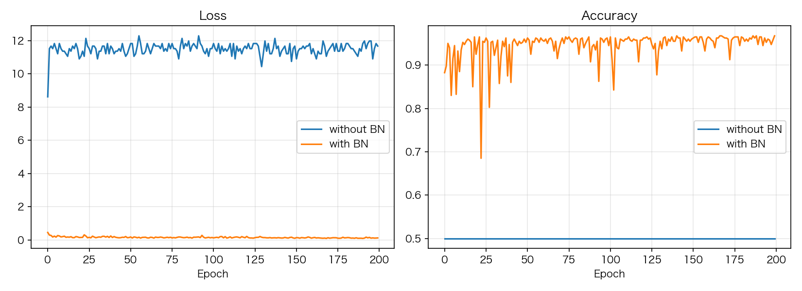

# 08 BatchNormalization：训练/推理双模式与滑动统计量

> **前置知识**：本系列《MLP 深入》（深层网络与初始化）与《学习率与九大调度器》
> **运行环境**：numpy_keras v2.1.0 / Python 3.12 / NumPy 1.26.4（Apple M2 Pro 实测）
> **运行时间**：约 30-60 秒（纯 NumPy 模式）
> **随机种子**：`np.random.seed(0)`

## 深层网络难训，难在哪

《激活函数全解》讲过信号在前向传播中的衰减；BatchNormalization 从另一个角度出手：**每一层的输入分布会随着训练漂移**（前面层的参数一更新，后面层看到的输入分布就变了），层数越深越明显。BN 的做法简单粗暴：把每层的输入**标准化成均值 0、方差 1**，再乘 γ 加 β 恢复表达能力。分布稳住了，高学习率才敢用。

看库的实现（`numpy_keras/layers/batch_norm.py`，注释已删减）：

```python
# excerpt: numpy_keras/layers/batch_norm.py
        if is_training:
            batch_mean = np.mean(inputs, axis=reduce_axis)
            batch_var = np.var(inputs, axis=reduce_axis)
            self.xmu = inputs - batch_mean
            self.ivar = 1. / np.sqrt(batch_var + self.epsilon)
            self.x_normalized = self.xmu * self.ivar
            out = self.params['gamma'] * self.x_normalized + self.params['beta']
            self.moving_mean = self.momentum * self.moving_mean + (1. - self.momentum) * batch_mean
            self.moving_variance = self.momentum * self.moving_variance + (1. - self.momentum) * batch_var
        # Otherwise, compute the outputs using the running mean and variance
        else:
            xmu = inputs - self.moving_mean
            ivar = 1. / np.sqrt(self.moving_variance + self.epsilon)
            x_normalized = xmu * ivar
            out = self.params['gamma'] * x_normalized + self.params['beta']
        return out
```

BN 是库中少见的**双模式层**，这四条线是精髓：

1. **训练模式**（`is_training=True`）：用**当前 batch** 的均值/方差标准化，同时把它们滑进 `moving_mean`/`moving_variance`（动量 0.9，即每个 batch 只贡献 10%）。
2. **推理模式**（`is_training=False`）：用**滑动统计量**标准化。为什么不能继续用 batch 统计量？推理时可能只有一个样本，没有"batch"可言。
3. `reduce_axis = tuple(range(inputs.ndim - 1))`：均值方差沿除最后一维外的所有轴求——最后一维是通道，所以 (N, D) 和 (N, H, W, C) 两种输入都能正确按通道归一化。
4. γ 和 β 是**可训练参数**（初始 1 和 0）：标准化本身会抹掉表达力，γ/β 把"缩放和平移的自由"还回来。

一个容易踩的点：**BN 在推理模式的表现依赖滑动统计量的质量**。初始值是 0 和 1，训练初期它们还没跟上真实分布——所以刚训几轮的模型 `evaluate` 会明显差于训练中的表现。训满一定轮数后两者才趋于一致。

## 实验：同一个高学习率，加与不加

8 层 MLP，SGD lr=0.7——对无 BN 的深网来说高到危险，对有 BN 的深网来说稀松平常：

```python
# excerpt: 对比实验
histories = {}
for name, with_bn in [("without BN", False), ("with BN", True)]:
    np.random.seed(0)                    # 同种子、同初始点
    m = build(with_bn)
    # 无 BN 时高学习率让梯度爆炸、预测崩塌（损失停在高位、准确率钉死
    # 随机水平）——压掉 relu 的 invalid 警告噪音
    with np.errstate(invalid="ignore"):
        h = m.fit(X, y, batch_size=64, epochs=200, verbose=0)
    histories[name] = h
    print(f"{name:>11}: 最终 loss={h['loss'][-1]:.4f}, "
          f"train_acc={h['metrics']['train_accuracy'][-1]:.4f}")
```

```text
 without BN: 最终 loss=11.6671, train_acc=0.5000
    with BN: 最终 loss=0.1165, train_acc=0.9675
```



没有 BN 的网络直接**崩塌**：loss 停在 11.67 的高位（预测"自信地错"），准确率钉死在随机水平 0.5——训练曲线居高不下、准确率纹丝不动，这是训练里最常见的求救信号，见到它第一反应就是"学习率太大或缺少归一化"。加了 BN 的同一个网络在同样的 lr 下稳稳收敛到 96.75%。

训练结束后看一眼滑动统计量（`evaluate`/`predict` 用的就是它们）：

```text
训练 50 轮后，第一个 BN 层的滑动均值（前 5 个通道）: [1.5397 0.5838 0.854  0.5753 1.2103]
滑动方差（前 5 个通道）: [4.0889 0.5812 1.0409 0.6995 2.9758]
```

它们不是 0 和 1——BN 的输入是 ReLU 的输出（恒 ≥ 0），所以均值是正的、方差随通道各异。这正是"训练统计量"：每个通道的分布被完整记录，推理时据此归一化。

## 完整代码

```python
"""08_batch_norm.py — BatchNormalization：训练/推理双模式与滑动统计量

运行方式（在任意目录均可）：
    pip install -e .   # 仓库根目录执行一次
    python tutorials/code/08_batch_norm.py

说明：
- 同一个 8 层 MLP 用同一个高学习率（SGD lr=0.7）训练两遍：
  一层不加 BN、一层在每层激活后加 BN，对比训练曲线
- 训练结束后打印 BN 层的滑动均值/方差：训练模式用 batch 统计量，
  推理模式（evaluate/predict）用滑动统计量
- 固定种子 np.random.seed(0)，数字可复现
- 环境：Apple M2 Pro / macOS / Python 3.12 / NumPy 1.26.4
"""

from pathlib import Path

import matplotlib
matplotlib.use("Agg")
import matplotlib.pyplot as plt
import numpy as np

# 中文字体回退链：macOS 用苹方、Windows 用雅黑，其他系统退化为英文渲染
plt.rcParams["font.sans-serif"] = [
    "PingFang SC", "Hiragino Sans GB", "Arial Unicode MS",
    "Microsoft YaHei", "sans-serif",
]
plt.rcParams["axes.unicode_minus"] = False

ROOT = Path(__file__).resolve().parents[2]

import numpy_keras as keras

ASSETS = ROOT / "tutorials" / "assets"
ASSETS.mkdir(parents=True, exist_ok=True)

np.random.seed(0)

def make_blobs(n=200, seed=0):
    rng = np.random.default_rng(seed)
    centers = np.array([[1.0, 1.0], [-1.0, -1.0]])
    X = np.vstack([rng.normal(c, 0.9, (n, 2)) for c in centers])
    y = np.array([0] * n + [1] * n)
    idx = rng.permutation(2 * n)
    return X[idx], y[idx]


X, y = make_blobs()
print(f"玩具数据: {X.shape}, 标签 {np.unique(y)}")


def build(with_bn):
    m = keras.Sequential()
    m.add(keras.layers.Input(2))
    for _ in range(8):
        m.add(keras.layers.Dense(32, activation="relu", kernel_initializer="he_normal"))
        if with_bn:
            m.add(keras.layers.BatchNormalization())
    m.add(keras.layers.Dense(2, activation="softmax"))
    m.compile(loss="sparse_categorical_crossentropy",
              optimizer=keras.optimizers.SGD(learning_rate=0.7),
              metrics=["accuracy"])
    return m


histories = {}
for name, with_bn in [("without BN", False), ("with BN", True)]:
    np.random.seed(0)                    # 同种子、同初始点
    m = build(with_bn)
    # 无 BN 时高学习率让梯度爆炸、预测崩塌（损失停在高位、准确率钉死
    # 随机水平）——压掉 relu 的 invalid 警告噪音
    with np.errstate(invalid="ignore"):
        h = m.fit(X, y, batch_size=64, epochs=200, verbose=0)
    histories[name] = h
    print(f"{name:>11}: 最终 loss={h['loss'][-1]:.4f}, "
          f"train_acc={h['metrics']['train_accuracy'][-1]:.4f}")

fig, axes = plt.subplots(1, 2, figsize=(11, 4))
for name in histories:
    axes[0].plot(histories[name]["loss"], label=name)
axes[0].set_title("Loss")
axes[0].set_xlabel("Epoch")
axes[0].legend()
axes[0].grid(alpha=0.3)
for name in histories:
    axes[1].plot(histories[name]["metrics"]["train_accuracy"], label=name)
axes[1].set_title("Accuracy")
axes[1].set_xlabel("Epoch")
axes[1].legend()
axes[1].grid(alpha=0.3)
fig.tight_layout()
fig.savefig(ASSETS / "08_bn_compare.png", dpi=150)
plt.close(fig)

# 滑动统计量：训练模式用 batch 统计量，推理模式用它们
np.random.seed(0)
m = build(with_bn=True)
m.fit(X, y, batch_size=64, epochs=50, verbose=0)
bn_layer = next(l for l in m.layers.values() if hasattr(l, "moving_mean"))
print(f"\n训练 50 轮后，第一个 BN 层的滑动均值（前 5 个通道）: {np.round(bn_layer.moving_mean[:5], 4)}")
print(f"滑动方差（前 5 个通道）: {np.round(bn_layer.moving_variance[:5], 4)}")
print("（evaluate/predict 走推理模式，用的就是这两个统计量而非 batch 统计量）")

print("图片已保存: tutorials/assets/08_bn_compare.png")
```

完整运行输出（纯 NumPy 模式）：

```text
玩具数据: (400, 2), 标签 [0 1]
 without BN: 最终 loss=11.6671, train_acc=0.5000
    with BN: 最终 loss=0.1165, train_acc=0.9675

训练 50 轮后，第一个 BN 层的滑动均值（前 5 个通道）: [1.5397 0.5838 0.854  0.5753 1.2103]
滑动方差（前 5 个通道）: [4.0889 0.5812 1.0409 0.6995 2.9758]
（evaluate/predict 走推理模式，用的就是这两个统计量而非 batch 统计量）
图片已保存: tutorials/assets/08_bn_compare.png
```

## 小结

- BN 稳住每层输入的分布，让深层网络敢用高学习率——实测同 lr=0.7：无 BN 崩塌（loss 11.67、准确率 0.5），有 BN 收敛到 96.75%
- **双模式是 BN 的灵魂**：训练用 batch 统计量并滑动更新，推理用滑动统计量；`reduce_axis` 让 2D/4D 输入统一按通道归一化
- γ/β 是可训练参数，把标准化抹掉的表达力还回来
- 坑：滑动统计量初期（0/1 冷启动）不准确，刚训几轮就 `evaluate` 会明显偏差

**练习**：把 lr 从 0.5 降到 0.05，无 BN 的网络还发散吗？把 `momentum` 从 0.9 改成 0.5，前 50 轮的滑动统计量变化速度会怎样？

下一篇：《CNN 解剖：im2col 与 LeNet》——卷积层把"局部连接"翻译成了矩阵乘法。
