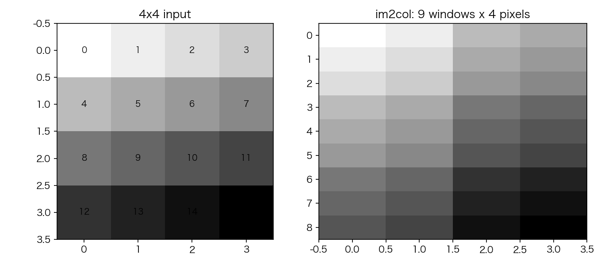
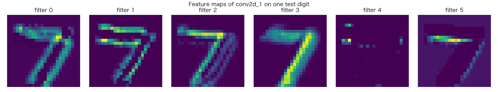

# 09 CNN 解剖：im2col、卷积与 LeNet 实战

> **前置知识**：本系列《反向传播逐行拆解》（矩阵微分的形状直觉）与《MLP 深入》
> **运行环境**：numpy_keras v2.1.0 / Python 3.12 / NumPy 1.26.4（Apple M2 Pro 实测）
> **运行时间**：约 1 分钟（纯 NumPy 模式，2,000 样本 × 2 轮）
> **随机种子**：`np.random.seed(0)`

## 卷积的秘密：它只是矩阵乘法

卷积核在图像上滑动，每个位置做一次点积。这个过程和矩阵乘法长得完全一样，差的只是数据排列——**im2col** 把每个滑窗拉成一列：



4×4 的输入、2×2 的核、步长 1，共 9 个合法滑窗位置，每个滑窗 4 个像素，于是卷积等价于一个 9×4 的列矩阵乘上展平后的核。看库的实现（`numpy_keras/layers/conv2d.py`）：

```python
# excerpt: numpy_keras/layers/conv2d.py
        cols = np.lib.stride_tricks.sliding_window_view(x_pad, (kh, kw), axis=(1, 2))[:, ::sh, ::sw]
        cols = cols.transpose(0, 1, 2, 4, 5, 3)   # (N, OH, OW, kh, kw, C)
        N, OH, OW, _, _, C = cols.shape
        cols = cols.reshape(N * OH * OW, kh * kw * C)
```

```python
# excerpt: numpy_keras/layers/conv2d.py
        lin_output = cols @ self.params["W"].reshape(kh * kw * C, self.__filters)
```

`sliding_window_view` 是 NumPy 的**零拷贝**滑窗视图——9 个窗口共享同一块内存，reshape 之后整个卷积就退化成两行代码：**展平 + 矩阵乘**。这正是选择 NumPy 做教学实现的回报：卷积的数学本质（局部连接、权值共享）被清清楚楚地翻译成"把窗口排成列"，而不是某个黑箱 C++ 内核。

反向是对称的：dW 是列矩阵的转置乘（`self.cols.T @ grad_cols`），而 dX 要把列空间的梯度**散射回**图像——每个像素同时出现在多个滑窗里，所以它的梯度是多个窗口贡献的累加（`np.add.at` 的 scatter-add）。MaxPool2D 更简单：前向记下每个窗口最大值的位置，反向只把梯度送还给那个位置：

```python
# excerpt: numpy_keras/layers/maxpool2d.py
        # remember which position won in each window for the backward pass
        self.__amax = np.argmax(win.reshape(N, OH, OW, ph * pw, C), axis=3)
```

## LeNet 实战

经典 LeNet 结构：卷积 5×5×6 → 池化 → 卷积 5×5×16 → 池化 → 展平 → 全连接。2,000 个训练样本、2 轮（种子 0）：

```text
Layer (type)         Output Shape         Param #   
=================================================================
input_1              (28, 28, 1)          0         
conv2_d_1            (24, 24, 6)          156       
max_pool2_d_1        (12, 12, 6)          0         
conv2_d_2            (8, 8, 16)           2,416     
max_pool2_d_2        (4, 4, 16)           0         
flatten_1            (256,)               0         
dense_1              120                  30,840    
dense_2              10                   1,210     
=================================================================
Total params: 34,622
```

两个值得玩味的数字：

- **第一个卷积层只有 156 个参数**（5×5×1×6 + 6），却能处理整张 28×28 的图像——权值共享的力量。作为对比，00 篇的第一个全连接层是 100,480 个参数。
- **参数分布和 MLP 相反**：CNN 的参数集中在最后的全连接层（30,840），前面的卷积层反而便宜——卷积"提特征"，全连接"做决策"。

实测（`np.random.seed(0)`，纯 NumPy 模式）：

```text
训练集准确率: 0.9320
测试集准确率: 0.8930
```

2 轮、2,000 样本就达到训练 93.2% / 测试 89.3%——同样的数据量给 MLP（00 篇的两层模型用了 5,000 样本 × 5 轮才 92%）。卷积的归纳偏置（局部性 + 平移不变性）让它在图像上**用更少的数据学到更多**。

训练完成后，把测试集第一张图喂进第一个卷积层，看它的 6 个通道各自在提取什么：



有的通道在描边、有的在提取笔画方向——同一个输入，六个不同视角的低级特征。把它们堆起来交给下一个卷积层，就是"特征的层次结构"。

## 完整代码

```python
"""09_cnn.py — CNN 解剖：im2col、卷积与 LeNet 实战

运行方式（在任意目录均可）：
    pip install -e .   # 仓库根目录执行一次
    python tutorials/code/09_cnn.py

说明：
- 第一部分：4×4 输入、2×2 卷积核的 im2col 展开（卷积 = 矩阵乘法）
- 第二部分：LeNet 风格 CNN 在 MNIST 2,000 行子集上训练 2 轮，
  打印训练/测试准确率
- 第三部分：把第一个卷积层的 6 个输出通道画成特征图
- 固定种子 np.random.seed(0)，数字可复现
- 环境：Apple M2 Pro / macOS / Python 3.12 / NumPy 1.26.4
"""

import csv
import itertools
from pathlib import Path

import matplotlib
matplotlib.use("Agg")
import matplotlib.pyplot as plt
import numpy as np

# 中文字体回退链：macOS 用苹方、Windows 用雅黑，其他系统退化为英文渲染
plt.rcParams["font.sans-serif"] = [
    "PingFang SC", "Hiragino Sans GB", "Arial Unicode MS",
    "Microsoft YaHei", "sans-serif",
]
plt.rcParams["axes.unicode_minus"] = False

ROOT = Path(__file__).resolve().parents[2]

import numpy_keras as keras

ASSETS = ROOT / "tutorials" / "assets"
ASSETS.mkdir(parents=True, exist_ok=True)

np.random.seed(0)

# 1. im2col：卷积 = 把每个滑窗拉成一列，再做矩阵乘法
x = np.arange(16).reshape(4, 4).astype(float)
cols = np.lib.stride_tricks.sliding_window_view(x, (2, 2)).reshape(-1, 4)
print("4×4 输入:")
print(x)
print(f"\nim2col 后的列矩阵 ({cols.shape[0]} 个滑窗位置 × {cols.shape[1]} 个像素):")
print(cols)

fig, axes = plt.subplots(1, 2, figsize=(9, 4))
axes[0].imshow(x, cmap="gray_r")
for i in range(4):
    for j in range(4):
        axes[0].text(j, i, str(int(x[i, j])), ha="center", va="center", fontsize=9)
axes[0].set_title("4x4 input")
axes[1].imshow(cols, cmap="gray_r", aspect="auto")
axes[1].set_title("im2col: 9 windows x 4 pixels")
fig.tight_layout()
fig.savefig(ASSETS / "09_im2col.png", dpi=150)
plt.close(fig)

# 2. LeNet 实战：MNIST 2,000 行子集，2 轮
def load_mnist(path, n_rows=None):
    with open(path) as f:
        rows = list(itertools.islice(csv.reader(f), n_rows))
    y = np.array([int(r[0]) for r in rows])
    X = np.array([[float(v) for v in r[1:]] for r in rows]) / 255.0
    return X, y


X_train, y_train = load_mnist(ROOT / "data" / "mnist_train_small.csv", n_rows=2000)
X_test, y_test = load_mnist(ROOT / "data" / "mnist_test.csv", n_rows=1000)
X_train = X_train.reshape(-1, 28, 28, 1)
X_test = X_test.reshape(-1, 28, 28, 1)
print(f"\n数据: 训练 {X_train.shape}, 测试 {X_test.shape}")

model = keras.Sequential()
model.add(keras.layers.Input((28, 28, 1)))
model.add(keras.layers.Conv2D(6, kernel_size=5, activation="relu"))
model.add(keras.layers.MaxPool2D(pool_size=2))
model.add(keras.layers.Conv2D(16, kernel_size=5, activation="relu"))
model.add(keras.layers.MaxPool2D(pool_size=2))
model.add(keras.layers.Flatten())
model.add(keras.layers.Dense(120, activation="tanh"))
model.add(keras.layers.Dense(10, activation="softmax"))
model.compile(loss="sparse_categorical_crossentropy", optimizer="adam",
              metrics=["accuracy"])
model.summary()

history = model.fit(X_train, y_train, batch_size=32, epochs=2, verbose=0)
print(f"训练集准确率: {model.evaluate(X_train, y_train, batch_size=64):.4f}")
print(f"测试集准确率: {model.evaluate(X_test, y_test, batch_size=64):.4f}")

# 3. 第一个卷积层的 6 个特征图（取测试集第一张图）
# 注意：层的字典键来自 camel_to_snake("Conv2D") = "conv2_d"，
# 用类型查找更稳（见《引擎室》一篇对层命名的说明）
conv1 = next(l for l in model.layers.values() if isinstance(l, keras.layers.Conv2D))
fm = conv1.forward(X_test[0:1], is_training=False)   # (1, 24, 24, 6)
fig, axes = plt.subplots(1, 6, figsize=(15, 2.8))
for i in range(6):
    axes[i].imshow(fm[0, :, :, i], cmap="viridis")
    axes[i].set_title(f"filter {i}")
    axes[i].axis("off")
fig.suptitle("Feature maps of conv2d_1 on one test digit")
fig.tight_layout()
fig.savefig(ASSETS / "09_feature_maps.png", dpi=150)
plt.close(fig)

print("图片已保存: tutorials/assets/09_im2col.png, tutorials/assets/09_feature_maps.png")
```

完整运行输出（纯 NumPy 模式）：

```text
4×4 输入:
[[ 0.  1.  2.  3.]
 [ 4.  5.  6.  7.]
 [ 8.  9. 10. 11.]
 [12. 13. 14. 15.]]

im2col 后的列矩阵 (9 个滑窗位置 × 4 个像素):
[[ 0.  1.  4.  5.]
 [ 1.  2.  5.  6.]
 [ 2.  3.  6.  7.]
 [ 4.  5.  8.  9.]
 [ 5.  6.  9. 10.]
 [ 6.  7. 10. 11.]
 [ 8.  9. 12. 13.]
 [ 9. 10. 13. 14.]
 [10. 11. 14. 15.]]

数据: 训练 (2000, 28, 28, 1), 测试 (1000, 28, 28, 1)
Model: Sequential
_________________________________________________________________
Layer (type)         Output Shape         Param #   
=================================================================
input_1              (28, 28, 1)          0         
conv2_d_1            (24, 24, 6)          156       
max_pool2_d_1        (12, 12, 6)          0         
conv2_d_2            (8, 8, 16)           2,416     
max_pool2_d_2        (4, 4, 16)           0         
flatten_1            (256,)               0         
dense_1              120                  30,840    
dense_2              10                   1,210     
=================================================================
Total params: 34,622
_________________________________________________________________
训练集准确率: 0.9320
测试集准确率: 0.8930
图片已保存: tutorials/assets/09_im2col.png, tutorials/assets/09_feature_maps.png
```

## 小结

- 卷积 = im2col（零拷贝滑窗视图）→ 展平 → **矩阵乘法**；反向是对称的 col2im 散射累加
- MaxPool2D 前向记 argmax，反向只送还最大值位置——简单到三行
- LeNet 2 轮 2,000 样本：训练 93.20% / 测试 89.30%，参数集中在最后的全连接层，卷积层便宜得出奇（156 个参数）
- 特征图可视化：不同通道提取不同方向的低级特征，层级结构由此而生

**练习**：把两个卷积层的 kernel_size 改成 3，参数个数怎么变？把 MaxPool2D 换成 stride=2 的 Conv2D，测试准确率会怎样？（提示：池化没有参数，但也不是免费的。）

下一篇：《RNN 三部曲与 BPTT》——把"时间"加进网络，反向传播沿时间轴展开。
