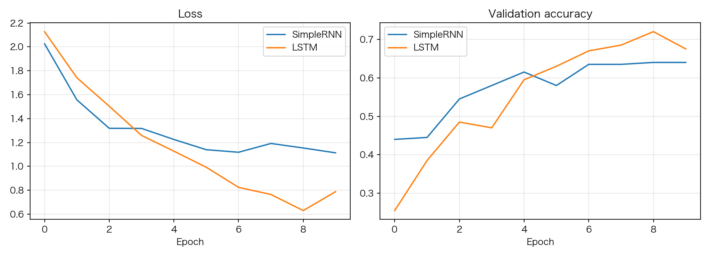
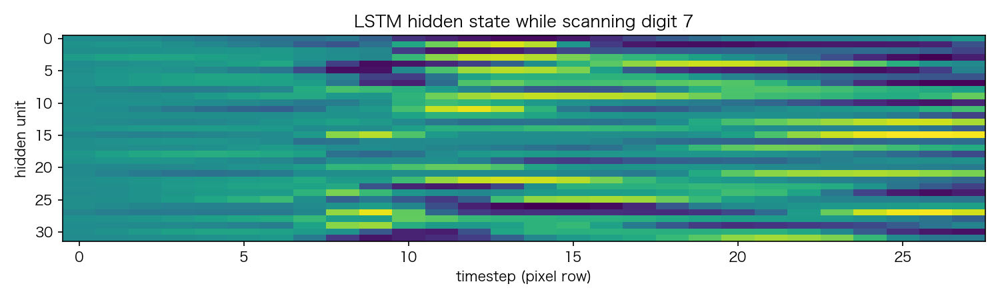

# 10 RNN 三部曲：SimpleRNN / LSTM / GRU 与 BPTT

> **前置知识**：本系列《反向传播逐行拆解》（链式法则与形状直觉）
> **运行环境**：numpy_keras v2.1.0 / Python 3.12 / NumPy 1.26.4（Apple M2 Pro 实测）
> **运行时间**：约 1 分钟（纯 NumPy 模式，800 样本 × 10 轮 × 2 个模型）
> **随机种子**：`np.random.seed(0)`

## 把"时间"加进网络

前面所有的网络都是"看整张图再给答案"。序列数据不一样：信息沿时间到达，答案依赖**顺序**。RNN 的解法是权值共享 + 一个循环：每个时间步用同一套权重，把上一步的隐状态和当前的输入揉在一起：

$$h_t = \text{act}(x_t W_{xh} + h_{t-1} W_{hh} + b)$$

库里的 SimpleRNN 前向循环（`numpy_keras/layers/simple_rnn.py`）：

```python
# excerpt: numpy_keras/layers/simple_rnn.py
        h = np.zeros((N, U))
        h_seq = np.empty((N, T, U))   # hidden states, cached for backward
        for t in range(T):
            pre = inputs[:, t, :] @ self.params["W_xh"] + h @ self.params["W_hh"]
            if "b" in self.params:
                pre = pre + self.params["b"]
            h = self.__activation_mapper[self.__activation](pre, **self.__activation_config)
            h_seq[:, t, :] = h
```

两个参数矩阵：`W_xh (F, U)` 吃输入、`W_hh (U, U)` 吃上一步的隐状态。每步的隐状态都被缓存下来（`h_seq`），供反向传播使用。

## BPTT：链式法则沿时间轴展开

反向传播还是那套链式法则，只是计算图在时间轴上**展开**了：损失对 W_hh 的梯度是每个时间步贡献的累加。看 backward 的核心（注释已删减）：

```python
# excerpt: numpy_keras/layers/simple_rnn.py
        d_out = np.zeros((N, T, U))
        if self.__return_sequences:
            d_out = grad
        else:
            d_out[:, -1, :] = grad

        self.grads["W_xh"] = np.zeros_like(self.params["W_xh"])
        self.grads["W_hh"] = np.zeros_like(self.params["W_hh"])
        if "b" in self.grads:
            self.grads["b"] = np.zeros_like(self.params["b"])

        dX = np.empty_like(self.inputs)
        dh = np.zeros((N, U))          # gradient through h_t from the future
        for t in range(T - 1, -1, -1):
            dh = dh + d_out[:, t, :]
            # through the activation: derivs take the post-activation value
            d_pre = dh * self.__own_activation_deriv(self.__h_seq[:, t, :], **self.__activation_config)
            # h_{t-1}; the initial state h_{-1} is zeros
            h_prev = np.zeros((N, U)) if t == 0 else self.__h_seq[:, t - 1, :]
            self.grads["W_hh"] += h_prev.T @ d_pre
            self.grads["W_xh"] += self.inputs[:, t, :].T @ d_pre
            if "b" in self.grads:
                self.grads["b"] += d_pre.sum(axis=0)
            dX[:, t, :] = d_pre @ self.params["W_xh"].T
            dh = d_pre @ self.params["W_hh"].T
```

三个关键设计：

1. **梯度只落在最后一个时间步**（`d_out[:, -1, :] = grad`）：默认 `return_sequences=False` 只输出最后的 h_T，损失直接作用在 h_T 上；更早时间步的梯度**只能**通过 `dh = d_pre @ W_hh.T` 这条循环路径流回去——"信息沿时间回传"不是比喻，就是这一行矩阵乘。
2. **h_prev 在每个迭代开头取**：`t` 时刻的梯度要用 `h_{t-1}`（初始状态是零）。把它放在循环末尾取会错位一格——这类 off-by-one 正是有限差分梯度校验（《反向传播逐行拆解》）的用武之地。
3. **`activation` 属性刻意返回 `None`**：Dense/Conv2D 遵守"下一层乘我的导数"的通用约定，但 RNN 的隐状态还要喂给循环本身，输出链必须在层内完整走完。所以三个 RNN 层都自持输出链，同时把通用链在层边界处"归零"——这是库里最重要的设计约定之一。

## SimpleRNN 的短板与两个改进

SimpleRNN 的问题：梯度每过一个时间步就要乘一次 W_hh 和激活导数，长期依赖衰减得飞快。改进思路都是**给信息开高速通道**：

| 层 | 核心机制 | 一句话 |
|---|---|---|
| LSTM | 记忆细胞 c_t 走加法路径：c_t = f⊙c_{t-1} + i⊙g | 遗忘门 f 决定留下什么，梯度经加法无损流动 |
| GRU | 更新门 z 在旧状态与候选间插值：h = (1−z)⊙h + z⊙h̃ | 一个门管遗忘+更新，参数更少 |

## 实验：把 MNIST 按行扫描成序列

每张 28×28 的图变成 **28 个时间步 × 28 特征**的序列——从上到下逐行"读"数字。800 训练 / 200 测试，LSTM(32) 与 SimpleRNN(32) 同一配置对比：

```text
  SimpleRNN: train_acc=0.6138, val_acc=0.6400
       LSTM: train_acc=0.7913, val_acc=0.6750
```



LSTM 明显占优：训练 79.13% vs 61.38%，验证 67.50% vs 64.00%。逐行扫描时，"数字 9 的圈在哪些行闭合"这类信息横跨二十多个时间步——SimpleRNN 的隐状态撑不住这么长的依赖，LSTM 的遗忘门让它有选择地保留关键行。同样的数据量下，这是架构差异最直观的展示。

最后看一眼 LSTM 扫描一个"9"时隐状态的演化（32 个隐单元 × 28 行像素）：



不同的隐单元在**不同的行**被点亮——有的对顶部圆弧响应、有的对底部折线响应。扫描式识别的本质：隐状态是一份随时间更新的"读到这里，我看到了什么"的摘要。

## 完整代码

```python
"""10_rnn.py — RNN 三部曲：SimpleRNN / LSTM / GRU 与 BPTT

运行方式（在任意目录均可）：
    pip install -e .   # 仓库根目录执行一次
    python tutorials/code/10_rnn.py

说明：
- 第一部分：把 MNIST 每张图按行扫描成 28 个时间步的序列，
  同一配置下对比 SimpleRNN 与 LSTM（800 训练 / 200 测试样本）
- 第二部分：可视化 LSTM 扫描一个数字时隐状态随时间的演化
- 固定种子 np.random.seed(0)，数字可复现
- 环境：Apple M2 Pro / macOS / Python 3.12 / NumPy 1.26.4
"""

import csv
import itertools
from pathlib import Path

import matplotlib
matplotlib.use("Agg")
import matplotlib.pyplot as plt
import numpy as np

# 中文字体回退链：macOS 用苹方、Windows 用雅黑，其他系统退化为英文渲染
plt.rcParams["font.sans-serif"] = [
    "PingFang SC", "Hiragino Sans GB", "Arial Unicode MS",
    "Microsoft YaHei", "sans-serif",
]
plt.rcParams["axes.unicode_minus"] = False

ROOT = Path(__file__).resolve().parents[2]

import numpy_keras as keras

ASSETS = ROOT / "tutorials" / "assets"
ASSETS.mkdir(parents=True, exist_ok=True)

np.random.seed(0)

# 1. 行扫描 MNIST：SimpleRNN vs LSTM
def load_mnist(path, n_rows=None):
    with open(path) as f:
        rows = list(itertools.islice(csv.reader(f), n_rows))
    y = np.array([int(r[0]) for r in rows])
    X = np.array([[float(v) for v in r[1:]] for r in rows]) / 255.0
    return X, y


X_train, y_train = load_mnist(ROOT / "data" / "mnist_train_small.csv", n_rows=800)
X_test, y_test = load_mnist(ROOT / "data" / "mnist_test.csv", n_rows=200)
# (N, T, F)：每行 28 个像素是一个时间步，一张图是 28 个时间步的序列
X_train = X_train.reshape(-1, 28, 28)
X_test = X_test.reshape(-1, 28, 28)
print(f"数据: 训练 {X_train.shape}, 测试 {X_test.shape}（T=28 时间步, F=28 特征）")


def build(rnn_layer):
    m = keras.Sequential()
    m.add(keras.layers.Input((28, 28)))
    m.add(rnn_layer)
    m.add(keras.layers.Dense(10, activation="softmax"))
    m.compile(loss="sparse_categorical_crossentropy", optimizer="adam",
              metrics=["accuracy"])
    m.optimizer.learning_rate = 0.01
    return m


histories = {}
for name, layer in [("SimpleRNN", keras.layers.SimpleRNN(32)),
                    ("LSTM", keras.layers.LSTM(32))]:
    np.random.seed(0)                    # 同种子、同初始点
    m = build(layer)
    h = m.fit(X_train, y_train, batch_size=32, epochs=10, verbose=0,
              validation_data=(X_test, y_test))
    histories[name] = h
    print(f"{name:>11}: train_acc={h['metrics']['train_accuracy'][-1]:.4f}, "
          f"val_acc={h['metrics']['val_accuracy'][-1]:.4f}")

fig, axes = plt.subplots(1, 2, figsize=(11, 4))
for name in histories:
    axes[0].plot(histories[name]["loss"], label=name)
axes[0].set_title("Loss")
axes[0].set_xlabel("Epoch")
axes[0].legend()
axes[0].grid(alpha=0.3)
for name in histories:
    axes[1].plot(histories[name]["metrics"]["val_accuracy"], label=name)
axes[1].set_title("Validation accuracy")
axes[1].set_xlabel("Epoch")
axes[1].legend()
axes[1].grid(alpha=0.3)
fig.tight_layout()
fig.savefig(ASSETS / "10_rnn_compare.png", dpi=150)
plt.close(fig)

# 2. LSTM 扫描一个数字时，隐状态随时间的演化
np.random.seed(0)
m = build(keras.layers.LSTM(32))
m.fit(X_train, y_train, batch_size=32, epochs=10, verbose=0)
lstm = next(l for l in m.layers.values() if isinstance(l, keras.layers.LSTM))
lstm.forward(X_test[0:1], is_training=False)
h_seq = lstm._LSTM__h_seq          # 层内缓存的隐状态序列（名字改写后可见）
fig, ax = plt.subplots(figsize=(10, 3))
ax.imshow(h_seq[0].T, aspect="auto", cmap="viridis")
ax.set_xlabel("timestep (pixel row)")
ax.set_ylabel("hidden unit")
ax.set_title(f"LSTM hidden state while scanning digit {y_test[0]}")
fig.tight_layout()
fig.savefig(ASSETS / "10_hidden_state.png", dpi=150)
plt.close(fig)

print("图片已保存: tutorials/assets/10_rnn_compare.png, tutorials/assets/10_hidden_state.png")
```

完整运行输出（纯 NumPy 模式）：

```text
数据: 训练 (800, 28, 28), 测试 (200, 28, 28)（T=28 时间步, F=28 特征）
  SimpleRNN: train_acc=0.6138, val_acc=0.6400
       LSTM: train_acc=0.7913, val_acc=0.6750
图片已保存: tutorials/assets/10_rnn_compare.png, tutorials/assets/10_hidden_state.png
```

## 小结

- RNN = 权值共享 + 循环：`h_t = act(x_t W_xh + h_{t-1} W_hh + b)`，每个时间步同一套权重
- BPTT 的关键：梯度只落在最后时间步，经 `dh @ W_hh.T` 沿时间回传；每步累积 dW
- SimpleRNN 扛不住长依赖；LSTM 用遗忘门 + 加法路径让梯度无损流动；GRU 是它的精简版
- 实测行扫描 MNIST：LSTM 79.13% / 67.50% vs SimpleRNN 61.38% / 64.00%
- RNN 层 `activation` 属性为 None：输出链自持（隐状态喂循环，链必须在层内走完）

**练习**：把两个模型换成 GRU(32) 再跑一遍，它和 LSTM 差多少？把 `return_sequences=True` 加上、再接一层 LSTM——两层 RNN 堆叠后验证准确率会变吗？

下一篇（可选）：《引擎室：如何新增一层》——当你需要一个库中没有的层时，自己动手。
